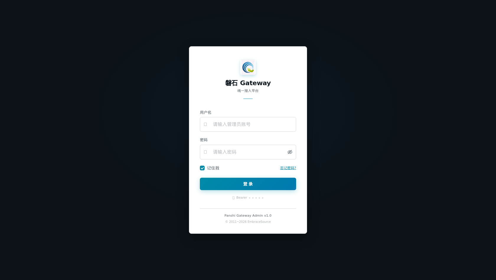
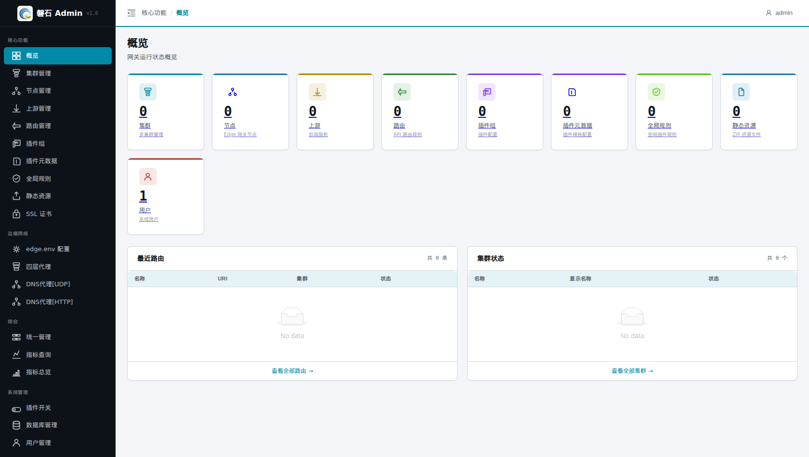
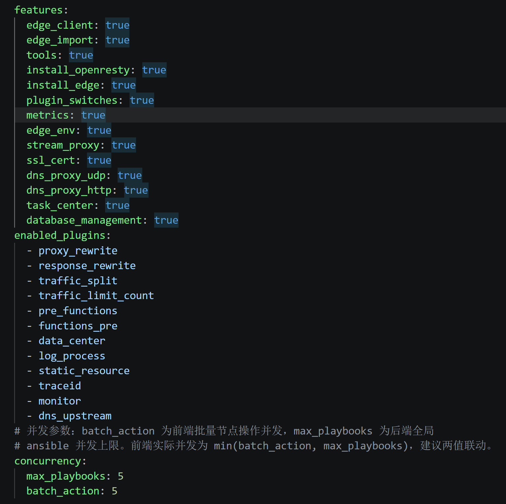
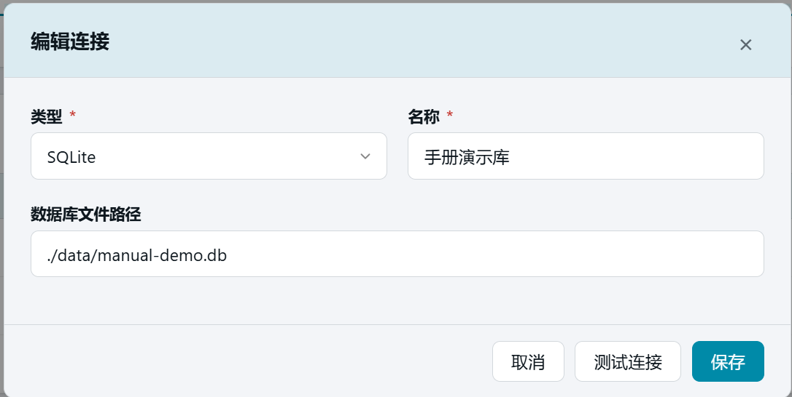
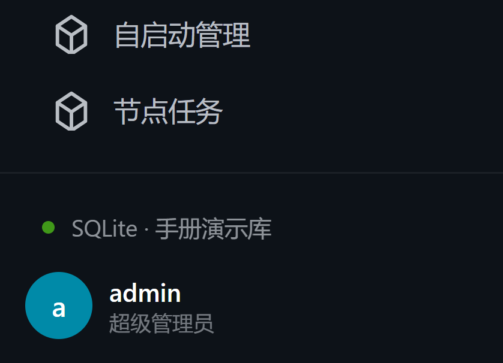

# 0. 登录与初始准备

> 本章目标：① 登录系统并认识界面；② 把系统切换到一个**干净的空数据库**上，保证后续章节从零开始。如果是在已有数据的生产环境学习，可跳过 0.3。

# 登录

> 默认账号：
> 管理员：admin / panshi123

打开浏览器访问 http://localhost:12345/ ，未登录时自动跳转到登录页，输入账号密码后点击【登 录】。

# 界面导览

登录后进入【概览】页面：

- **左侧侧边栏**：功能入口，按分组排列
  - 【核心功能】：集群管理、节点管理、上游管理、路由管理、插件组、插件元数据、全局规则等（第 1~9 章）
  - 【边缘网络】：edge.env 配置、四层代理、DNS代理[UDP]（第 3、10、11 章）
  - 【综合】：统一管理、指标查询、指标总览（第 16~17 章）
  - 【系统管理】：插件开关、数据库管理、用户管理（第 18~20 章）
  - 【运维管理】：Edge直连、数据导入、工具箱、自启动管理、节点任务（第 21~22 章）
- **顶部栏**：左侧面包屑显示当前页面位置，右侧为用户菜单（退出登录）。
- **内容区**：当前页面的操作主体。

概览页的数字卡片显示各类资源数量。全新系统中除"用户=1"外全部为 0。

# 功能开关前置检查

> 部分菜单项受「功能开关」控制：开关关闭时，对应入口**不会出现在侧边栏**。
> 如果后续章节要求你点击某个菜单却找不到，先回到本表核对开关是否开启。

| 菜单项 | 所属分组 | 开关名（features.yaml） |
|---|---|---|
| SSL 证书 | 核心功能 | `ssl_cert` |
| edge.env 配置 | 边缘网络 | `edge_env` |
| 四层代理 | 边缘网络 | `stream_proxy` |
| DNS代理[UDP] | 边缘网络 | `dns_proxy_udp` |
| DNS代理[HTTP] | 边缘网络 | `dns_proxy_http` |
| 指标查询 / 指标总览 | 综合 | `metrics` |
| 插件开关 | 系统管理 | `plugin_switches` |
| 数据库管理 | 系统管理 | `database_management` |
| Edge直连 | 运维管理 | `edge_client` |
| 数据导入 | 运维管理 | `edge_import` |
| 工具箱 / 自启动管理 | 运维管理 | `tools` |
| 节点任务 | 运维管理 | `task_center` |

开启方法：编辑后端配置文件 `backend/features.yaml`，把对应开关改为 `true` 并保存。

> 开发环境下保存后服务会自动重载；生产环境需重启服务后刷新页面。

# 准备干净的演示数据库

> 系统使用哪个数据库由连接配置决定，切换数据库 = 修改配置 + 重启后端服务。
> ⚠️ 生产环境请勿随意切换数据库，本章操作仅用于搭建演示环境。

## 1. 新增 SQLite 连接

点击左侧侧边栏：【系统管理】-> 【数据库管理】，在右侧内容区的【连接列表】中，点击【+ 添加连接】：

填写连接数据：

| 字段 | 填写值 | 说明 |
|---|---|---|
| 类型 | SQLite | 使用本地文件库 |
| 名称 | 手册演示库 | 连接的显示名称 |
| 数据库文件路径 | ./data/manual-demo.db | 文件不存在没关系，重启后自动创建 |

添加连接弹窗，SQLite 类型，路径填 ./data/manual-demo.db）

填写完成后可先点【测试连接】，再点【保存】。

## 2. 设为当前并重启

在【连接列表】中找到「手册演示库」一行，点击【设为当前】，弹窗中点击【确认切换】。

> ⚠️ 切换只修改配置文件，必须手动重启后端服务才生效：
> - 生产环境：`cd panshi; sh stop.sh; sh start.sh`

## 3. 验证

重启完成后刷新页面：

- 「当前数据库」卡片显示：SQLite · ./data/manual-demo.db
- 回到【概览】页，所有资源计数为 0（用户除外）

当前数据库卡片显示手册演示库

# 本章小结

- 登录地址与默认账号：http://localhost:12345/ ，admin / panshi123
- 界面 = 左侧导航 + 顶部栏 + 内容区
- 切换数据库的固定流程：添加连接 → 测试 → 设为当前 → 重启后端 → 验证

下一步：[第 1 章 添加集群](01-cluster.md)
