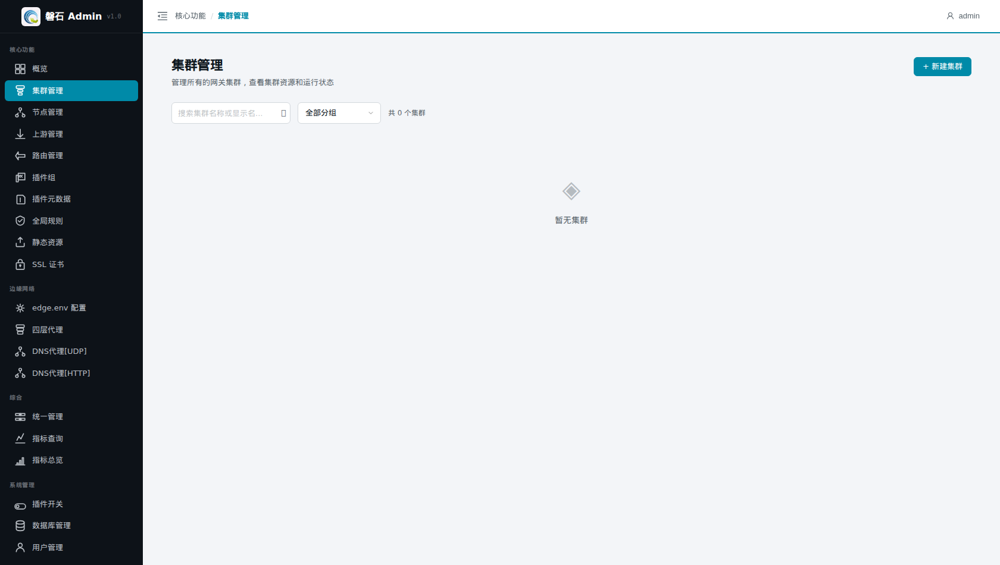
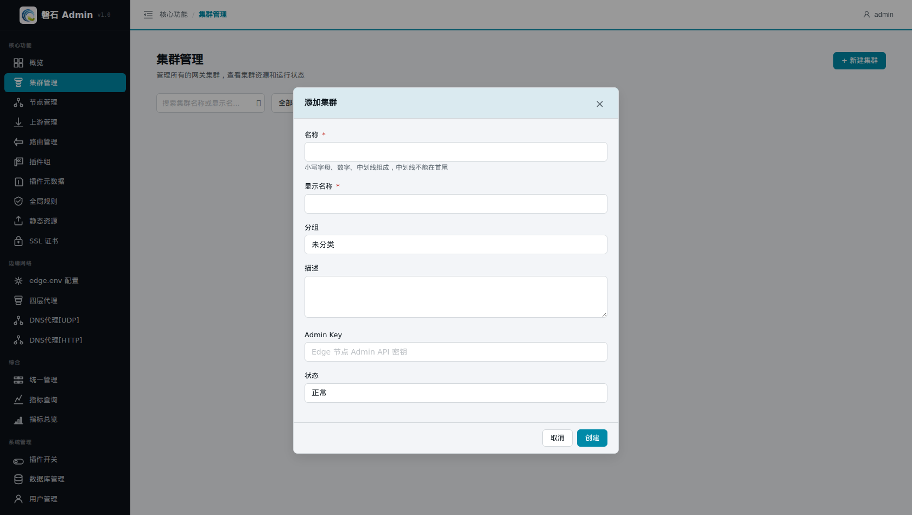
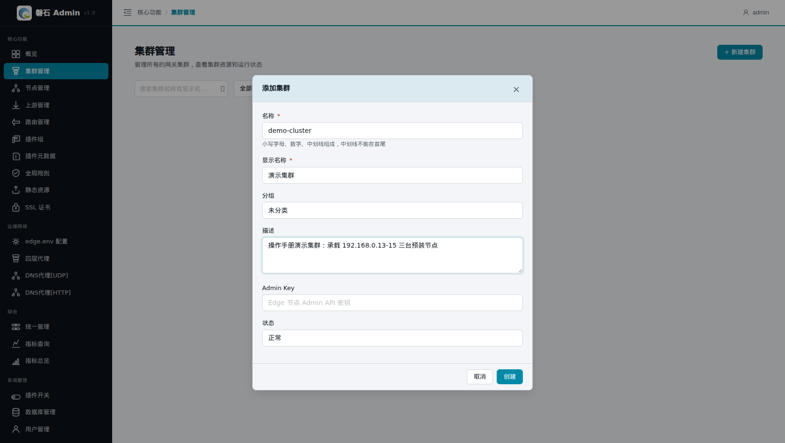
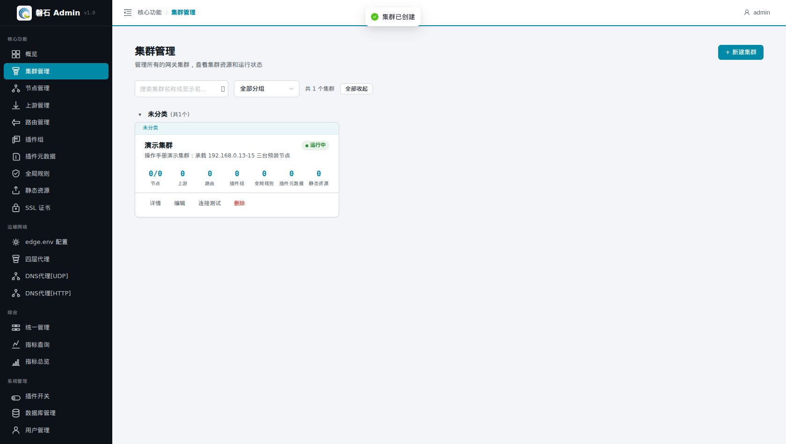

# 1. 添加集群

> 本章场景：我们有 3 台已经装好网关（OpenResty + Edge）的机器，需要交给磐石 Admin 统一管理。第一步是建立一个"集群"，作为这批机器和它们全部配置的容器。

# 集群是什么

**集群是服务器节点的集合，也是一套网关配置的边界。**

- 后续的节点、路由、上游、插件、证书等所有资源，都必须挂在某个集群下；
- "发布"动作以集群为单位：把配置推送到该集群内的节点上；
- 多套业务环境可以建多个集群，互不影响。

# 添加集群

点击左侧侧边栏：【核心功能】-> 【集群管理】，在右侧内容区内，点击【+ 新建集群】，进入【添加集群】页面：

填写集群数据：

| 字段 | 本例填写 | 说明 |
|---|---|---|
| 名称 | demo-cluster | 集群的内部标识，只能用**小写字母、数字、中划线**，中划线不能在首尾；创建后不可修改 |
| 显示名称 | 演示集群 | 界面上展示的中文名，列表和下拉框显示的是它 |
| 分组 | （留空） | 给多个集群归类便于筛选，可现场新建分组；不填归入「未分类」 |
| 描述 | 操作手册演示集群：承载 192.168.0.13-15 三台预装节点 | 备注信息 |
| Admin Key | （留空） | 与 Edge 节点通信验证的密钥，**必须与节点安装时设置的一致**；节点未启用鉴权时可留空 |
| 状态 | 正常 | 禁用后该集群不可发布 |

> ⚠️ 常见错误：名称填了中文或大写会提示格式错误。中文请填到「显示名称」。

点击【创建】后，列表中出现新集群：

# 验证

在【集群管理】列表中可以看到 `demo-cluster / 演示集群`，状态为正常。

📷 截图待补充：（集群列表一行 demo-cluster）

# 本章小结

- 先有集群，才能挂节点和配置
- 名称 = 英文标识不可改；显示名称 = 中文展示名
- Admin Key 必须与 Edge 节点实际密钥一致

下一步：[第 2 章 添加节点](02-nodes.md)
