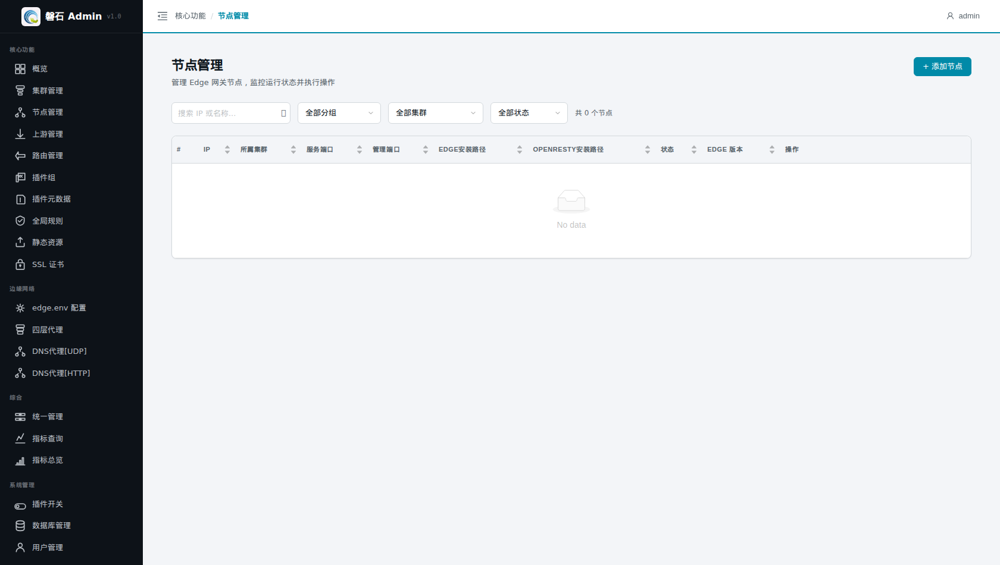
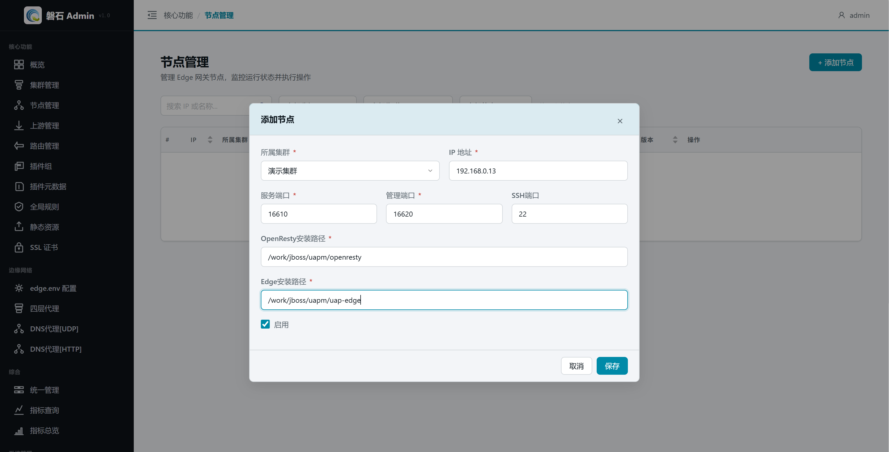
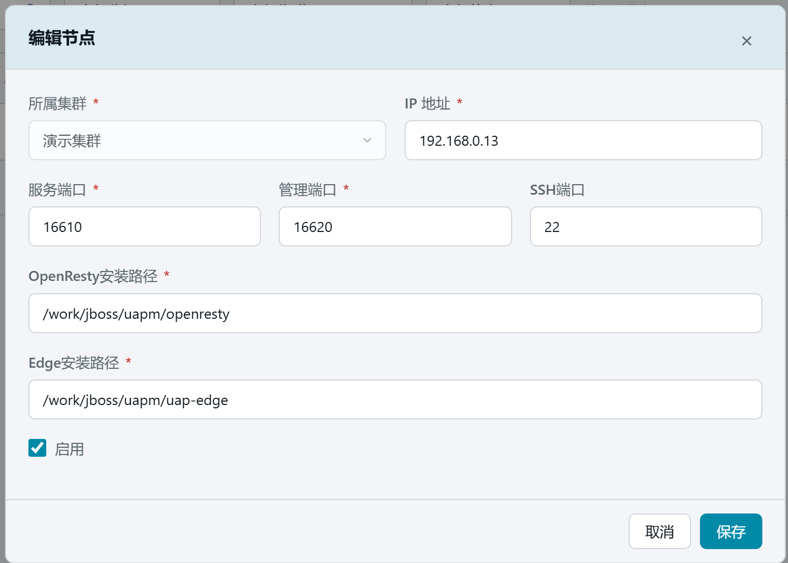
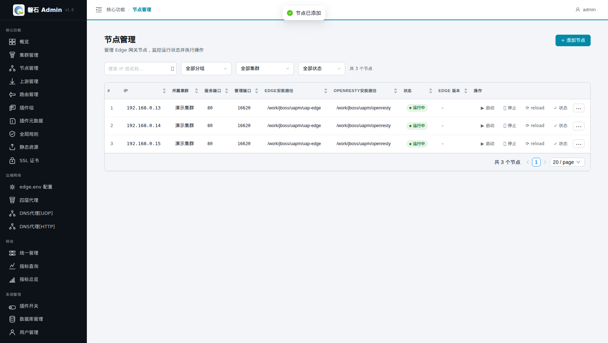
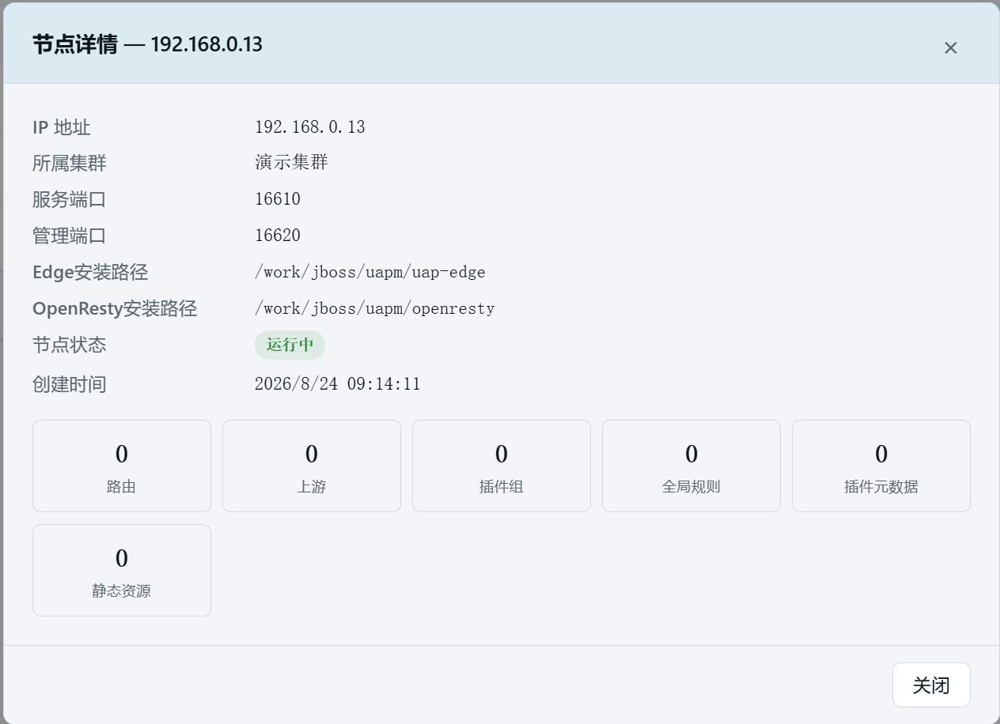

# 2. 添加节点

> 本章场景：我们有 3 台已经装好网关（OpenResty + Edge）的机器——192.168.0.13、14、15，需要把它们登记到平台，交给磐石 Admin 统一管理。节点是配置的最终落点：所有「发布」动作，本质都是平台把配置推送到这些机器上并重载网关。不添加节点，集群只是一个空壳，什么都发布不了。

## 2.1 节点是什么

**节点 = 一台真实的网关服务器。**

- 后续发布的路由、上游、插件、证书等配置，最终都会落到集群内的每一台节点上；
- 平台通过**管理端口**下发配置、通过 **SSH 端口**远程执行命令（如读取 edge.env）；
- 一个节点只能属于一个集群。

## 2.2 添加节点

点击左侧侧边栏：【核心功能】-> 【节点管理】，在右侧内容区右上角点击【+ 添加节点】：

在弹出的【添加节点】窗口中填写：

| 字段 | 本例填写 | 说明 |
| --- | --- | --- |
| 所属集群 \* | 演示集群 | 该节点归属哪个集群；发布时配置只会推送到所属集群的节点 |
| IP 地址 \* | 192.168.0.13 | 节点的 IP，平台用它发起管理接口调用和 SSH 连接 |
| 服务端口 \* | 16610 | OpenResty 对外提供 HTTP 服务的端口，用于连通性探测和流量验证 |
| 管理端口 \* | 16620 | Edge 管理 API 的端口（即 edge.env 中 `deploy.http.admin.listen`），**发布配置走这个端口**。表单默认 16610，请按节点实际部署修改 |
| SSH端口 | 22 | 远程执行命令用的 SSH 端口，默认 22；不填则无法执行读取 edge.env 等 SSH 类操作 |
| OpenResty安装路径 \* | /work/jboss/uapm/openresty | 节点上 OpenResty 的安装目录，平台按它执行 reload |
| Edge安装路径 \* | /work/jboss/uapm/uap-edge | Edge 程序和 edge.env 所在目录，平台往这里写配置 |
| 启用 | ✅ 勾选 | 取消勾选 = 暂停该节点参与发布 |

> ⚠️ 注意：两个安装路径必须填节点上的**真实绝对路径**。路径填错，发布会找不到目录而失败。
> ⚠️ 注意：管理端口必须与节点 edge.env 中 `deploy.http.admin.listen` 一致（第 3 章会读到它），否则发布连不上节点。

对三台机器重复上述操作，三台仅 IP 不同：

| 字段 | .13 | .14 | .15 |
| --- | --- | --- | --- |
| IP 地址 | 192.168.0.13 | 192.168.0.14 | 192.168.0.15 |
| 其余字段 | 与上表相同 | 同左 | 同左 |

第一台填写完成后如图：

点击【保存】，提示「节点已添加」。三台都加完后，列表如下：

## 2.3 验证

- 列表显示「共 3 个节点」，IP 分别为 192.168.0.13 / 14 / 15；
- 「状态」列显示【运行中】（绿色）——这是平台周期性探测服务端口和管理端口的结果：
  - 【运行中】= 两个端口均可达，可以正常发布；
  - 若显示异常，常见原因是网络不通或管理端口未放行，可先继续后续章节，发布前再处理。
- 每行【操作】列提供 ▶启动、⏹停止、⟳reload、✓状态 等快捷按钮，本章暂不使用。

可以点击行末尾的 【...】 操作菜单，选择其中的【详情】，可以查看当前的节点情况

## 2.4 本章小结

- 节点 = 一台真实的网关机器，四个关键信息：IP、服务端口、管理端口、两个安装路径
- 管理端口是发布通道，SSH 端口是远程命令通道
- 节点必须挂在某个集群下，一个节点只属于一个集群

下一步：[第 3 章 修改 edge.env](03-edge-env.md)
