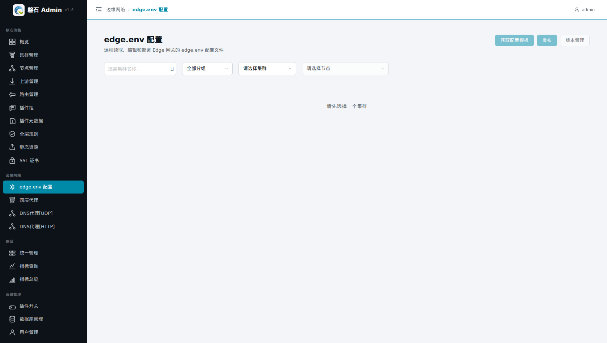
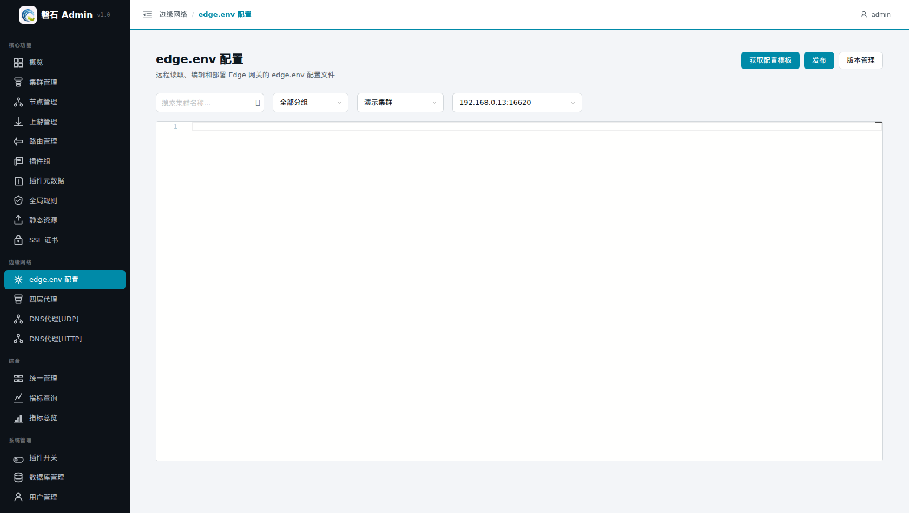
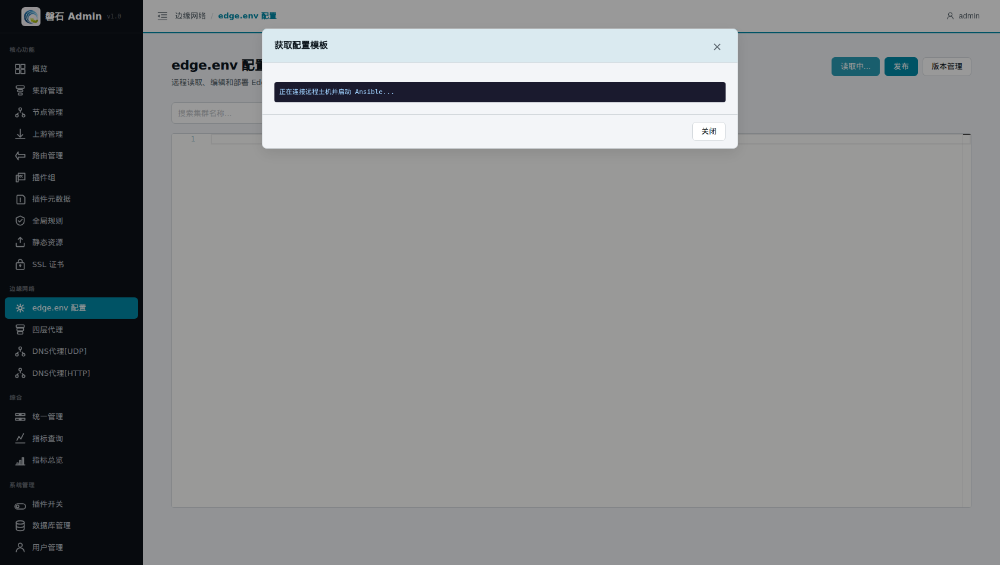
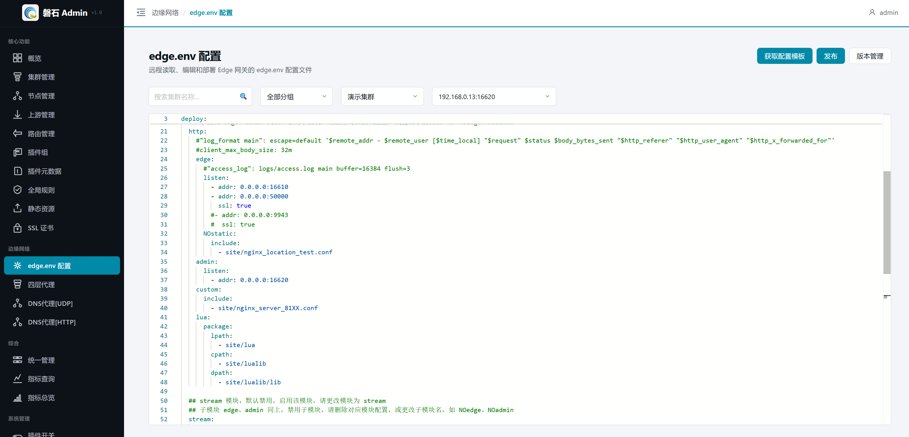
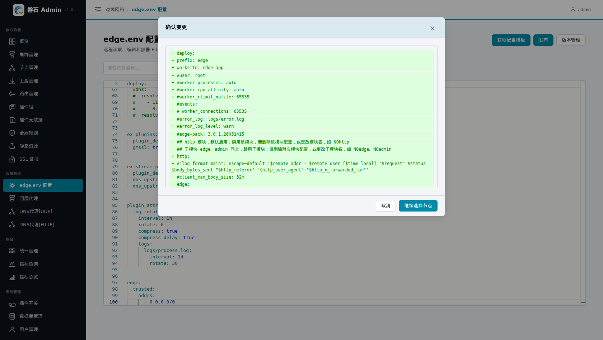
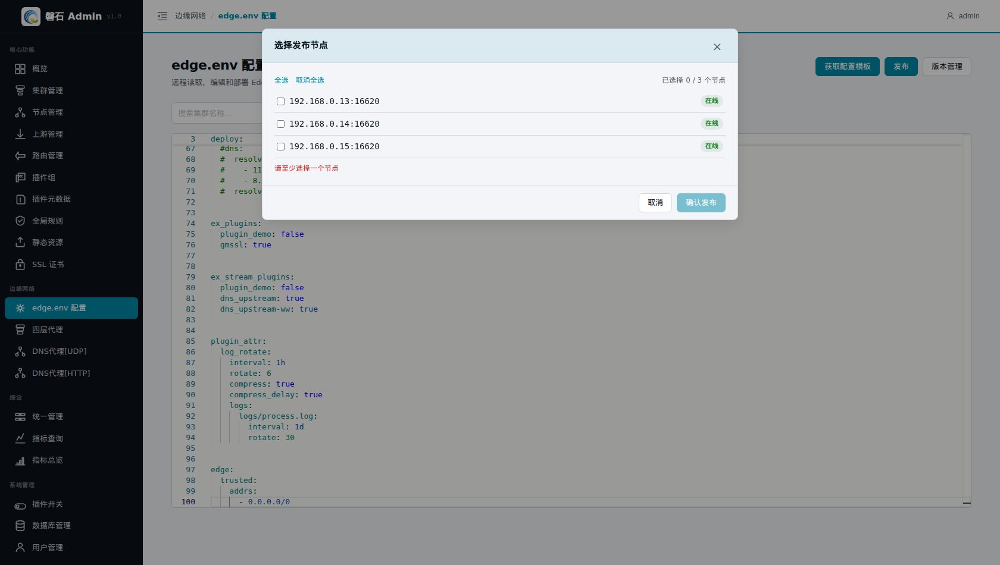
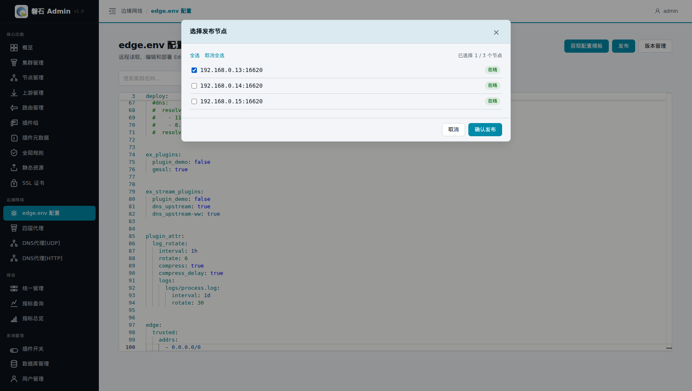
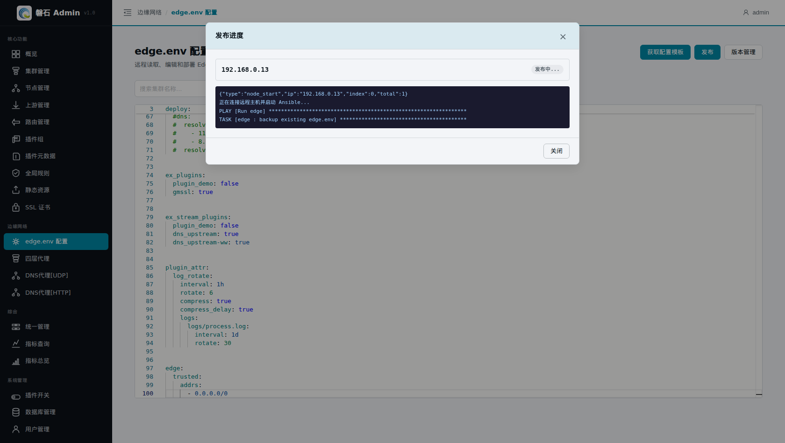

# 3. 修改 edge.env（新增监听端口）

> 本章场景：业务要求网关提供三种新能力——HTTPS 七层代理（端口 5000）、TCP 四层转发（端口 8880）、DNS 代理（UDP 53）。这些「网关监听哪些端口」的信息不在各功能页面里逐项配置，而是集中记录在每个节点上的 `edge.env` 文件中。本章通过平台远程读取 → 修改 → 发布这个文件，为后续章节打开端口。

# edge.env 是什么

`edge.env` 是 Edge 网关的核心配置文件，位于每个节点的 Edge 安装目录下，决定网关**监听哪些端口、启用哪些模块**。与本章相关的结构如下：

```yaml
deploy:
  http:                # 七层 HTTP 模块（默认启用）
    edge:              # 对外服务子模块
      listen:          # ← 对外服务端口列表
        - addr: 0.0.0.0:16610     # 现有 HTTP 端口
        - addr: 0.0.0.0:5000      # ← 本章新增
          ssl: true               # ← 该端口启用 HTTPS
    admin:
      listen:
        - addr: 0.0.0.0:16620     # 管理 API（即第 2 章节点的「管理端口」）
  stream:              # 四层 TCP/UDP 模块
    edge:
      listen:
        - addr: 0.0.0.0:53
          udp: true              # UDP 53：DNS 代理用（第 11 章）
        - addr: 0.0.0.0:8880     # ← 本章新增 TCP 8880（第 10 章）
```

关键规则：

| 配置点 | 说明 |
|---|---|
| `deploy.http.edge.listen[].addr` | HTTP 对外监听地址端口，可配多条 |
| `ssl: true` | 该端口启用 HTTPS；证书在第 9 章发布到节点后生效 |
| 模块名加 `NO` 前缀 = 禁用 | 如 `NOstream` 表示四层模块关闭；去掉 `NO` 即启用该模块 |
| `listen[].udp: true` | 该条监听走 UDP 而非 TCP |
| `deploy.http.admin.listen` | 管理 API 端口，对应第 2 章节点的「管理端口」 |

# 页面入口

点击左侧侧边栏：【边缘网络】-> 【edge.env 配置】：



页面顶部从左到右依次选择：集群 → 节点；右上角三个动作按钮：

| 按钮 | 作用 |
|---|---|
| 【获取配置模板】 | 通过 SSH 从所选节点读取当前 edge.env 到下方编辑器 |
| 【发布】 | 把编辑器内容推送到勾选的节点（自动生成版本记录，可回滚） |
| 【版本管理】 | 查看历史版本 / 回滚 |

选择集群与节点后：



# 操作步骤

## 3.1 读取当前配置

1. 选择集群「演示集群」，节点 `192.168.0.13:16620`；
2. 点击【获取配置模板】，平台通过 SSH 连接节点读取文件，弹窗实时显示执行日志：



3. 看到 `ok: [192.168.0.13]` 表示读取成功，点击【关闭】，内容已载入下方编辑器：


> ⚠️ 若读取失败：多为 SSH 不通（密钥未配置 / 端口不对）。可先手动把节点上的 edge.env 内容粘贴进编辑器继续本章操作。

## 3.2 修改三处

在编辑器中定位并修改（保持 YAML 缩进，两级空格）：

**① http.edge.listen 增加 5000 并启用 HTTPS：**

```yaml
      listen:
        - addr: 0.0.0.0:16610
        - addr: 0.0.0.0:5000     # ← 新增
          ssl: true              # ← HTTPS
```

**② stream.edge.listen 增加 TCP 8880：**

```yaml
      listen:
        - addr: 0.0.0.0:53
          udp: true
        - addr: 0.0.0.0:8880     # ← 新增（不带 udp 即为 TCP）
```

**③ 确认 UDP 53 存在**（演示环境已有；如无，按上面格式补一条 `- addr: 0.0.0.0:53` + `udp: true`）。

修改完成后的编辑器：



> 💡 编辑器支持 YAML 语法高亮；粘贴大段内容比逐字输入更不容易破坏缩进。

## 3.3 发布

1. 点击右上角【发布】，弹出【确认变更】框，绿色行为将写入的新增内容：



2. 点击【继续选择节点】，勾选要发布的节点。本章先只发 `.13` 一台验证，成功后再补其余两台：





3. 确认后弹出【发布进度】，实时显示每台节点的 Ansible 执行日志：



4. 结束后查看每台节点的结果：
   - 成功 = 配置已写入并自动重载网关；
   - 失败 = 显示具体错误（连接拒绝 / 认证失败等），修复后重新发布即可，不影响其他节点。

> ⚠️ 其余两台节点（.14 / .15）：重复 3.1~3.3，或在 3.3 第 2 步同时勾选三台一次发布。生产环境建议先发一台灰度验证，再全量发布。

# 验证

1. 再次点击【获取配置模板】，确认读回的内容包含 5000 和 8880；
2. 在能连通节点的机器上执行：

```bash
curl -sk -I https://192.168.0.13:5000/
timeout 3 bash -c 'cat < /dev/null > /dev/tcp/192.168.0.13/8880' && echo "TCP 8880 通"
```

预期结果：

1. 第一条返回 HTTP 响应头（证书未配置前 curl 加 `-k` 忽略告警，属正常）；
2. 第二条输出 `TCP 8880 通`。

📷 截图待补充：（版本管理弹窗，显示本次发布生成的 v1 记录）

# 本章小结

- edge.env 决定网关「听什么端口、开什么模块」，改动流程固定为：**读取 → 编辑 → 发布（选节点）→ 验证**
- 每次发布自动生成版本，可在【版本管理】中回滚
- 本章打开的 5000(HTTPS) / 8880(TCP) / 53(UDP) 将分别在第 8、10、11 章被业务配置使用

下一步：[第 4 章 建立全局规则](04-global-rules.md)
