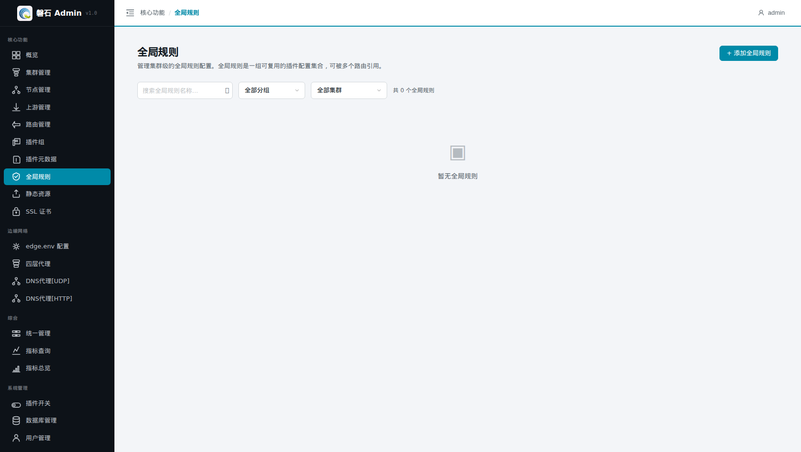
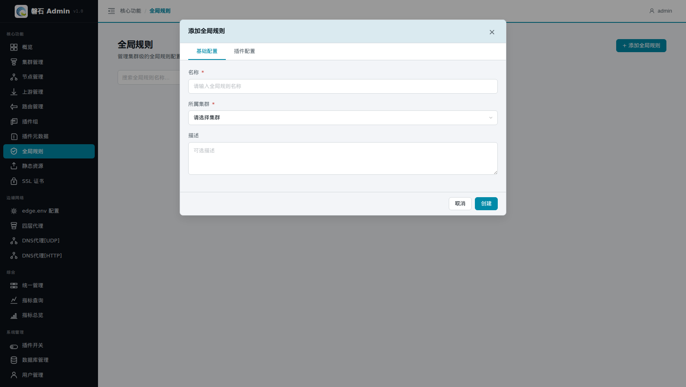
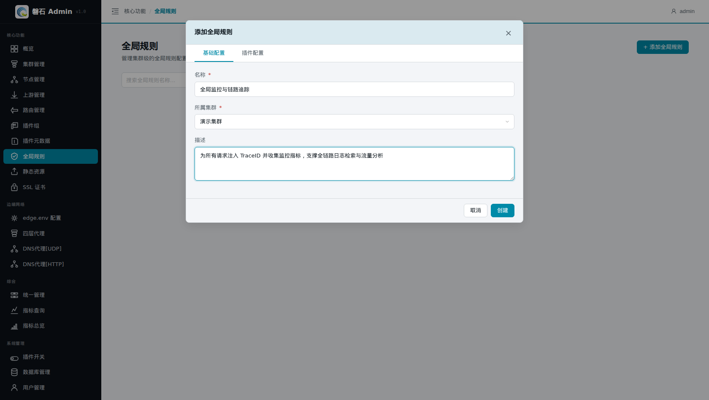
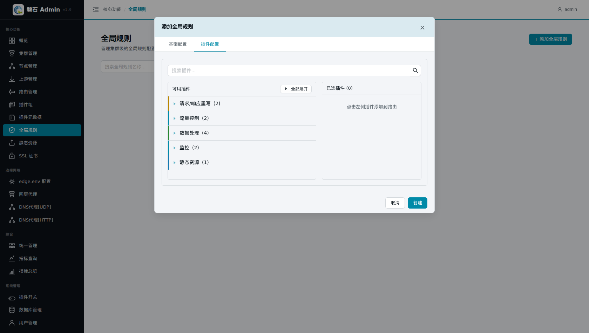
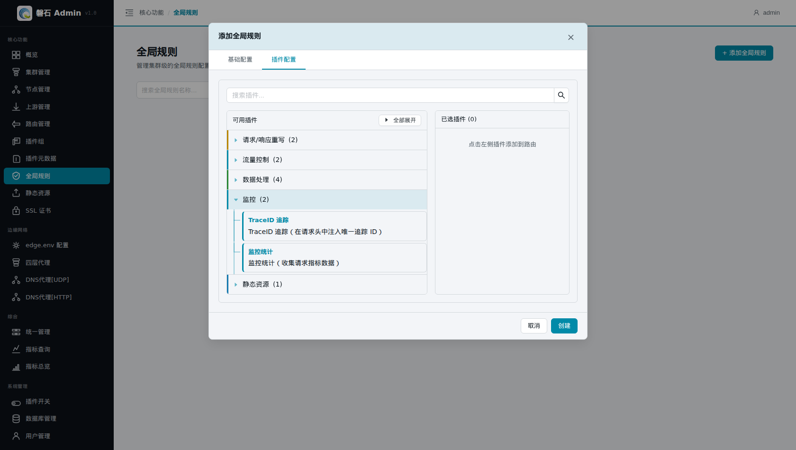
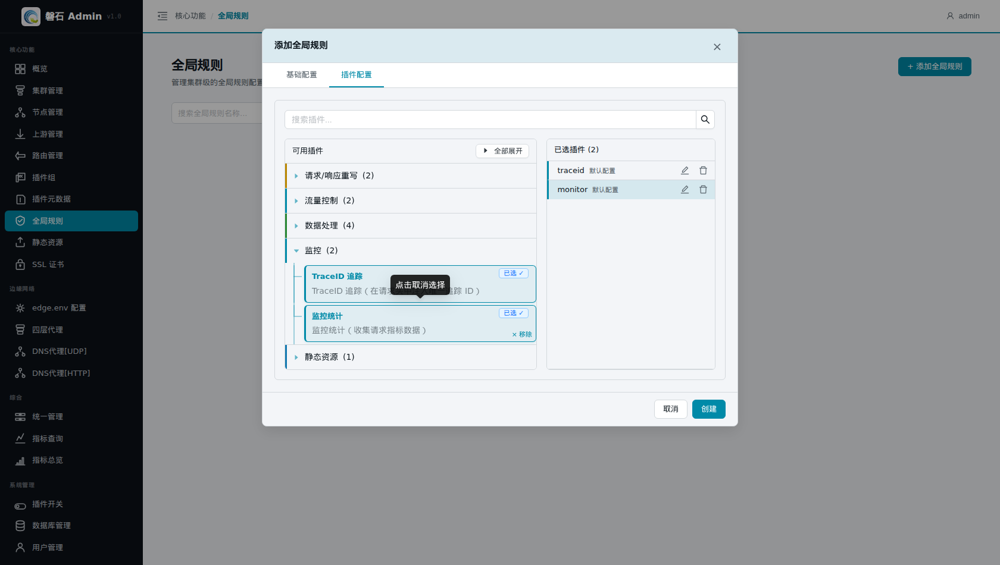
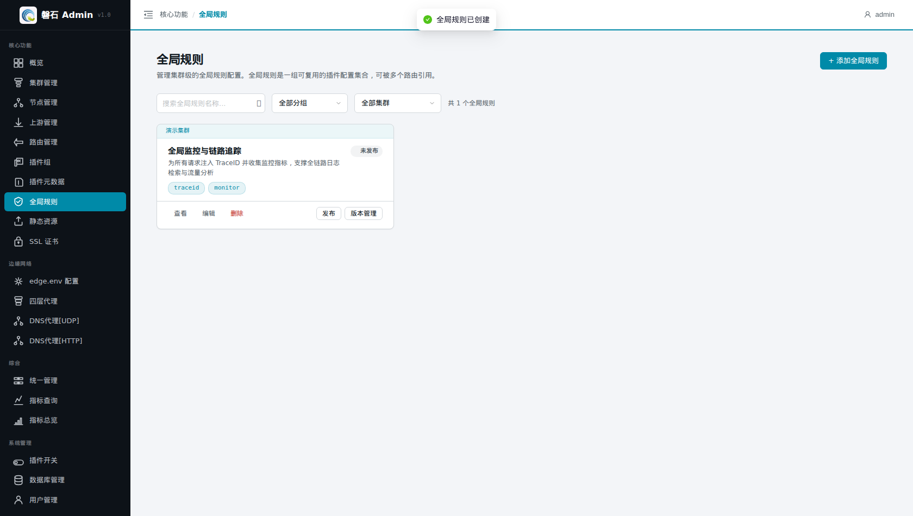
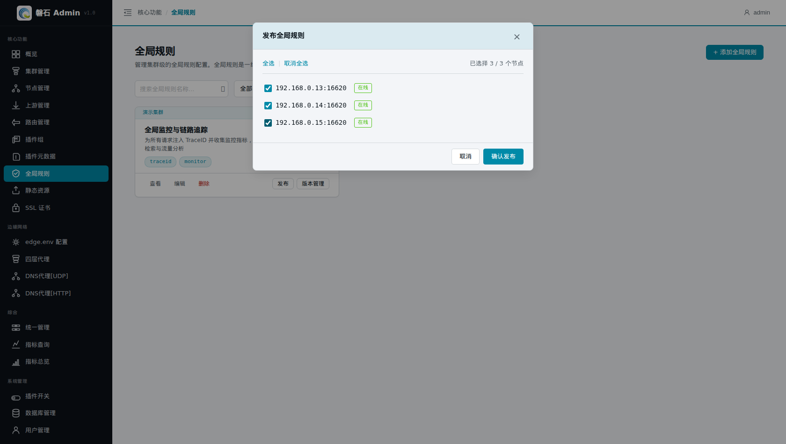
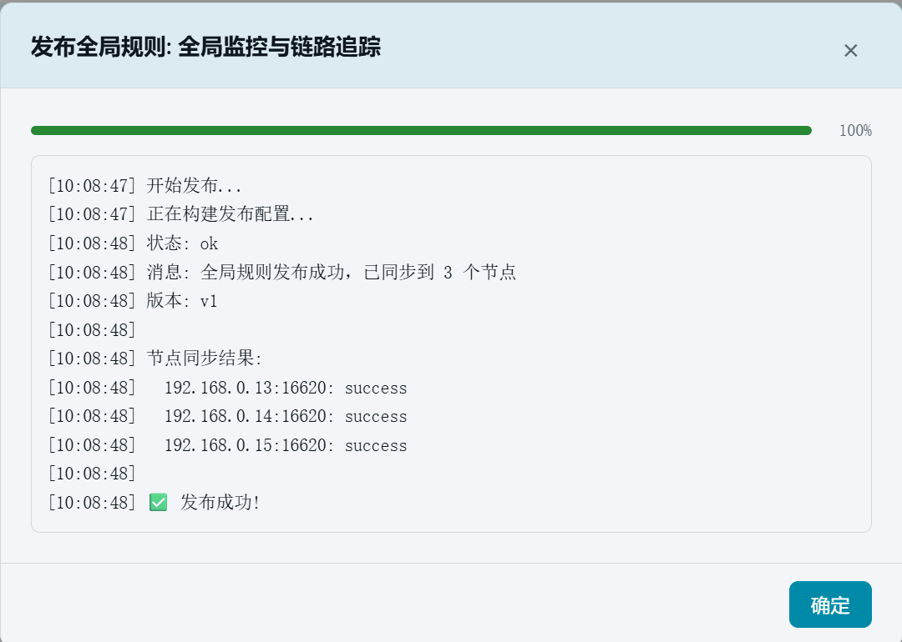

# 4. 建立全局规则

> 本章场景：我们希望所有经过网关的请求都自动带上 TraceID（便于全链路日志检索），并收集监控指标（请求量、耗时等）。这类"对所有请求生效"的能力不适合在每条路由上重复配置——全局规则就是干这个的。本章创建一条包含 traceid 和 monitor 两个插件的全局规则并发布。

## 4.1 全局规则是什么

**全局规则 = 挂在集群上、对所有请求自动生效的插件集合。**

- 全局规则内的插件无需在每条路由上单独挂载——集群下的所有路由都会自动执行；
- 典型用途：链路追踪（traceid）和监控统计（monitor）这类横切能力；
- 与路由级插件的区别：路由插件只影响命中该路由的请求，全局规则对集群内全部请求生效；
- 与插件组的区别：插件组需要路由手动引用才生效，全局规则自动全局生效。

## 4.2 创建全局规则

点击左侧侧边栏：【核心功能】-> 【全局规则】，在右侧内容区右上角点击【+ 添加全局规则】：

在弹出的【添加全局规则】窗口中，先填写基本信息：

| 字段 | 本例填写 | 说明 |
| --- | --- | --- |
| 全局规则名称 \* | 全局监控与链路追踪 | 规则的显示名称，便于在列表中识别 |
| 集群 \* | 演示集群 | 规则所属的集群；生效范围限于该集群 |
| 描述 | 为所有请求注入 TraceID 并收集监控指标，支撑全链路日志检索与流量分析 | 可选备注 |

> ⚠️ 注意：全局规则只在绑定的集群内有效。如需在另一个集群使用同样规则，需重新创建。

## 4.3 选择插件

切换到【插件配置】tab：

页面分左右两栏：

- **左栏（可用插件）**：按分类列出所有内置插件，点击分类标题展开/折叠；
- **右栏（已选插件）**：当前已选择的插件列表，显示插件名称和配置状态。

展开【监控】分类，可以看到两个插件：

| 插件 | 说明 |
| --- | --- |
| TraceID 追踪 | 在请求头中注入唯一追踪 ID，用于全链路日志检索 |
| 监控统计 | 收集请求指标数据（TPS、RT、带宽等） |

依次点击两个插件卡片，它们会移入右栏：

右栏显示：

| 已选插件 | 配置状态 |
| --- | --- |
| traceid | 默认配置（无需自定义，点编辑可查看） |
| monitor | 默认配置 |

> 💡 如需自定义插件行为（如 traceid 的 header 名），点击已选插件右侧的编辑图标（✏️）进入配置编辑。本例保持默认。

## 4.4 创建

确认无误后点击【创建】：

卡片上显示两个插件标签：`traceid` + `monitor`，状态为「未发布」。

## 4.5 发布

点击卡片上的【发布】按钮，弹出节点选择窗口：

| 操作 | 说明 |
| --- | --- |
| 全选 | 勾选集群内所有节点 |
| 勾选框 | 手动选择要发布到的节点 |
| 在线 | 节点管理端口可达，可以发布 |

本例勾选全部 3 个节点，点击【确认发布】：

发布完成后弹出结果摘要：

- ✅ 192.168.0.13:16620 — success
- ✅ 192.168.0.14:16620 — success
- ✅ 192.168.0.15:16620 — success

> ⚠️ 如果出现「部分成功」，例如：
- ❌ 192.168.0.14:16620 — failed（Connection refused，管理端口未响应）
说明某台节点管理端口可能不通，需要修复该节点后重新发布。其余节点不受影响。

## 4.6 验证

1. 列表中卡片状态已更新为「已发布 v1」；
2. 点击卡片上的【查看】可确认插件列表包含 traceid 和 monitor；
3. 点击【版本管理】可查看发布历史。

## 4.7 本章小结

- 全局规则 = 挂在集群上、对所有请求自动生效的插件集合
- 创建流程：基本信息 → 插件配置 → 选插件 → 创建 → 发布
- traceid（链路追踪）+ monitor（监控统计）是全局规则的典型搭配
- 部分节点发布失败不影响其余节点，修复后可重新发布

下一步：[第 5 章 配置插件元数据](05-plugin-metadata.md)
