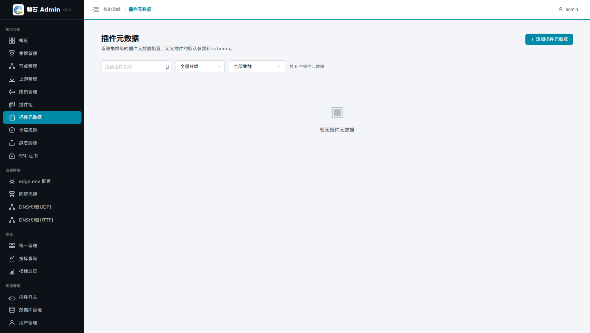
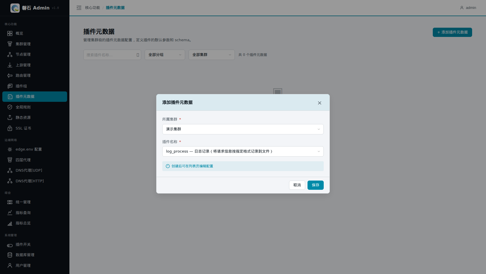
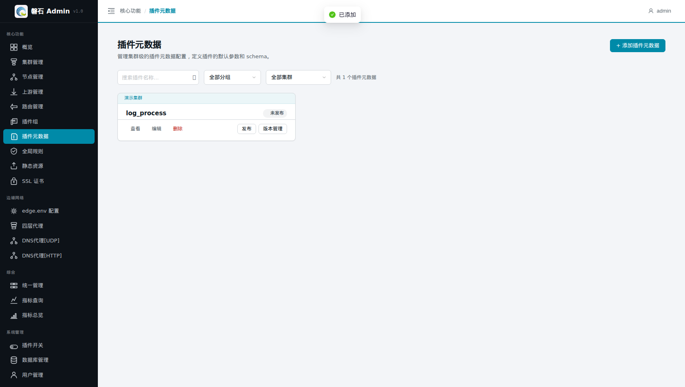
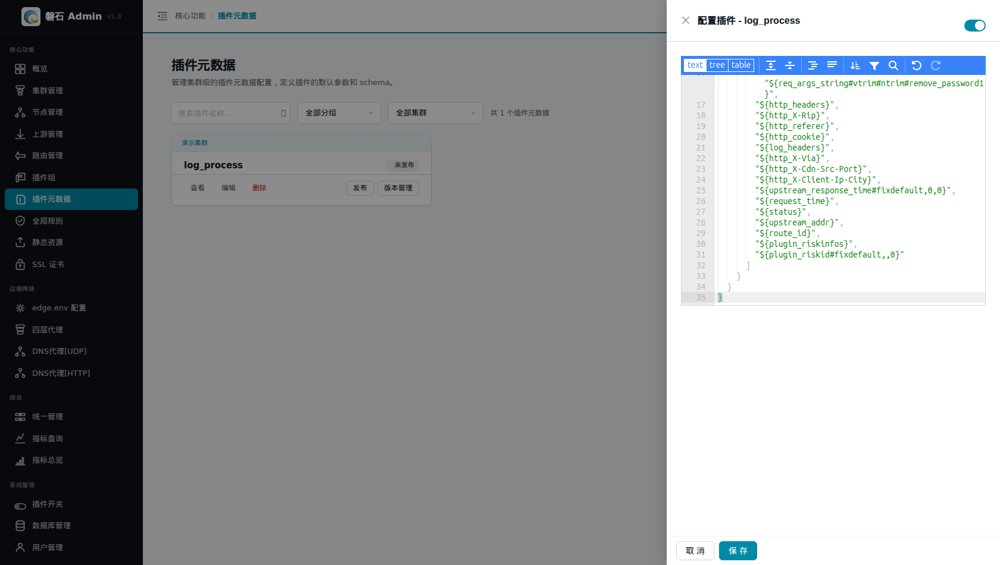
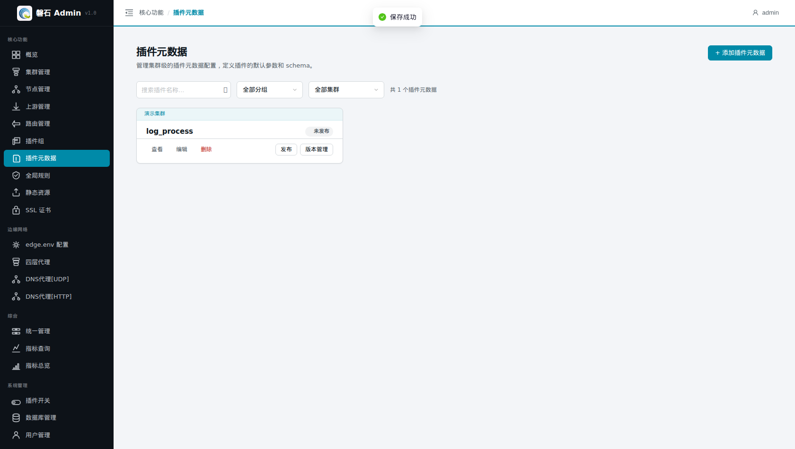
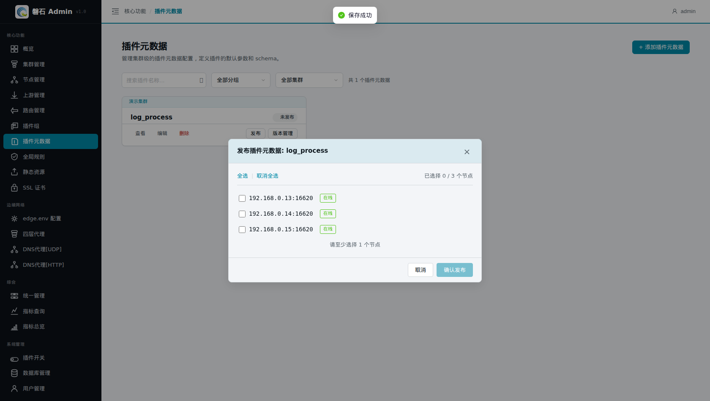
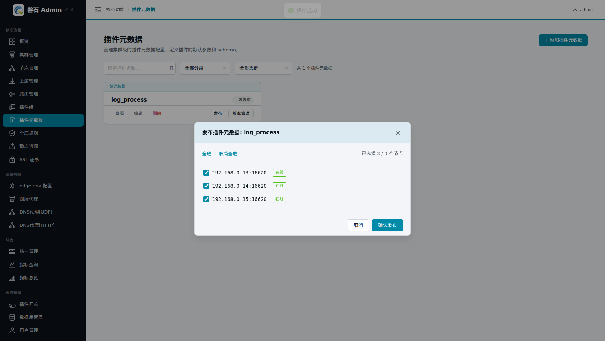
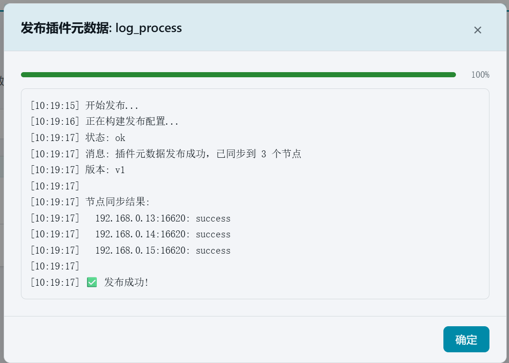

# 5. 配置插件元数据

> 本章场景：日志插件（log_process）默认只把请求信息按简单格式记录到 `logs/process.log`。我们希望所有网关日志都按统一格式记录——包含 TraceID、用户名、URI、状态码、耗时等 27 个字段，便于后续的日志检索与安全分析。这类"插件的全局默认参数"就是通过**插件元数据**来配置的。

# 插件元数据是什么

插件元数据（Plugin Metadata）是某个插件在**集群级别**的全局属性配置：

- **作用范围**：对整个集群生效。凡是引用了该插件的路由、插件组，都会继承这份元数据定义。
- **典型用途**：为日志插件定义统一的日志格式（formats）；一般也只需要为日志插件设置元数据，其他插件保持默认即可。
- **与插件配置的区别**：路由/插件组里的"插件配置"是某条具体规则的行为参数；而"插件元数据"是插件本身的全局定义（如日志格式），两者配合使用。

> 💡 日志插件的元数据内容是固定的 JSON 模板，其中各字段（`${...}` 格式串）可以根据需要增减。

# 创建插件元数据

1. 点击左侧侧边栏：【核心功能】→【插件元数据】，进入插件元数据页面。



2. 点击右上角【+ 添加插件元数据】按钮，弹出创建对话框。
3. 选择所属集群：本例选择【演示集群】。
4. 选择插件名称：在下拉框中选择【log_process — 日志记录（将请求信息按指定格式记录到文件）】。



5. 点击【保存】。创建完成后可在列表页继续编辑配置。



# 填写日志格式（JSON）

1. 在列表卡片上点击【编辑】，打开"配置插件 - log_process"抽屉。
2. 抽屉右上角有表单/JSON 切换开关，切换到 **JSON 模式**。
3. 将以下固定 JSON 粘贴到 JSON 输入框中（字段可按需增减）：

```json
{
    "logs": {
        "logs/process.log": {
            "formats": [
                "${req_start_time#time_format,%Y%m%d%H%M%S}",
                "${http_x-edge-traceid}",
                "${username}",
                "${username_isvalid#fixdefault,,0}",
                "${http_cdn-src-ip}",
                "${deviceid}",
                "${deviceid_flag_suspicion}",
                "${deviceid_dfp.incode_info}",
                "${cookie_JSESSIONID}",
                "${method}",
                "${uri}",
                "${req_args_string#vtrim#ntrim#remove_password1}",
                "${http_headers}",
                "${http_X-Rip}",
                "${http_referer}",
                "${http_cookie}",
                "${log_headers}",
                "${http_X-Via}",
                "${http_X-Cdn-Src-Port}",
                "${http_X-Client-Ip-City}",
                "${upstream_response_time#fixdefault,0,0}",
                "${request_time}",
                "${status}",
                "${upstream_addr}",
                "${route_id}",
                "${plugin_riskinfos}",
                "${plugin_riskid#fixdefault,,0}"
            ]
        }
    }
}
```



4. 点击【保存】，提示"保存成功"。



> 💡 常用字段说明：
>
> | 字段 | 含义 |
> |---|---|
> | `${http_x-edge-traceid}` | 请求头中的 TraceID（配合第 4 章全局规则的 traceid 插件实现全链路检索） |
> | `${username}` / `${username_isvalid}` | 认证用户名及其有效性 |
> | `${method}` / `${uri}` / `${status}` | 请求方法、URI、响应状态码 |
> | `${request_time}` / `${upstream_response_time}` | 请求总耗时、上游响应耗时 |
> | `${http_cdn-src-ip}` / `${http_X-Client-Ip-City}` | 客户端来源 IP / 城市 |
> | `${route_id}` | 命中的路由 ID |

# 发布

元数据保存后处于"未发布"状态，需要发布到节点才会实际生效：

1. 在列表卡片上点击【发布】。
2. 在弹出的节点选择窗口中勾选目标节点（本例点击【全选】选中全部 3 个节点）。





3. 点击【确认发布】，系统开始向各节点同步配置。



> ⚠️ 与全局规则一样，如果出现「部分成功」，说明某台节点管理端口可能不通，需要修复该节点后重新发布。其余节点不受影响。

# 验证

1. 发布完成后，列表卡片显示【已发布】徽标及版本号（v1）。

# 本章小结

- 插件元数据 = 插件的集群级全局属性；一般只需为日志插件 log_process 设置。
- 日志格式是固定 JSON 模板，`${...}` 字段可按需增减。
- 保存后必须发布到节点才生效；出现"部分成功"时修复失败节点后重新发布即可。

下一步：[6. 创建插件组（含日志插件）](06-plugin-configs.md)
