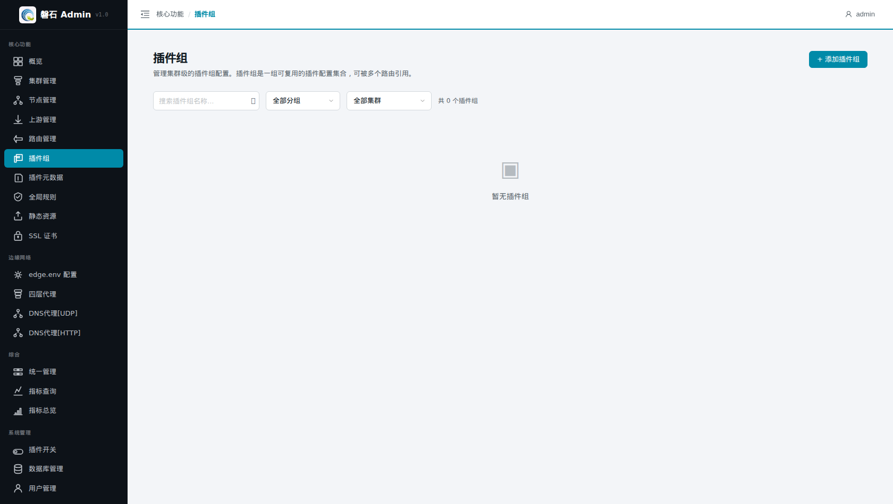
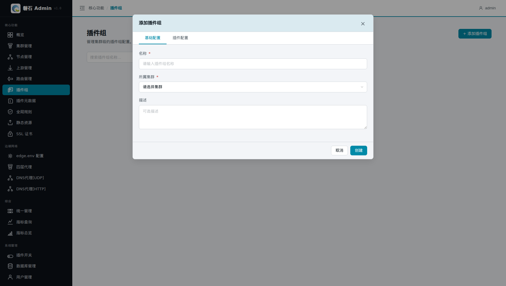
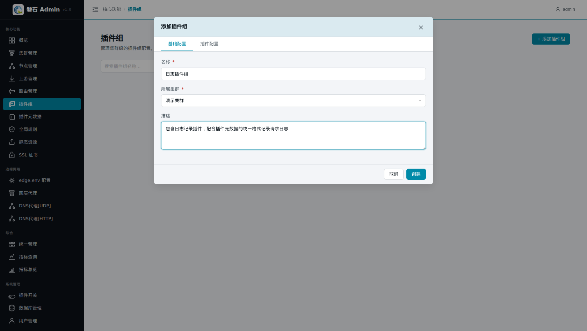
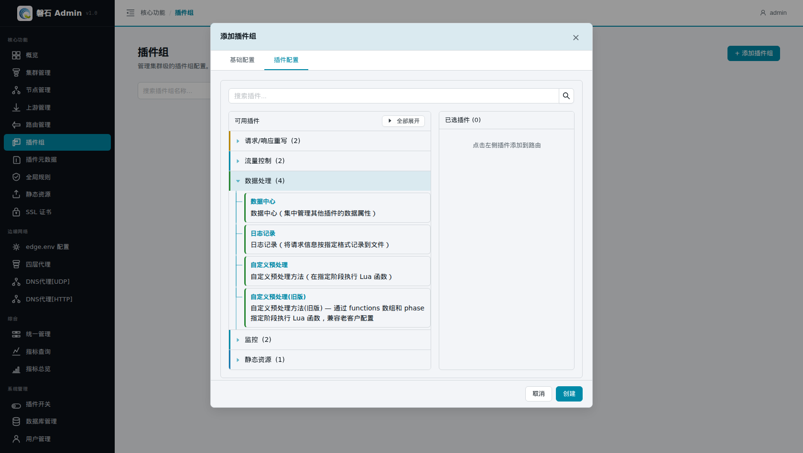
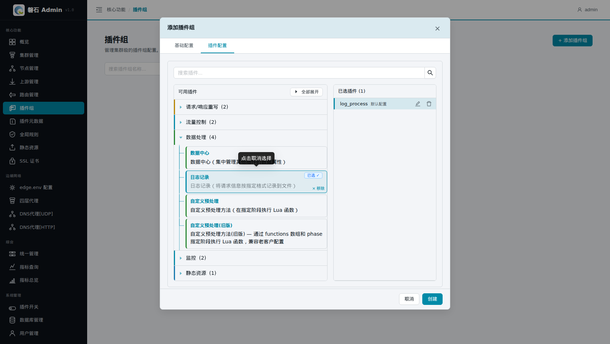
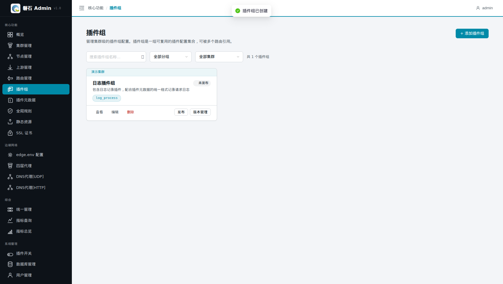
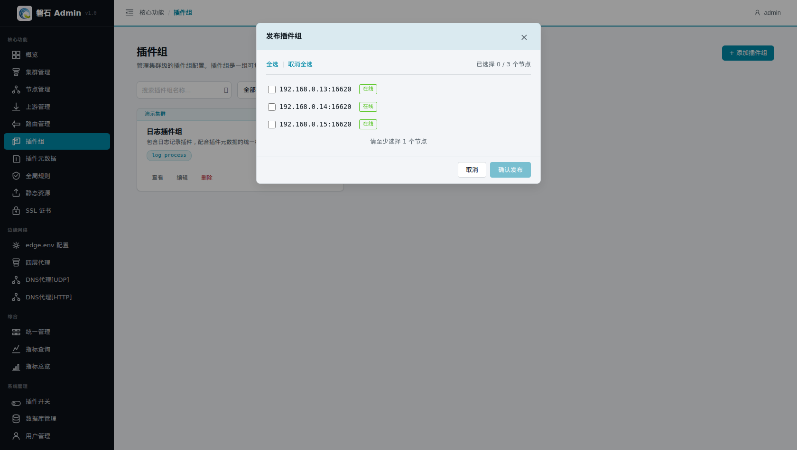
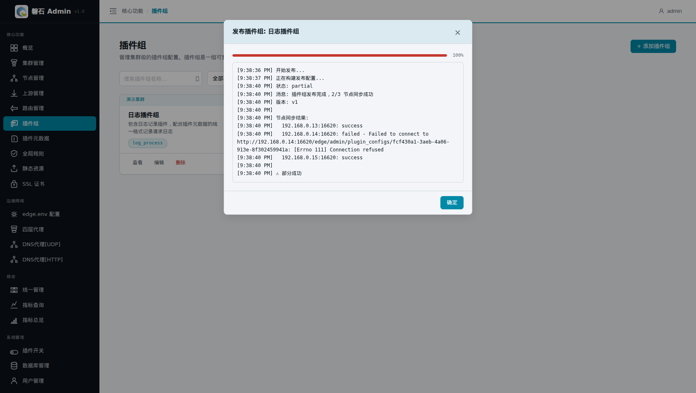

# 6. 创建插件组（含日志插件）

> 本章场景：我们希望凡是绑定某个"插件组合"的路由，都自动按第 5 章定义的统一格式记录日志。把日志插件打包成一个**插件组**，路由引用插件组即可一次启用整组插件——后续加路由时不必逐个挑插件。

# 插件组是什么

插件组（Plugin Group）是一组**可复用的插件配置集合**：

- **作用范围**：集群级别。一个插件组可以被多条路由引用。
- **与插件元数据的配合**：插件元数据（第 5 章）定义插件的"全局属性"（如日志格式）；插件组决定"哪些插件被一起启用"。两者配合：路由 → 插件组 → 日志插件 → 按元数据格式写日志。
- **与全局规则的区别**：全局规则对所有请求自动生效；插件组只对**引用了它的路由**生效，更灵活。

# 创建插件组

1. 点击左侧侧边栏：【核心功能】→【插件组】，进入插件组页面。



2. 点击右上角【+ 添加插件组】按钮，弹出创建对话框。



3. 填写基本信息：
   - 名称：`日志插件组`
   - 所属集群：【演示集群】
   - 描述：`包含日志记录插件，配合插件元数据的统一格式记录请求日志`



# 选择插件

1. 切换到【插件配置】标签页。
2. 展开【数据处理】分类（日志记录插件属于该分类）。



3. 点击【日志记录】卡片，右侧"已选插件"面板出现 `log_process`（默认配置）。



> 💡 本例保持 log_process 默认配置即可——日志格式由第 5 章的插件元数据统一控制。如需为某条路由单独调整行为参数，可在已选插件右侧点击编辑图标（✏️）修改。

# 创建

点击右下角【创建】按钮。创建完成后，列表中出现"日志插件组"卡片，显示 `log_process` 标签，状态为"未发布"。



# 发布

与前面章节一样，插件组需要发布到节点才会实际生效：

1. 在列表卡片上点击【发布】。
2. 在弹出的节点选择窗口中勾选目标节点（本例点击【全选】选中全部 3 个节点）。



3. 点击【确认发布】，系统开始向各节点同步配置。



> ⚠️ 「部分成功」属正常现象：某台节点管理端口不通时，其余节点不受影响。修复该节点后可重新发布。

# 验证

1. 发布完成后，卡片显示【已发布】徽标及版本号（v1）。
2. 通过 API 确认插件组内容：

```bash
curl -s http://localhost:12344/api/v1/plugin_configs?cluster_id=<集群ID> \
  -H "Authorization: Bearer <token>"
```

预期结果：

- 返回列表中包含名称为"日志插件组"的记录；
- 其 `plugins` 字段包含 `log_process`；
- 卡片状态为"已发布 v1"。

# 本章小结

- 插件组 = 一组可复用的插件配置集合，供多条路由引用。
- 本例创建了包含日志插件的"日志插件组"，与第 5 章的元数据配合实现统一格式日志。
- 保存后必须发布到节点才生效；"部分成功"时修复失败节点后重新发布即可。

下一步：[7. 创建上游](07-upstreams.md)
