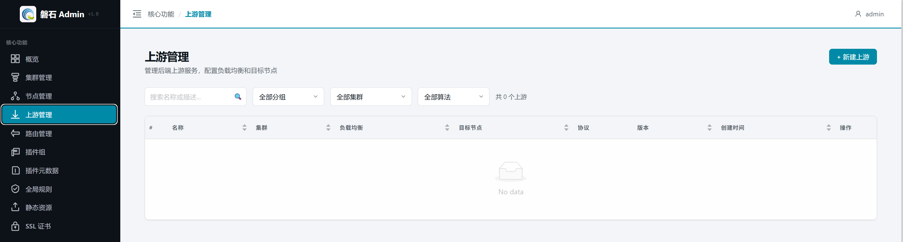
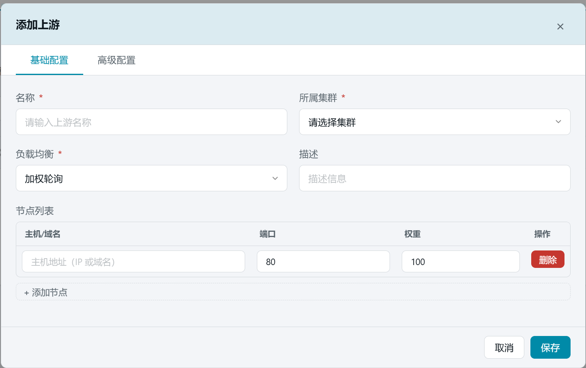
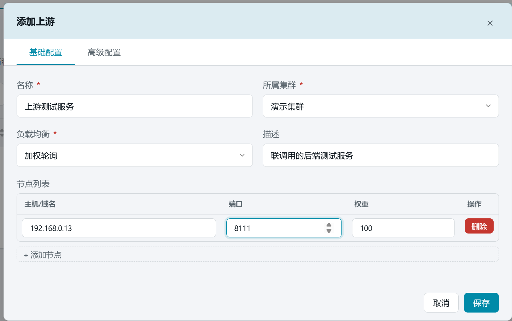
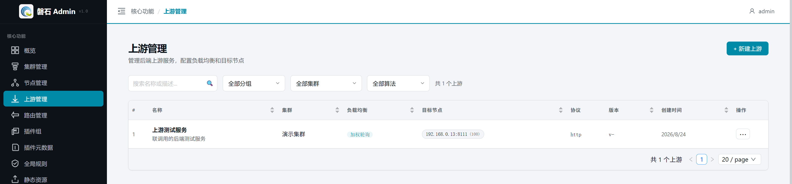
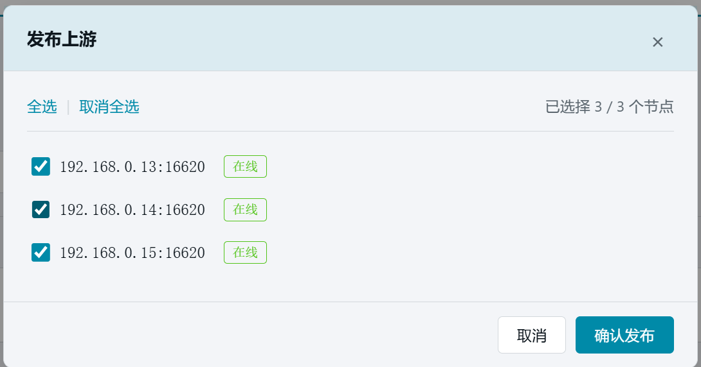
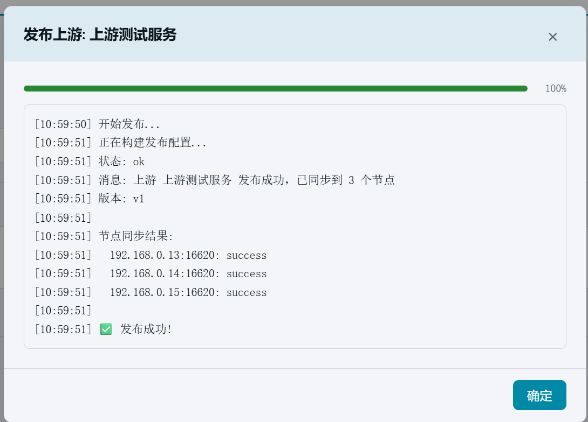

# 7. 添加上游

> 本章场景：路由需要转发到真实的后端服务。我们在本地起一个简单的测试服务（`127.0.0.1:8111`），在磐石Admin 中把它登记为"上游"，供第 8 章的路由引用。

# 准备本地测试服务

在管理机上启动一个简单的 HTTP 服务用于联调验证：

```bash
mkdir -p /tmp/upstream8111 && echo '<h1>Hello from 127.0.0.1:8111</h1>' > /tmp/upstream8111/index.html
cd /tmp/upstream8111 && nohup python3 -m http.server 8111 --bind 127.0.0.1 &
```

验证服务可访问：

```bash
curl http://127.0.0.1:8111/
# <html><body><h1>Hello from 127.0.0.1:8111</h1></body></html>
```

# 上游是什么

上游（Upstream）是后端服务的集合定义：

- **作用范围**：集群级别，供该集群下的路由引用。
- **核心内容**：一组后端节点（主机:端口）+ 负载均衡策略。
- **与路由的关系**：路由只声明"转发到哪个上游"，具体转发到哪台后端、按什么权重分配，由上游决定。

# 创建上游

1. 点击左侧侧边栏：【核心功能】→【上游管理】，进入上游管理页面。



2. 点击右上角【+ 新建上游】按钮，弹出创建对话框。



3. 填写基础配置：

   | 字段 | 本例填写 | 说明 |
   |---|---|---|
   | 名称 | `本地测试服务` | 上游的唯一标识，路由引用时使用 |
   | 所属集群 | 【演示集群】 | 创建后不可修改 |
   | 负载均衡 | 加权轮询（默认） | 可选：加权轮询 / 一致性哈希 / 延迟最小 / 最少连接 |
   | 描述 | `本地联调用的后端测试服务` | 备注信息 |

4. 在【节点列表】表格中填写后端节点：

   | 主机/域名 | 端口 | 权重 |
   |---|---|---|
   | `127.0.0.1` | `8111` | `100` |

   > 💡 多个后端节点可点击【+ 添加节点】继续追加；权重越高分到的请求越多。本例单节点，权重保持默认 100。



5. 点击【保存】。创建完成后，列表中出现"本地测试服务"，状态为"未发布"。



> ⚠️ 高级配置（健康检查、超时、重试、keepalive 连接池等）本例保持默认即可，需要时可稍后在编辑中开启。

# 发布

与前面章节一样，上游需要发布到节点才会实际生效：

1. 在列表行点击【发布】，弹出节点选择窗口。
2. 点击【全选】选中全部 3 个节点。



3. 点击【确认发布】，等待发布结果。



> ⚠️ 「部分成功」属正常现象：某台节点管理端口不通时，其余节点不受影响。修复该节点后可重新发布。

# 验证

1. 发布完成后，列表行显示版本号（v1）。
2. 通过 API 确认上游内容：

```bash
curl -s http://localhost:12344/api/v1/upstreams?cluster_id=<集群ID> \
  -H "Authorization: Bearer <token>"
```

预期结果：

- 返回列表中包含名称为"本地测试服务"的记录；
- 其目标节点为 `127.0.0.1:8111`（权重 100）；
- 列表行状态为"已发布 v1"。

# 本章小结

- 上游 = 后端节点集合 + 负载均衡策略，供路由引用。
- 本例登记了本地测试服务 `127.0.0.1:8111`（加权轮询，权重 100）。
- 保存后必须发布到节点才生效；"部分成功"时修复失败节点后重新发布即可。

下一步：[8. 创建路由并绑定插件组](08-routes.md)
