# 8. 添加路由

> 本章场景：前面已经准备好了上游（第 7 章）、插件组（第 6 章）和插件元数据（第 5 章）。现在创建一条路由把它们串起来：请求 `/api/*` 且到达指定端口时，转发到"测试服务"，同时执行自定义预处理逻辑并按统一格式记录日志。

## 8.1 路由是什么

路由（Route）是网关的核心规则，定义"什么样的请求 → 转发到哪里 → 附加哪些处理"：

- **匹配条件**：URI（如 `/api/*`）+ 请求方法（GET/POST 等），可选高级匹配（如按端口、请求头过滤）。
- **转发目标**：引用一个上游（第 7 章），由上游决定后端节点与负载均衡。
- **附加处理**：路由级插件 + 关联的插件组（第 6 章），插件元数据（第 5 章）提供全局属性。

## 8.2 创建路由

1. 点击左侧侧边栏：【核心功能】→【路由管理】，进入路由管理页面。

   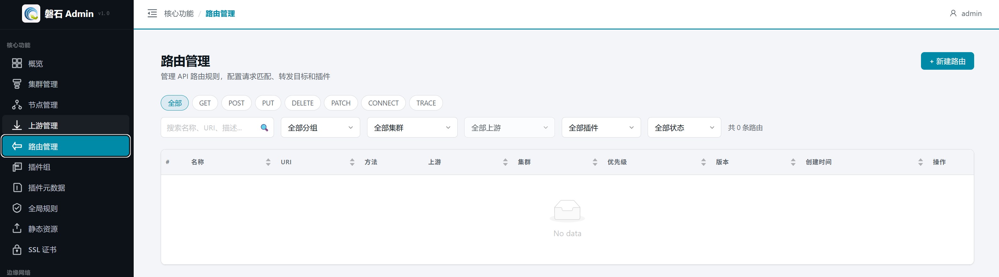

2. 点击右上角【+ 新建路由】按钮，弹出创建对话框。

   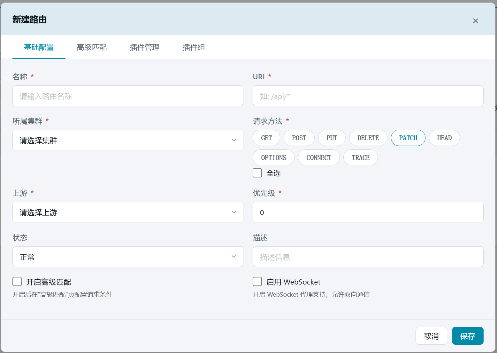

3. 填写基础配置：

   | 字段 | 本例填写 | 说明 |
   | --- | --- | --- |
   | 名称 | `API路由` | 路由的唯一标识 |
   | URI | `/*` | 匹配路径，`*` 为通配符；必须以 `/` 开头 |
   | 所属集群 | 【演示集群】 | 创建后不可修改 |
   | 请求方法 | 全选 | 至少选择一种；点击方法标签进行勾选 |
   | 上游 | 【上游测试服务】 | 第 7 章创建的上游，必填 |
   | 优先级 | `0`（默认） | 数字越大优先级越高，多个路由都匹配时按优先级转发 |
   | 状态 | 正常（默认） | 禁用后路由不生效 |
   | 描述 | 可留空 | 备注信息 |
   | 开启高级匹配 | ✅ 勾选 | 开启后在"高级匹配"页配置额外请求条件（本例按端口匹配） |

   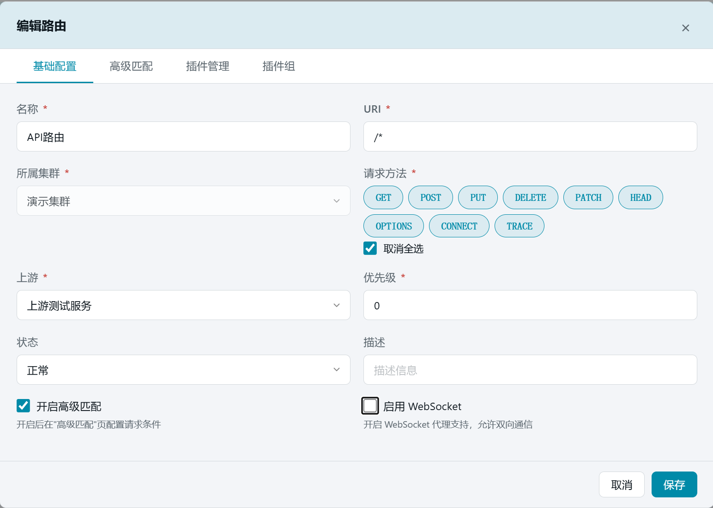

## 8.3 配置高级匹配（按端口匹配）

"开启高级匹配"勾选后，可切换到【高级匹配】标签页，在 URI/方法之外增加更细的匹配条件：

1. 切换到【高级匹配】标签页。
2. 点击【添加匹配条件】，出现一条规则行。
3. 按下表填写：

   | 配置项 | 本例选择/填写 | 说明 |
   | --- | --- | --- |
   | 类型 | 【内置参数】 | 支持请求头 / 查询参数 / POST参数 / Cookie / 内置参数 |
   | 名称 | `server_port` | Nginx 内置变量，本例表示"请求到达的监听端口" |
   | 运算符 | 【== 等于】 | 另有 ==*（忽略大小写）、!=、>、< 等可选 |
   | 匹配值 | `16610` | 只有到达 16610 端口的请求才命中本路由 |

   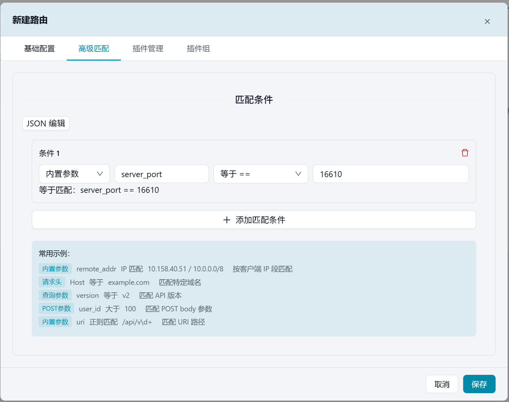

   > 💡 这条规则的含义：URI 匹配 `/api/*` **且** 请求端口为 16610 时才走本路由。利用内置变量可以实现"同一路径、不同端口 → 不同上游"的分流效果。常用内置变量还有 `server_addr`（监听地址）、`http_x_forwarded_for`（客户端链路 IP）等。

## 8.4 配置插件（本例使用【自定义预处理】插件来演示）

1. 切换到【插件管理】标签页。
2. 展开【数据处理】分类，找到【自定义预处理】插件（在指定阶段执行 Lua 函数）。

   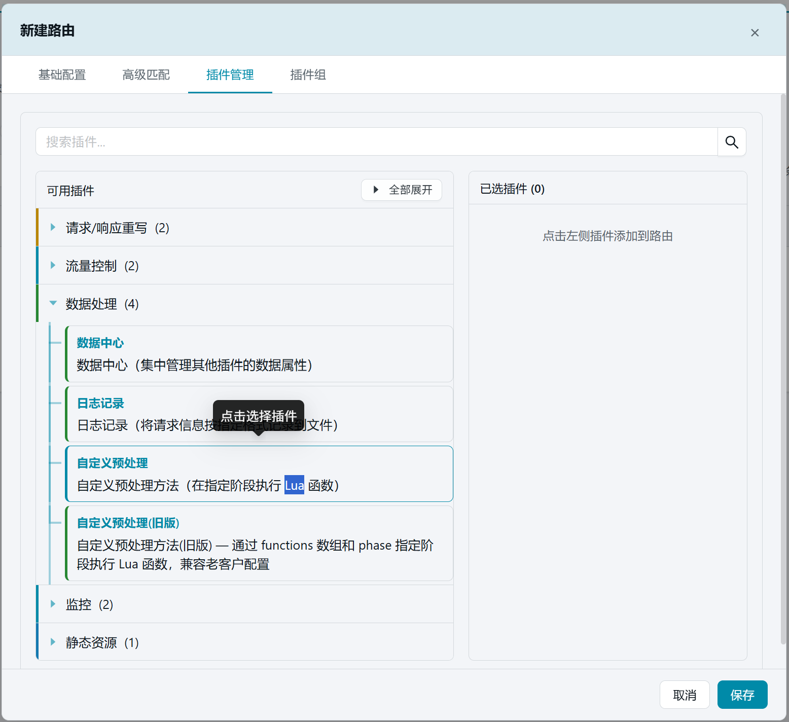

3. 点击卡片选中该插件。

   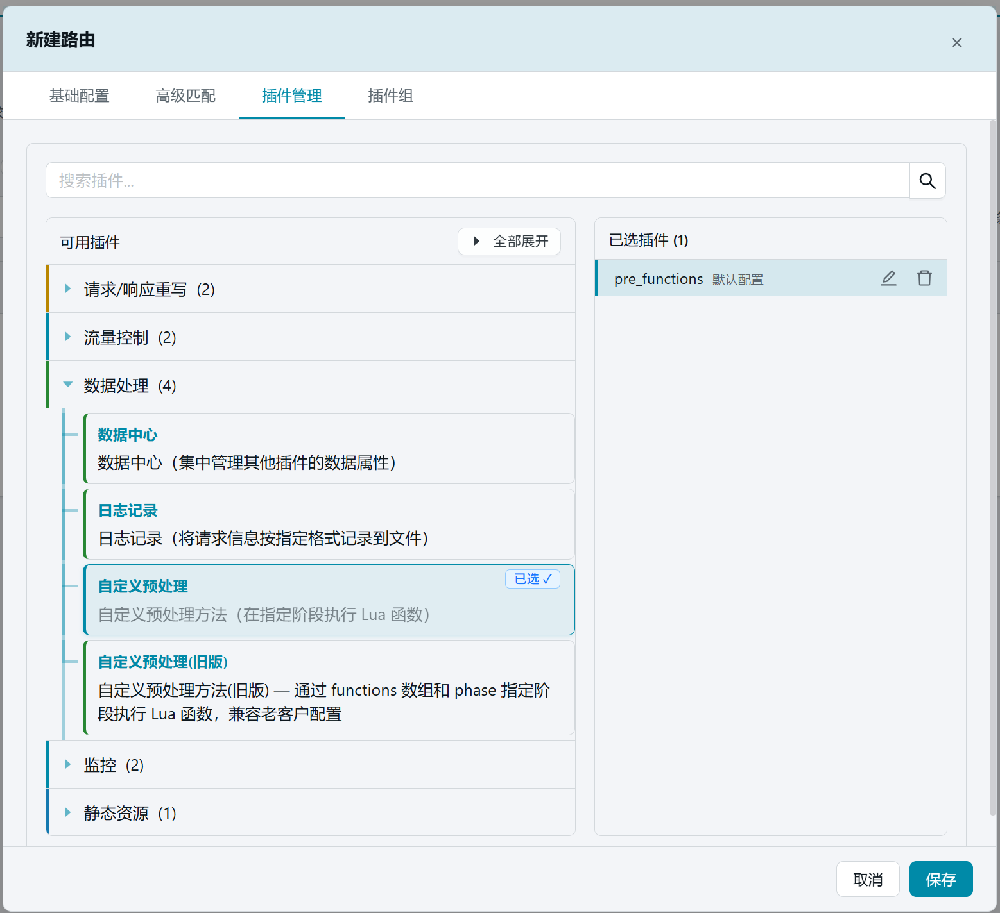

4. 如需自定义逻辑，点击已选插件右侧编辑图标（✏️），在对应阶段填入 Lua 函数。本例在 `rewrite` 阶段添加一条示例：

```json
{
  "rewrite": [
    "return function(conf, ctx) ngx.log(ngx.ERR, 'hello'); end"
  ]
}
```

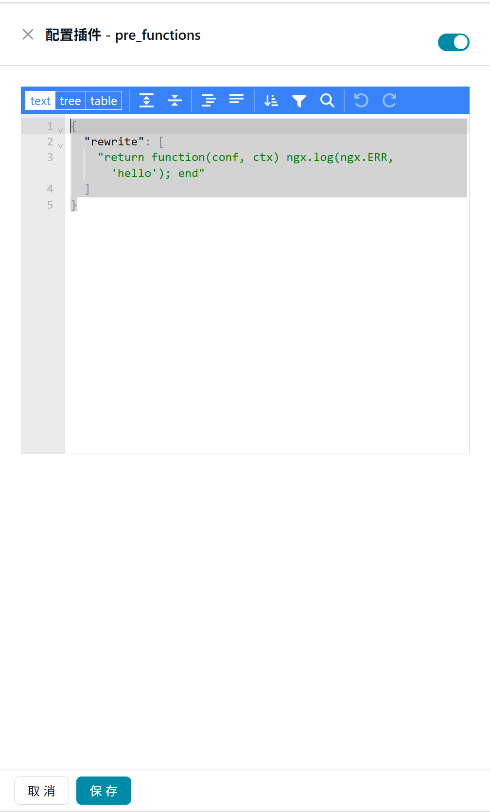

> 💡 自定义预处理支持 5 个阶段：`rewrite`（重写）、`access`（访问控制，可中断请求）、`header_filter`（响应头过滤）、`body_filter`（响应体过滤）、`log`（日志）。各阶段均为 Lua 函数数组，按需填写即可。

## 8.5 绑定插件组

1. 切换到【插件组】标签页。
2. 勾选【日志插件组】（第 6 章创建）。插件组的配置会合并到路由中——本路由的请求将按第 5 章元数据定义的统一格式记录日志。

   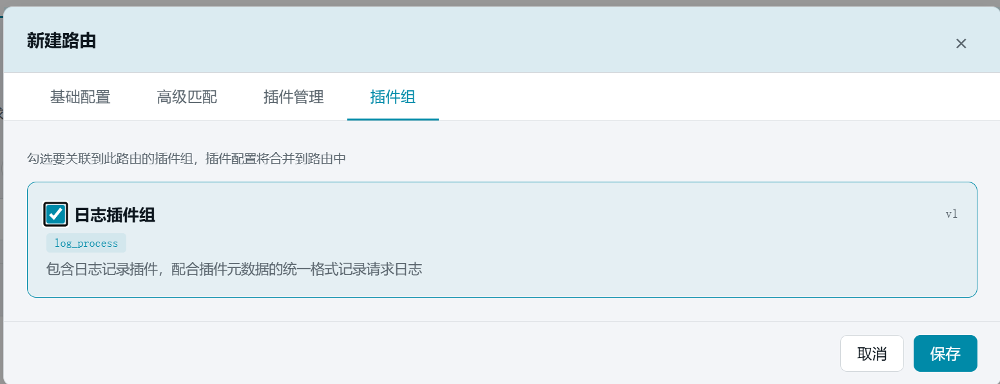

## 8.6 创建

点击右下角【保存】按钮。创建完成后，列表中出现"API路由"，状态为"未发布"。

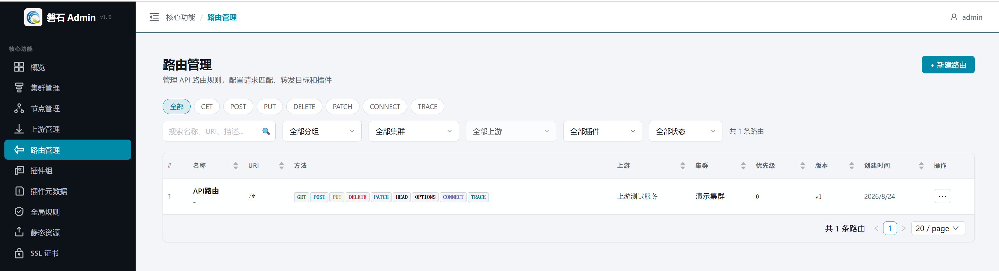

## 8.7 发布

1. 在路由所在行的【操作】列点击【⋯】，在菜单中选择【发布】。
2. 在弹出的节点选择窗口中点击【全选】选中全部 3 个节点。

   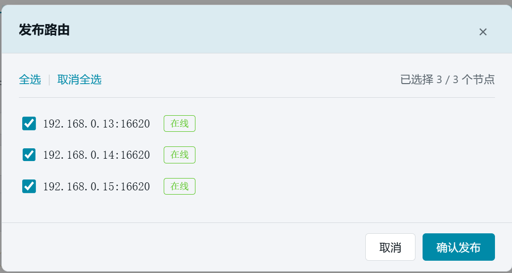

3. 点击【确认发布】，等待发布结果。

   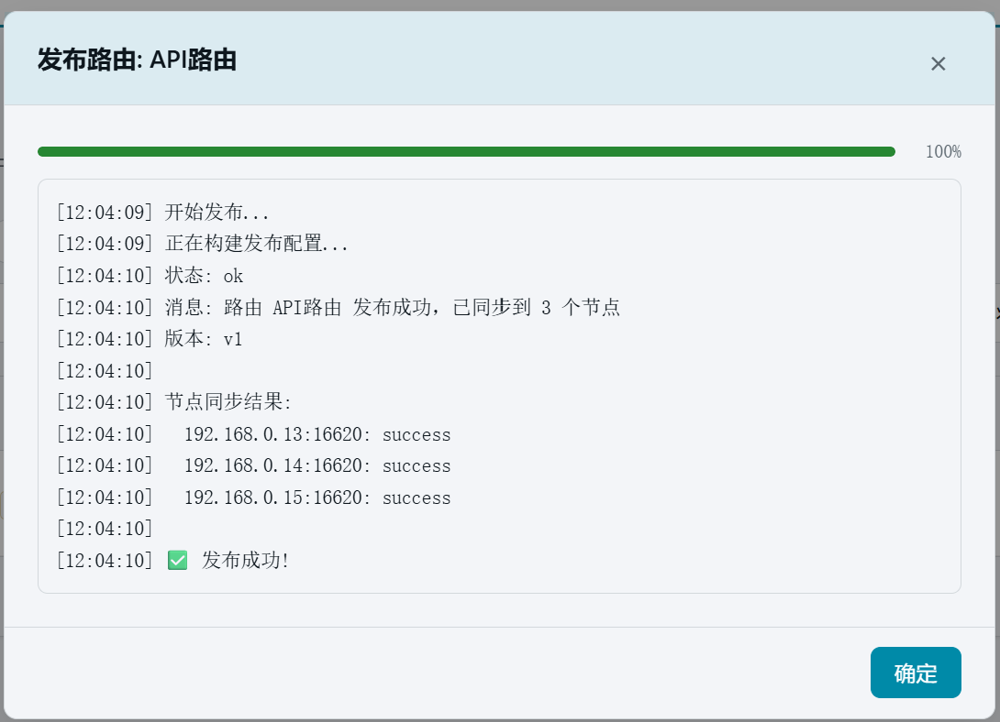

   > ⚠️ 如果出现「部分成功」，说明某台节点管理端口可能不通，需要修复该节点后重新发布。其余节点不受影响。

## 8.8 验证

1. 发布完成后，列表行显示版本号（v1 起）。

2. 端到端验证（可选）：向 Edge 节点的 **16610 端口**访问 `/api/*` 路径，请求应被转发到本地测试服务并返回其内容，同时在节点上生成按统一格式的日志；换其他端口访问则不命中本路由。

## 8.9 本章小结

- 路由 = 匹配条件（URI + 方法 + 高级匹配）+ 转发目标（上游）+ 附加处理（插件/插件组）。
- 本例创建了 `/api/*` 且端口 16610 → 本地测试服务的路由，挂载自定义预处理插件并绑定日志插件组。
- 保存后必须发布到节点才生效；"部分成功"时修复失败节点后重新发布即可。

下一步：[9. 根证书与证书签发](09-certificates.md)
