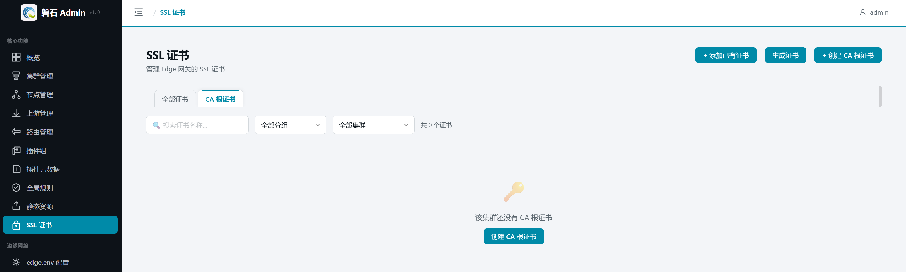
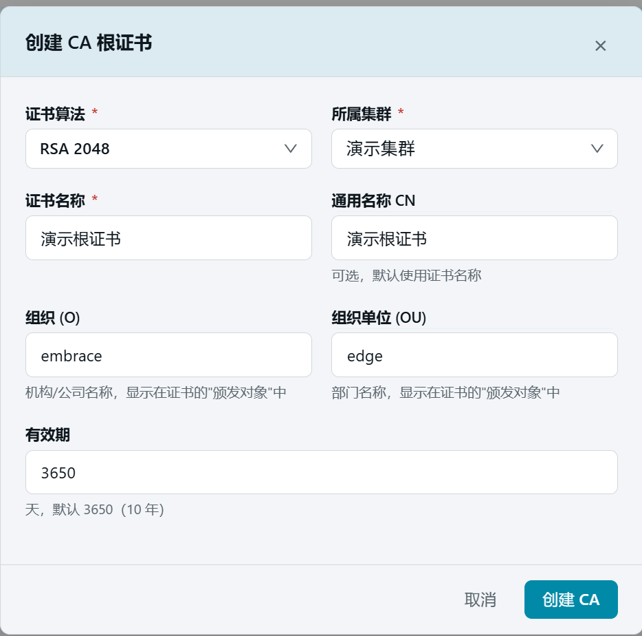
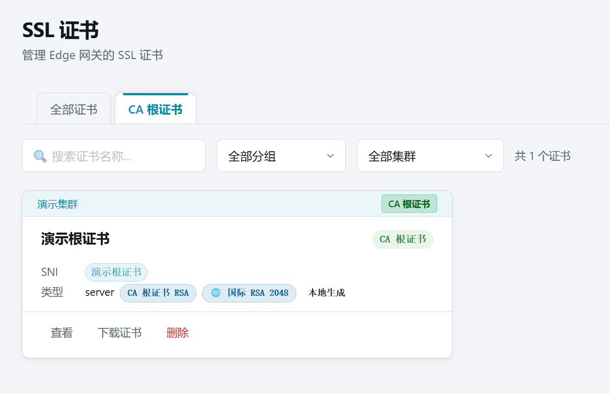
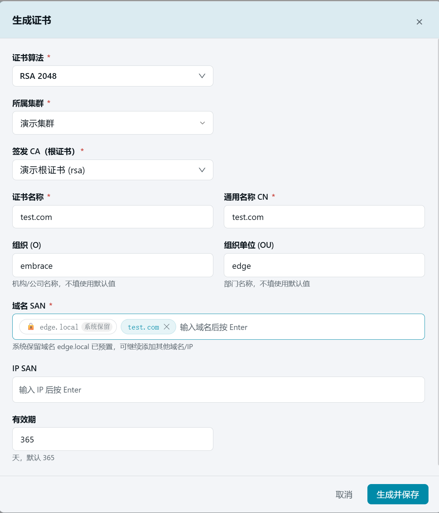
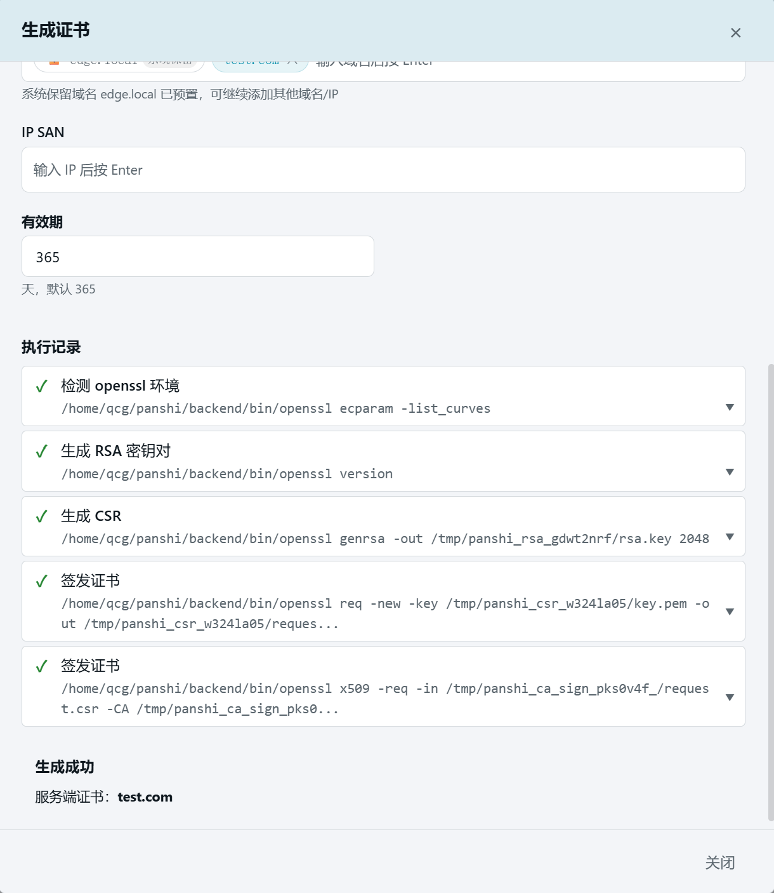
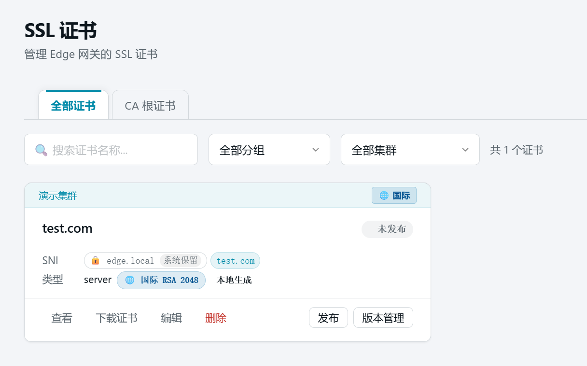
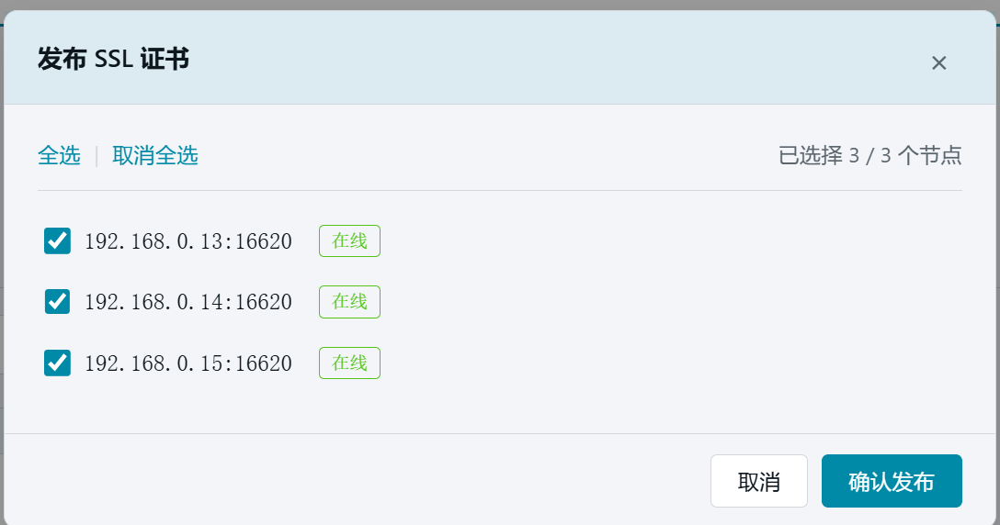
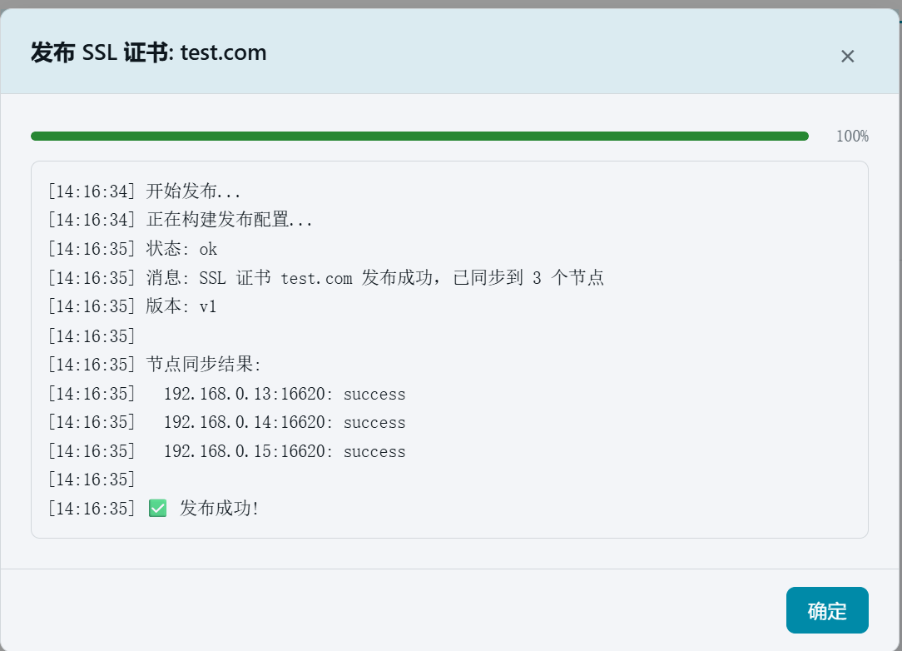

# 9. 证书管理

> 本章场景：为 HTTPS 接入做准备。先生成一张 RSA 算法的 CA 根证书（相当于自建的小型证书颁发机构），再用它签发一张 `test.com` 的服务器证书并发布到节点。根证书只用于签发，不需要发布。

# 证书是什么

磐石Admin 中的 SSL 证书分两类：

- **CA 根证书**：签发其他证书的"根"，保存在管理端即可，**无需发布到节点**。
- **服务器证书**：由根证书签发、绑定域名（如 `test.com`）的实际 HTTPS 证书，必须发布到节点才能被网关使用。

算法支持三种：RSA（国际通用）、ECC（更短更快）、SM2（国密）。本章全程使用 RSA。

# 第一步：生成根证书

1. 点击左侧侧边栏：【核心功能】→【SSL 证书】，进入证书管理页面。
2. 点击【CA 根证书】标签页。首次进入时列表为空，提示"该集群还没有 CA 根证书"。



3. 点击【+ 创建 CA 根证书】按钮，弹出创建对话框：

   | 字段 | 本例填写 | 说明 |
   |---|---|---|
   | 证书算法 | 【RSA 2048】 | 根证书与由它签发的证书算法需一致 |
   | 所属集群 | 【演示集群】 | 根证书归属的集群 |
   | 证书名称 | `演示根证书` | 唯一标识 |
   | 通用名称 CN | 可留空 | 不填默认取证书名称 |
   | 组织 (O) / 组织单位 (OU) | 可留空 | 默认 EMBRACE / EDGE |
   | 有效期 | 默认 | 根证书建议设置较长有效期 |



4. 点击【创建 CA】。完成后列表出现"演示根证书"卡片，带【CA 根证书 RSA】徽章。



> ⚠️ 注意：CA 根证书卡片上没有【发布】按钮——这是正常的。根证书只在签发证书时使用，不需要下发到节点。

# 第二步：生成服务器证书

1. 切回【全部证书】标签页，点击右上角【生成证书】按钮。
2. 按下表填写：

   | 字段 | 本例填写 | 说明 |
   |---|---|---|
   | 证书算法 | 【RSA 2048】 | 与根证书一致 |
   | 所属集群 | 【演示集群】 | 选择后才会加载该集群的根证书 |
   | 签发 CA（根证书） | 【演示根证书 (rsa)】 | 由第一步生成的根证书签发 |
   | 证书名称 | `test.com` | 唯一标识 |
   | 通用名称 CN | `test.com` | 证书主体域名 |
   | 组织 (O) / 组织单位 (OU) | 可留空 | 默认 EMBRACE / EDGE |
   | 域名 SAN | 输入 `test.com` 后按 Enter | 系统保留域名 `edge.local` 已预置 |
   | IP SAN | 可留空 | 如需按 IP 访问可添加 |
   | 有效期 | 默认 365 天 | |




3. 点击【生成并保存】。系统在本地完成密钥生成与签发，对话框底部显示执行记录。



4. 点击【关闭】。列表出现"test.com"证书卡片，状态为"未发布"。



> 💡 生成的证书支持【下载证书】导出 PEM 文件，便于在浏览器或其他系统中安装信任。

# 第三步：发布证书

服务器证书必须发布到节点才能生效：

1. 在"test.com"证书卡片上点击【发布】。
2. 在弹出的节点选择窗口中点击【全选】选中全部 3 个节点。



3. 点击【确认发布】，等待发布结果。



> ⚠️ 「部分成功」属正常现象：某台节点管理端口不通时，其余节点不受影响。修复该节点后可重新发布。

# 验证

1. 发布完成后，"test.com"卡片显示【已发布】徽章和版本号（v1）。
2. 通过 API 确认证书内容：

```bash
curl -s http://localhost:12344/api/v1/clusters/<集群ID>/ssl \
  -H "Authorization: Bearer <token>"
```

预期结果：

- 返回列表中包含名称为 `test.com` 的记录；
- 其 `algorithm` 为 `rsa`，SNI 包含 `test.com`；
- 卡片状态为"已发布 v1"；
- "演示根证书"无版本号且无发布入口（属正常）。

# 本章小结

- CA 根证书 = 签发工具，不发布；服务器证书 = 实际 HTTPS 证书，必须发布。
- 本例生成了 RSA 根证书"演示根证书"，并由它签发了 `test.com` 服务器证书（SAN 含 test.com，有效期 365 天）。
- 证书发布成功后即可在第 12 章的域名绑定中使用。

下一步：[10. 四层代理（TCP/UDP 端口转发）](10-stream-proxy.md)
