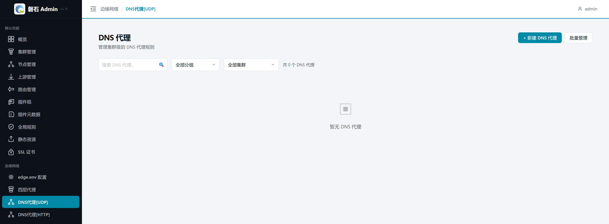
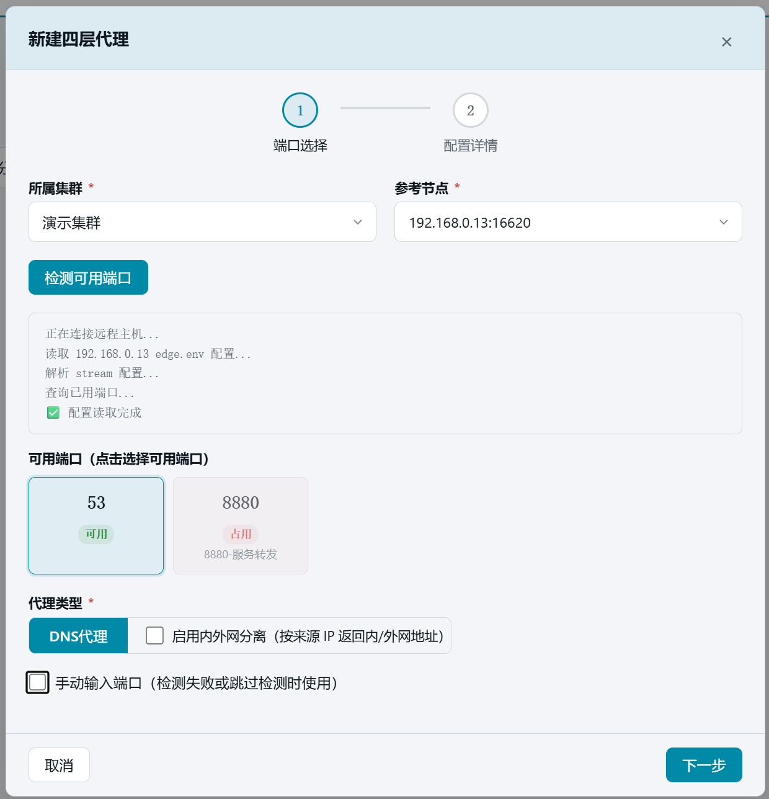
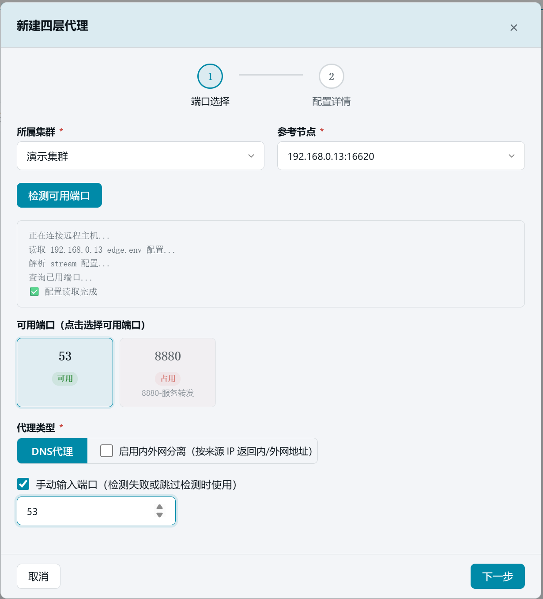
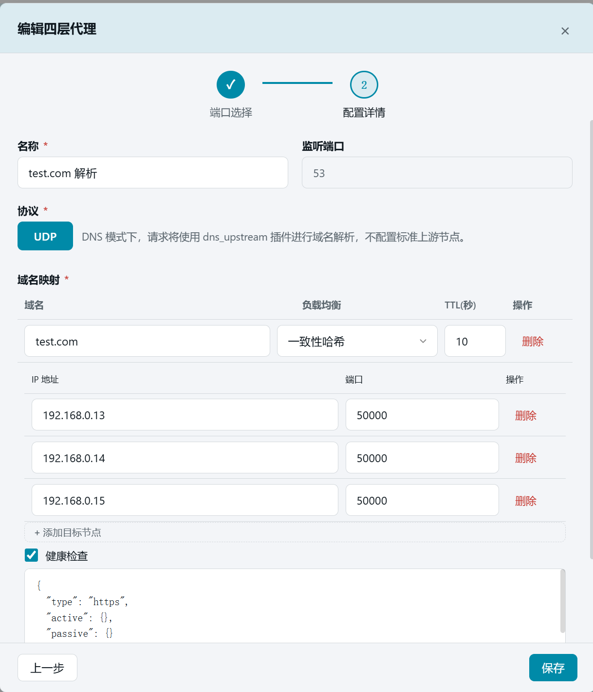
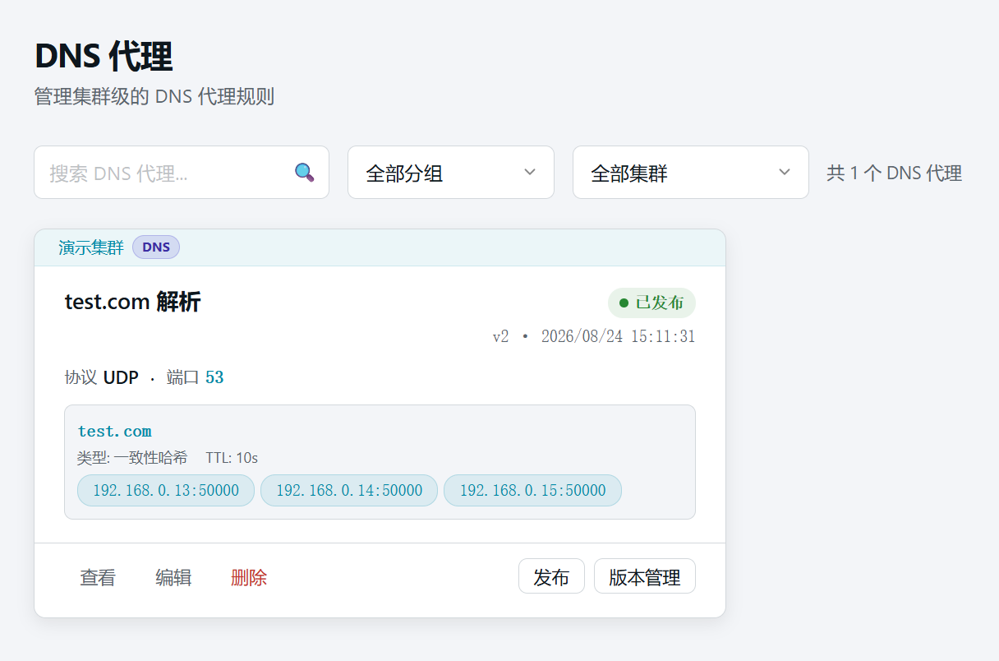
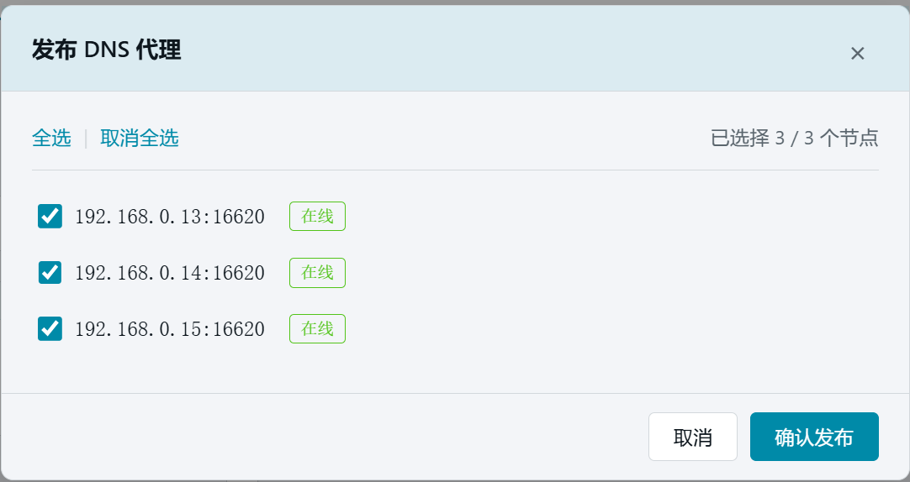
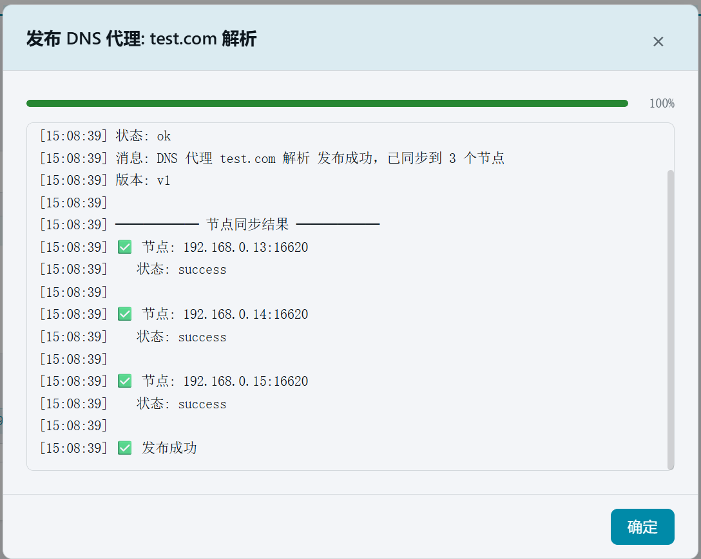

# 11. DNS 代理（UDP 53）

> 本章场景：客户端需要通过域名访问网关服务。DNS 代理监听节点的 UDP 53 端口，把 `test.com` 解析到三个网关节点的地址上，并按一致性哈希算法返回命中的节点，保证相同的客户端总是访问同一个节点。本章同时启用健康检查（HTTPS 探测），保证解析结果只包含存活的节点。

# DNS 代理是什么

- **作用**：把指定域名解析为一个节点 IP 返回给客户端，实现"域名 → 网关节点"的流量引导。
- **依赖插件**：DNS 模式使用 `dns_upstream` 插件进行域名解析——第 3 章 edge.env 中开启的 `dns_upstream: true` 与 `dns_upstream-ww: true` 在这里生效。
- **入口**：左侧侧边栏【边缘网络】→【DNS代理[UDP]】。

# 创建 DNS 代理

1. 点击右上角【+ 新建 DNS 代理】，弹出两步向导（与四层代理同一向导，类型自动为 DNS）。



## 第一步：端口选择

| 配置项 | 本例填写 | 说明 |
|---|---|---|
| 所属集群 | 【演示集群】 | 代理归属的集群 |
| 参考节点 | 【192.168.0.13:16620】 | 用于读取节点 Stream 模块配置 |
| 内外网分离 | **不勾选** | 勾选后目标节点需额外填写外网地址（见下方说明） |

2. 点击【检测可用端口】，系统连接参考节点并解析其 stream 配置，列出可用的监听端口。



3. 若节点不可达或需要指定其他端口，勾选【手动输入端口】，输入 `53`（DNS 标准端口，UDP）。



4. 点击【下一步】。

> 💡 关于**内外网分离**：如果第一步勾选了该选项，第二步的目标节点表格会多出一列「外网地址（内外网分离）」——每个节点除内网 IP 外还必须填写外网地址（如 `10.158.40.51`），DNS 应答时会按客户端来源分别返回内网或外网地址。本例所有客户端都在内网，因此不勾选。

## 第二步：配置详情

| 字段 | 本例填写 | 说明 |
|---|---|---|
| 名称 | `test.com 解析` | 唯一标识 |
| 监听端口 | `53`（第一步带入） | 节点上对外监听的 UDP 端口 |
| 协议 | UDP（固定） | DNS 模式下请求使用 dns_upstream 插件解析，不配置标准上游节点 |

4. 在【域名映射】中点击【+ 添加域名】，填写：

   | 配置项 | 本例填写 | 说明 |
   |---|---|---|
   | 域名 | `test.com` | 要解析的域名 |
   | 负载均衡 | 【一致性哈希】 | 同一客户端来源始终返回相同节点；另有轮询 / 最少连接 |
   | TTL(秒) | `10`（默认） | 客户端缓存时长，越短切换越快 |

5. 点击【+ 添加目标节点】三次，填入三个网关节点,端口填入对外提供服务的 HTTPS 端口号：

   | IP 地址 | 端口 |
   |---|---|
   | `192.168.0.13` | `50000` |
   | `192.168.0.14` | `50000` |
   | `192.168.0.15` | `50000` |

6. 勾选【健康检查】，并把 JSON 中的协议从 `http` 改为 `https`：

```json
{"type":"https","active":{},"passive":{}}
```



> 💡 健康检查的 `type` 决定探测方式：`http` / `https` / `tcp` 等。本例节点 50000 是 HTTPS 端口，所以用 `https`；`active`（主动探测）与 `passive`（被动统计）参数保持默认即可。

7. 点击【创建】。列表出现"test.com 解析"卡片，状态为"未发布"。



# 发布

1. 在卡片上点击【发布】，弹出节点选择窗口。
2. 点击【全选】选中全部 3 个节点。



3. 点击【确认发布】，等待发布结果。



> ⚠️  如果出现「部分成功」，说明某台节点管理端口可能不通，需要修复该节点后重新发布。其余节点不受影响。

# 验证

1. 发布完成后，卡片显示【已发布】徽章和版本号（v1）。

2. 端到端验证（可选）：在能连通节点的机器上执行：

```bash
dig @192.168.0.13 -p 53 test.com +short
```

预期返回三个节点 IP 之一（一致性哈希下同一客户端多次查询结果稳定）。

# 本章小结

- DNS 代理 = 监听 UDP 53 + 域名映射（域名 → 节点列表）+ 负载均衡策略，把客户端流量引导到网关集群。
- 本例创建了 `test.com` → 三个节点 `16610` 的一致性哈希解析，健康检查协议为 https，并发布成功。
- 勾选"内外网分离"时必须为每个目标节点补充外网地址；DNS 功能依赖第 3 章开启的 `dns_upstream` 插件。

下一步：[12. 域名绑定与全链路验证](12-domain-verify.md)
