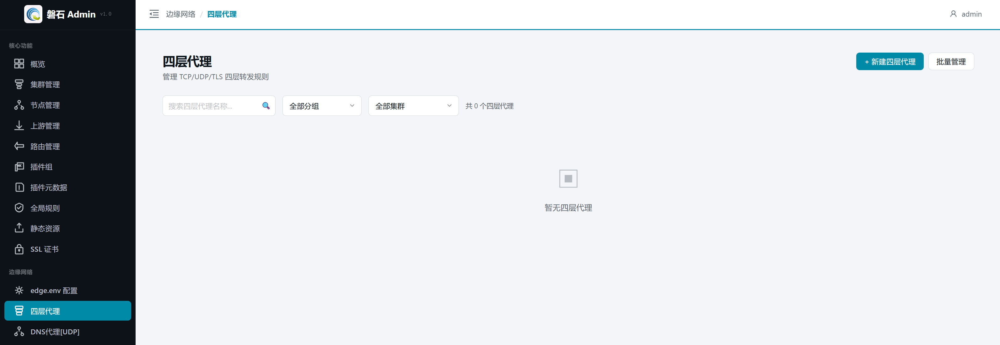
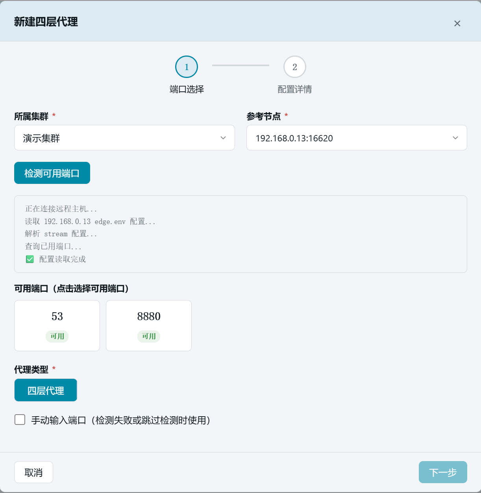
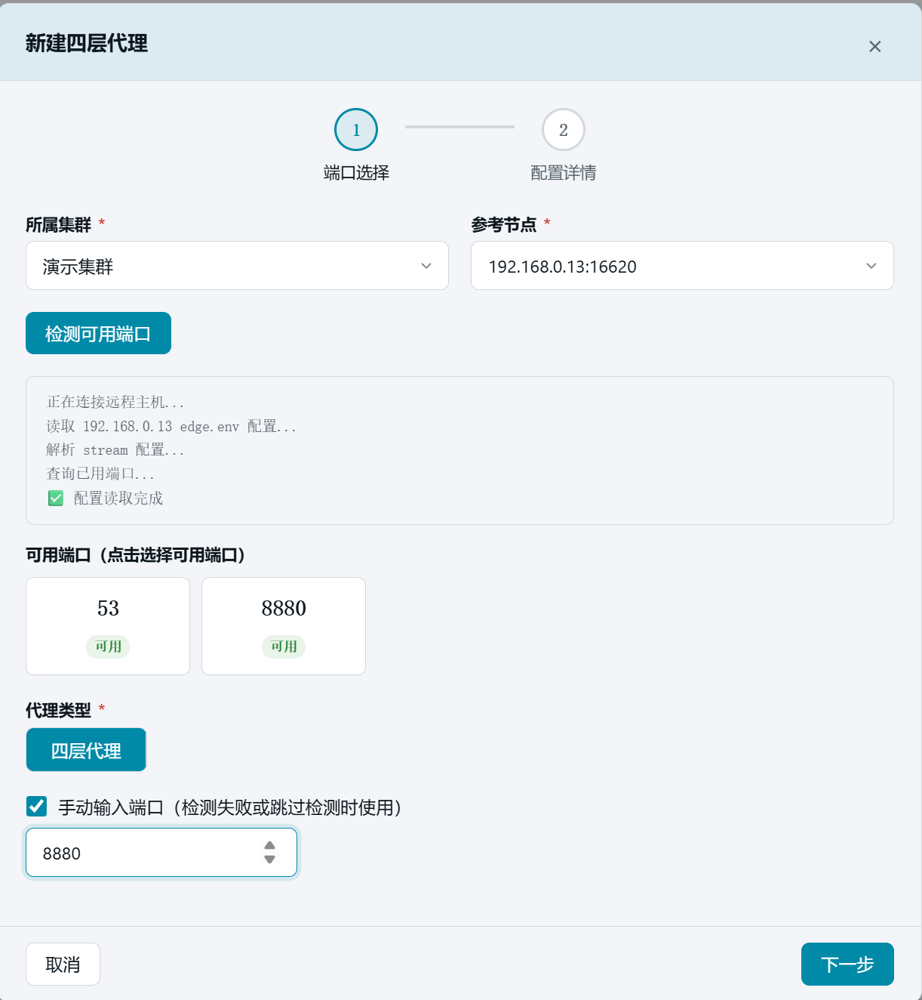
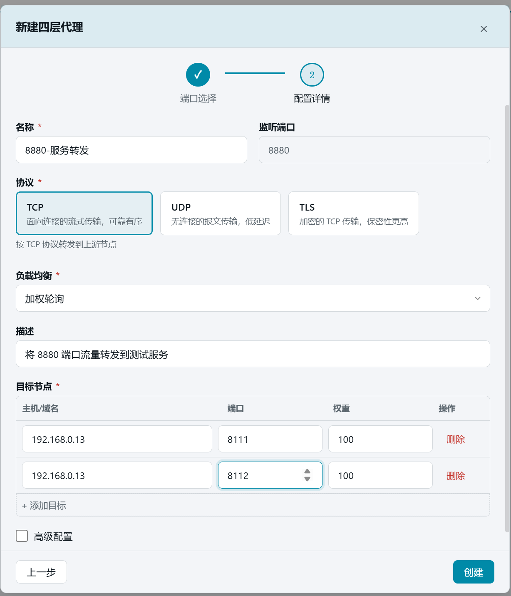
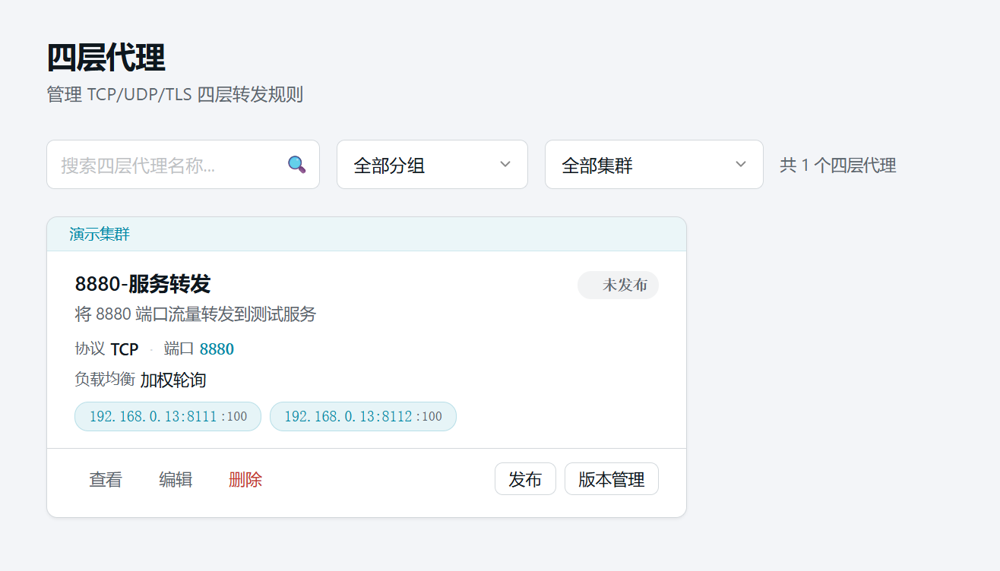
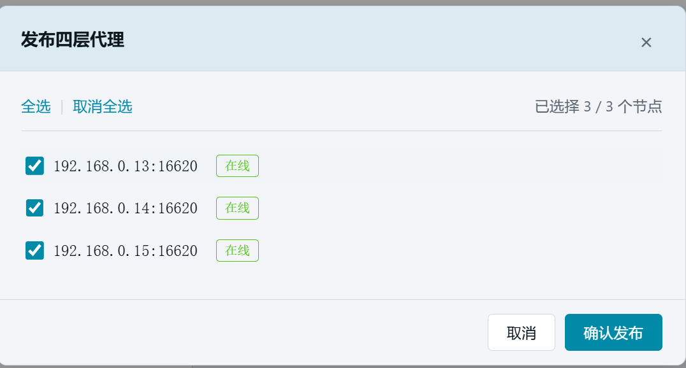
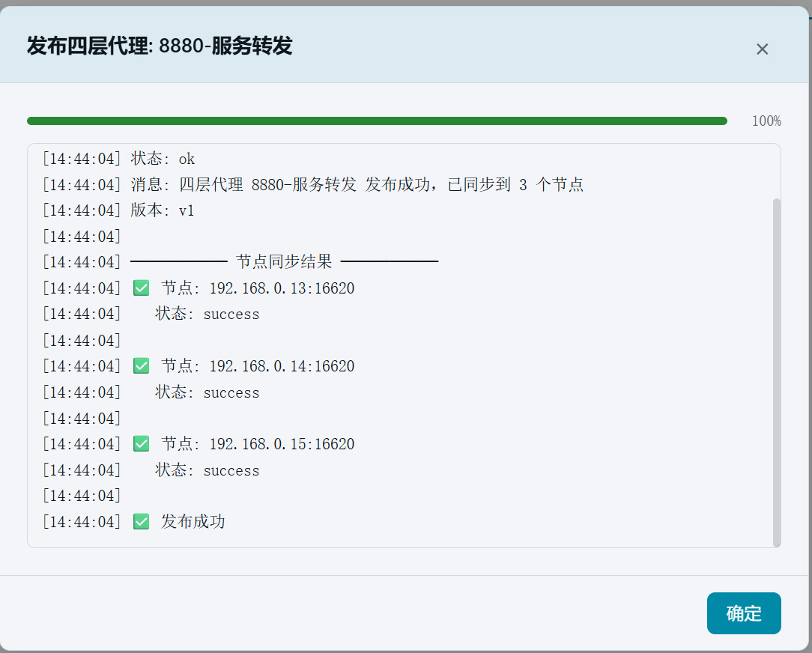

# 11. 四层代理（TCP 端口转发）

> 本章场景：有些业务不走 HTTP（如数据库、自定义 TCP 协议），无法用"路由"配置。四层代理直接按端口转发：本章把节点的 `8880` 端口流量转发到 192.168.0.13 上的两个测试服务 `192.168.0.13:8111` 和 `192.168.0.13:8112`，并发布到节点。

## 11.1 准备本地测试服务

在第 8 章的 `8111` 基础上再启动一个 `8112` 服务：

```bash
mkdir -p /tmp/upstream8112 && echo '<h1>Hello from 192.168.0.13:8112</h1>' > /tmp/upstream8112/index.html
cd /tmp/upstream8112 && nohup python3 -m http.server 8112 --bind 0.0.0.0 &
```

## 11.2 四层代理是什么

- **作用**：在 Edge 节点上监听一个端口，把收到的 TCP/UDP/TLS 流量原样转发到目标节点列表。
- **与七层路由的区别**：路由按 URI/请求头匹配 HTTP 请求；四层代理不解析应用层内容，任何 TCP/UDP 协议都能转发。
- **入口**：左侧侧边栏【边缘网络】→【四层代理】。

## 11.3 创建四层代理

1. 点击右上角【+ 新建四层代理】，弹出两步向导。

   

### 11.3.1 第一步：端口选择

| 配置项 | 本例填写 | 说明 |
| --- | --- | --- |
| 所属集群 | 【演示集群】 | 代理归属的集群 |
| 参考节点 | 【192.168.0.13:16620】 | 用于读取节点 Stream 模块配置 |
| 代理类型 | 【四层代理】 | 另有 DNS 代理专用向导 |

1. 点击【检测可用端口】，系统连接参考节点并解析其 stream 配置，列出可用的监听端口。

   

2. 若节点不可达或需要指定其他端口，勾选【手动输入端口】，输入 `8880`。

   

3. 点击【下一步】。

### 11.3.2 第二步：配置详情

| 字段 | 本例填写 | 说明 |
| --- | --- | --- |
| 名称 | `8880-服务转发` | 唯一标识 |
| 监听端口 | `8880`（第一步带入） | 节点上对外监听的端口 |
| 协议 | 【TCP】 | 可选 TCP（可靠有序）/ UDP（低延迟）/ TLS（加密） |
| 负载均衡 | 加权轮询（默认） | 多目标时的分发策略 |
| 描述 | `将 8880 端口流量转发到测试服务` | 备注信息 |

1. 在【目标节点】表格中填写两条转发目标：

   | 主机/域名 | 端口 | 权重 |
   | --- | --- | --- |
   | `192.168.0.13` | `8111` | `100` |
   | `192.168.0.13` | `8112` | `100` |

      > 💡 点击【+ 添加目标】追加第二行。权重相同时轮询均分流量。"高级配置"（WAN 过滤等）本例保持默认。

   

2. 点击【创建】。列表出现"本地服务转发"卡片，状态为"未发布"，卡片上显示协议 TCP、端口 8880 和目标标签。

   

## 11.4 发布

1. 在卡片上点击【发布】，弹出节点选择窗口。
2. 点击【全选】选中全部 3 个节点。

   

3. 点击【确认发布】，等待发布结果。

   

   > ⚠️ 如果出现「部分成功」，说明某台节点管理端口可能不通，需要修复该节点后重新发布。其余节点不受影响。

## 11.5 验证

1. 发布完成后，卡片显示【已发布】徽章和版本号（v1）。

2. 端到端验证（可选）：在节点所在主机上执行 `curl <http://192.168.0.13:8880/`>，应返回测试服务内容；多次访问会在 8111 与 8112 之间轮询交替。

## 11.6 本章小结

- 四层代理 = 监听端口 + 协议（TCP/UDP/TLS）+ 目标节点列表，适合非 HTTP 协议的端口级转发。
- 本例创建了 8880 → 192.168.0.13:8111 / 192.168.0.13:8112 的加权轮询转发并发布成功。
- 端口可通过参考节点自动检测，也可手动输入。

下一步：[11. DNS 代理（UDP 53）](12-dns-proxy.md)
