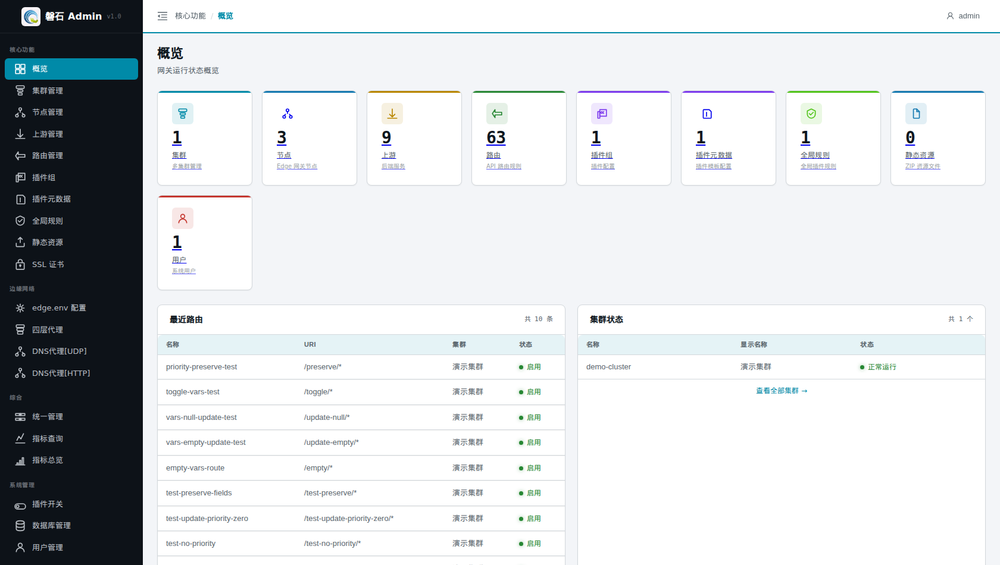

# 13. 概览（健康速览）

> 本章场景：日常巡检的第一站。概览页回答一个问题——**系统现在缺什么、坏了吗**。它与第 16 章的「指标总览」分工不同：本页看**资源与健康状态**（运维视角），指标页看**流量与性能**（性能视角），两章配合使用。

# 页面入口

登录后默认进入，或点击左侧侧边栏：【核心功能】→【概览】。

# 统计卡片

页面按分组排列 9 张统计卡片，每张显示当前数量，**点击可直接跳转**到对应管理页：

| 卡片 | 含义 | 跳转 |
|---|---|---|
| 集群 | 多集群管理的集群总数 | 集群管理 |
| 节点 | Edge 网关节点数 | 节点管理 |
| 上游 | 后端服务数 | 上游管理 |
| 路由 | API 路由规则数 | 路由管理 |
| 插件组 | 插件配置数 | 插件组 |
| 插件元数据 | 插件模板配置数 | 插件元数据 |
| 全局规则 | 全局插件规则数 | 全局规则 |
| 静态资源 | ZIP 资源文件数 | 静态资源 |
| 用户 | 系统用户数 | 用户管理 |

# 巡检方法

1. **对照预期数量**：按主线搭建完成后，集群=1、节点=3、上游≥1、路由≥1；某项为 0 说明对应章节漏做或资源被删。
2. **顺链路点检**：从「集群」开始逐卡跳转，重点确认节点列表中三台机器均为在线/启用状态——节点掉线时后续所有发布都会失败（排查见[第 3 章 3.4](03-edge-env.md)）。
3. **健康之后看流量**：需要分析 QPS、连接数、延迟等运行指标时，前往[第 16 章 指标总览与查询](16-metrics.md)。

# 本章小结

- 概览 = 资源数量速览 + 快捷跳转入口，不提供编辑操作
- 数字为 0 或与预期不符 → 回到对应章节补建
- 流量性能问题请使用指标总览/查询（第 16 章）

下一步：[第 14 章 静态资源](14-static-resources.md)
