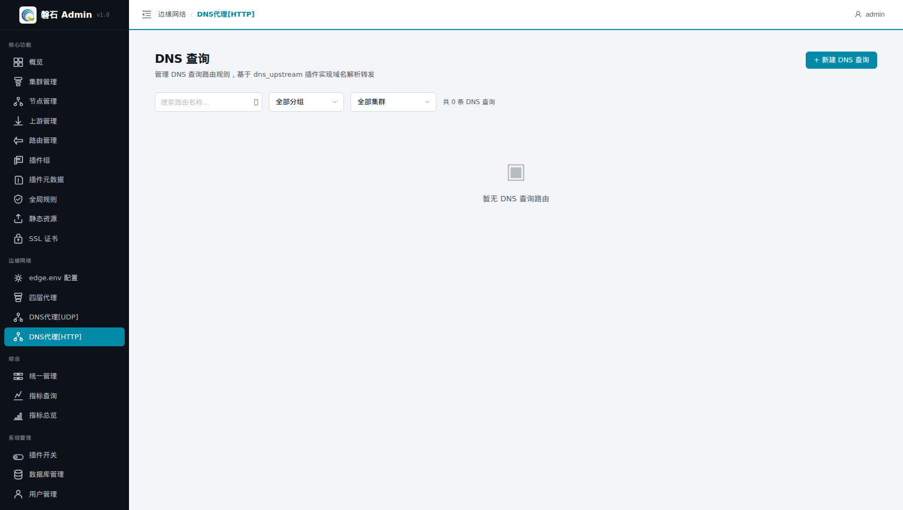
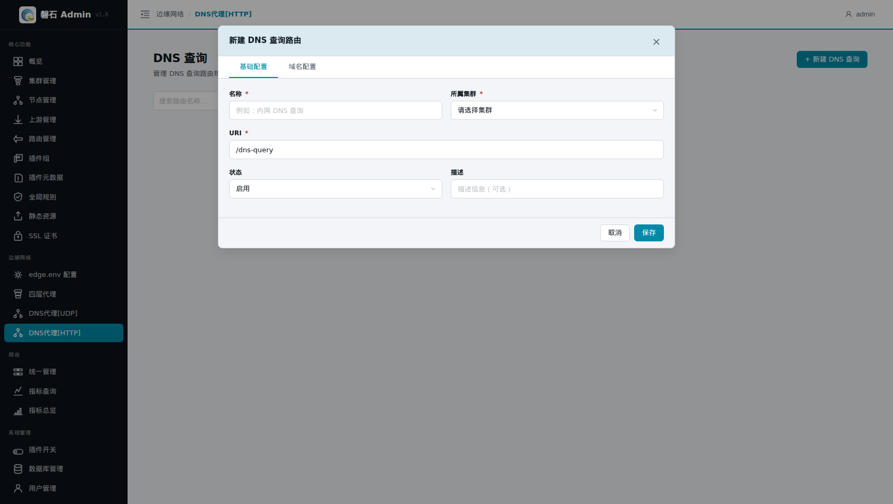

# 15. DNS代理[HTTP]

> 本章场景：第 11 章的 DNS 代理走 UDP 53 端口，适合传统解析场景。本页的「DNS 查询」则是 **DoH（DNS over HTTPS）** 方案：DNS 查询以 HTTPS 请求的形式走七层路由链路，加密、可过防火墙、可复用证书与路由体系。

## 15.1 前置依赖

> ⚠️ 本功能建立在主线产物之上，请先完成：  
> - **第 8 章**：路由机制（本页创建的就是一条挂载 `dns_upstream` 插件的路由）
> - **第 9 章**：服务器证书（DoH 是 HTTPS 请求，需要证书已发布）
> - **第 3 章**：HTTPS 监听端口（5000）已开启并发布

## 15.2 与 DNS代理[UDP] 的区别

| | DNS代理[UDP]（第 11 章） | DNS代理[HTTP]（本页） |
| --- | --- | --- |
| 协议 | 明文 UDP，独立监听 53 端口 | HTTPS 请求，走七层路由 |
| 配置载体 | 四层代理规则 | 挂载 `dns_upstream` 插件的路由 |
| 加密 | 无 | TLS 加密 |
| 典型场景 | 内网解析、替换运营商 DNS | 浏览器 DoH、加密转发、公网安全解析 |

两者可同时使用，互不影响。

## 15.3 页面入口

点击左侧侧边栏：【边缘网络】→【DNS代理[HTTP]】。



> 若菜单不可见：回[第 0 章 功能开关前置检查](00-login.md)核对 `dns_proxy_http` 开关。

## 15.4 新建 DNS 查询

点击右上角【+ 新建 DNS 查询】，按表单填写：

| 字段 | 本例填写 | 说明 |
| --- | --- | --- |
| 名称 | `test.com 解析-DoH` | 规则的唯一标识 |
| URI | 以 `/` 开头的路径（如 `/dns-query`） | DoH 请求的访问路径，客户端将向该路径发起 DNS 查询 |
| 所属集群 | 【演示集群】 | 规则归属 |
| 描述 | （可选） | 备注信息 |

保存后按提示**发布**到节点（流程同前；失败排查见[第 3 章 3.4](03-edge-env.md)）。发布成功后详情中显示版本号与发布时间。



## 15.5 验证

在能连通节点、且已完成第 12 章 hosts 解析的机器上执行：

```bash
curl -sk "https://test.com:5000/dns-query?name=test.com&type=A"
```

预期返回 JSON 格式的解析结果（DoH 的 JSON API 形态），其中包含 `test.com` 的 A 记录——即第 11 章配置的负载均衡目标节点 IP。

也可以用 curl 的 DoH 能力做端到端验证（让 curl 自己通过我们的 DoH 服务器解析域名再发起请求）：

```bash
curl -vk --doh-url https://test.com:5000/dns-query https://test.com:5000/api/ping
```

📷 截图待补充：（DoH 查询返回 JSON）

## 15.6 本章小结

- DNS代理[HTTP] = 挂载 `dns_upstream` 插件的路由规则，走 HTTPS 七层链路
- 与 UDP 版互补：加密场景用本页，传统内网解析用第 11 章
- 验证方式：向 `<URI>?name=<域名>&type=A` 发起请求，或用 `curl --doh-url` 端到端测试

下一步：[第 16 章 指标总览与指标查询](16-metrics.md)
