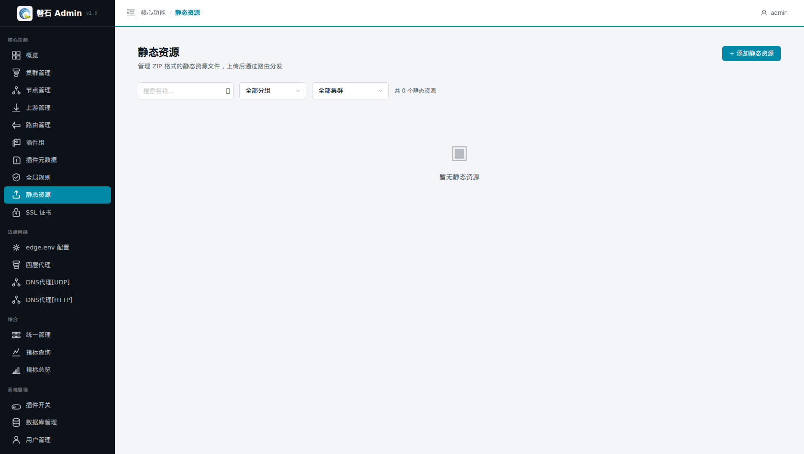
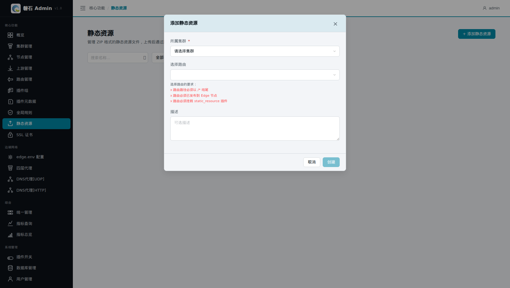
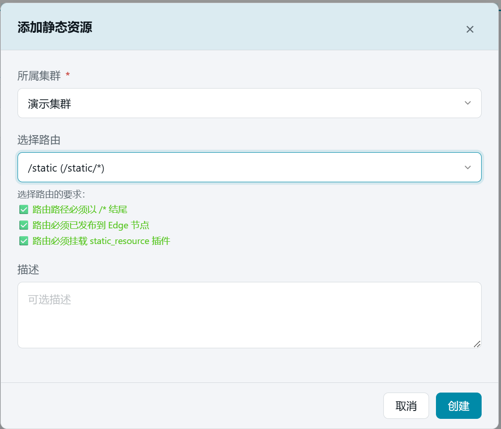
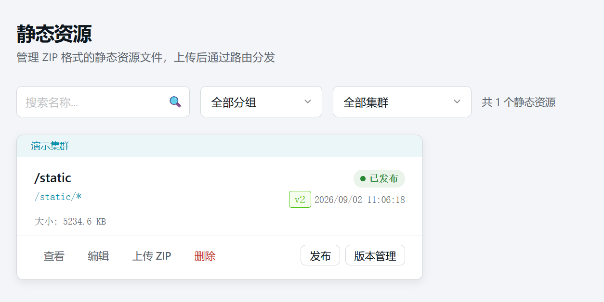
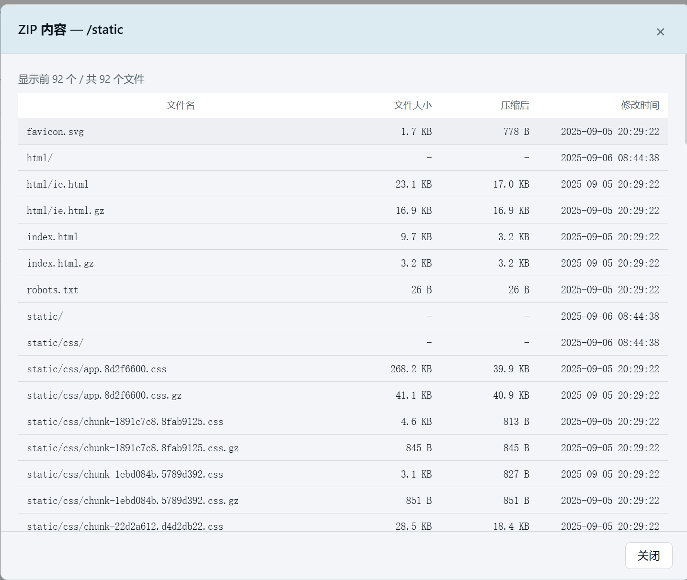
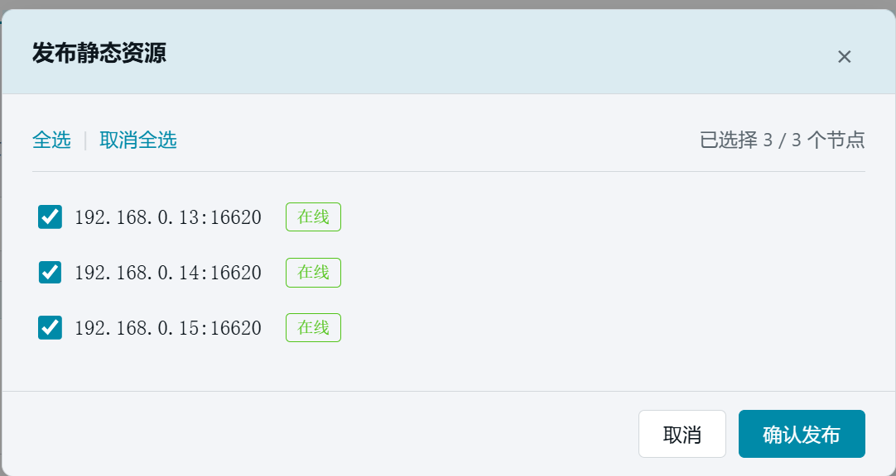

# 15. 静态资源

> 本章场景：把一个 ZIP 静态资源包（前端构建产物、文档站、下载文件等）上传到网关并分发出去。静态资源本身不直接对外服务——它必须**关联一条挂载了 `static_resource` 插件的路由**，由路由把请求映射到 ZIP 内的文件。

## 15.1 页面入口

点击左侧侧边栏：【核心功能】→【静态资源】。



## 15.2 前置条件

创建前需要一条**可用的路由**（第 9 章已学过创建方法），且同时满足三个校验项：

| 校验项 | 要求 |
| --- | --- |
| 路径格式 | 路由 URI 必须以 `/*` 结尾（如 `/static/*`） |
| 发布状态 | 路由必须已发布到 Edge 节点 |
| 插件挂载 | 路由必须挂载 `static_resource` 插件 |

> 💡 三项校验在表单中选择路由时会实时显示 ✅/❌。若还没有满足条件的路由，先到【路由管理】补建。

## 15.3 添加静态资源

点击右上角【+ 添加静态资源】，填写表单：

| 字段 | 本例填写 | 说明 |
| --- | --- | --- |
| 所属集群 \* | 【演示集群】 | 资源归属的集群；编辑时不可更改 |
| 选择路由 | 选择满足三校验的路由 | 资源与该路由绑定，经此路由对外分发；编辑模式下显示为只读「关联路由」 |
| 描述 | （可选） | 备注信息 |



选择静态路由后，点击[创建]



## 15.4 上传 ZIP 文件

1. 在卡片列表中找到刚创建的资源卡片，点击【上传 ZIP】，选择本地 ZIP 文件。
2. 上传成功后，卡片中会显示文件大小。



1. 点击【查看】可浏览 ZIP 包内的文件清单，确认内容正确。



注意：ZIP 包内文件必须是在更目录下打包,不能在上层目录打包。


## 15.5 发布

ZIP 上传后还只是"存在"，要分发到节点才能被访问：

1. 点击该卡片的【发布】按钮（未上传 ZIP 时置灰）。
2. 弹出【发布静态资源】确认框，选择节点后确认。
3. 发布进度实时显示每台节点的执行日志：
   - 全部成功 → 状态徽章变为 **已发布**；
   - 部分失败 → 显示 ⚠️ 提示，修复对应节点后重新发布即可（排查思路见[第 4 章 3.4](04-edge-env.md)）。



## 15.6 验证

1. 列表中该资源状态徽章为 **已发布**；
2. 通过关联的路由路径访问 ZIP 内文件（把 `test.com:50000` 换成你的实际域名/端口与路由 URI）：

```bash
curl -k https://test.com:50000/static/
```

预期返回文件内容（而非 404）。


## 15.7 本章小结

- 静态资源 = ZIP + 关联路由，三者缺一不可：资源、路由发布、static_resource 插件
- 流程固定：添加（选路由）→ 上传 ZIP → 发布 → 经路由路径访问
- 更新内容 = 重新上传 ZIP 后再次发布

下一步：[第 16 章 DNS代理[HTTP]](16-dns-http.md)
