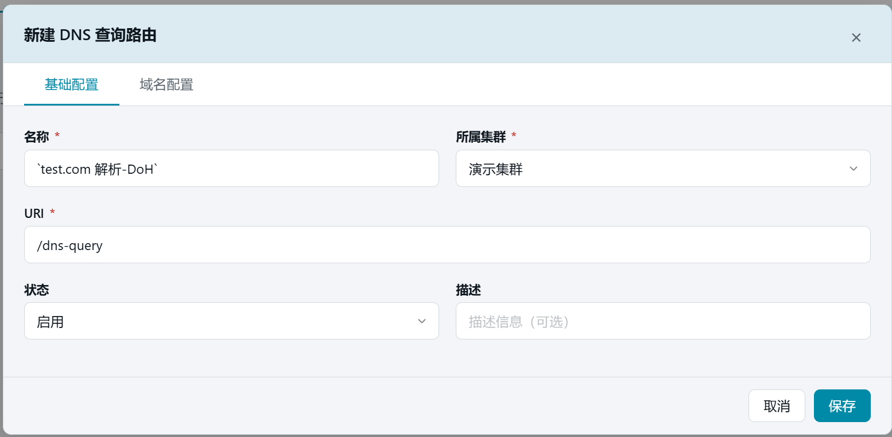
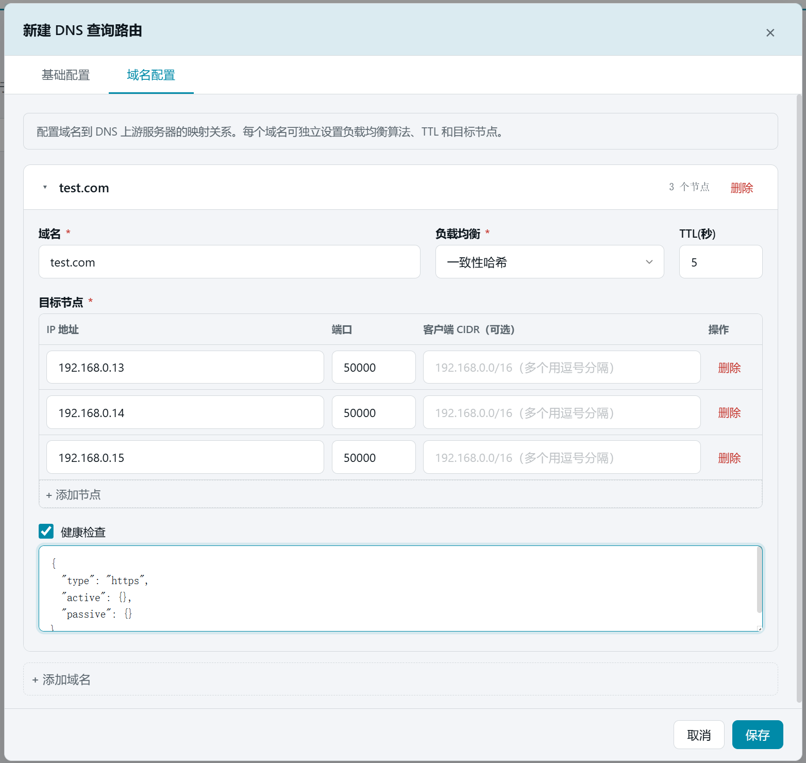
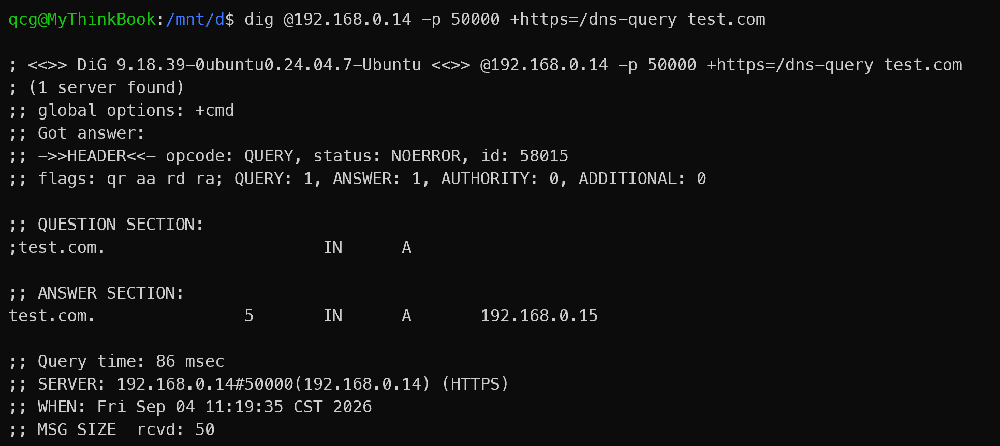

# 16. DNS代理[HTTP]

> 本章场景：第 12 章的 DNS 代理走 UDP 53 端口，适合传统解析场景。本页的「DNS 查询」则是 **DoH（DNS over HTTPS）** 方案：DNS 查询以 HTTPS 请求的形式走七层路由链路，加密、可过防火墙、可复用证书与路由体系。

## 16.1 前置依赖

> ⚠️ 本功能建立在主线产物之上，请先完成：  
> - **第 9 章**：路由机制（本页创建的就是一条挂载 `dns_upstream` 插件的路由）
> - **第 10 章**：服务器证书（DoH 是 HTTPS 请求，需要证书已发布）
> - **第 4 章**：HTTPS 监听端口（50000）已开启并发布

## 16.2 与 DNS代理[UDP] 的区别

| | DNS代理[UDP]（第 12 章） | DNS代理[HTTP]（本页） |
| --- | --- | --- |
| 协议 | 明文 UDP，独立监听 53 端口 | HTTPS 请求，走七层路由 |
| 配置载体 | 四层代理规则 | 挂载 `dns_upstream` 插件的路由 |
| 加密 | 无 | TLS 加密 |
| 典型场景 | 内网解析、替换运营商 DNS | 浏览器 DoH、加密转发、公网安全解析 |

两者可同时使用，互不影响。

## 16.3 页面入口

点击左侧侧边栏：【边缘网络】→【DNS代理[HTTP]】。


> 若菜单不可见：回[第 1 章 功能开关前置检查](01-login.md)核对 `dns_proxy_http` 开关。

## 16.4 新建 DNS 查询

点击右上角【+ 新建 DNS 查询】，按表单填写：

| 字段 | 本例填写 | 说明 |
| --- | --- | --- |
| 名称 | `test.com 解析-DoH` | 规则的唯一标识 |
| URI | 以 `/` 开头的路径（如 `/dns-query`） | DoH 请求的访问路径，客户端将向该路径发起 DNS 查询 |
| 所属集群 | 【演示集群】 | 规则归属 |
| 描述 | （可选） | 备注信息 |

保存后按提示**发布**到节点（流程同前；失败排查见[第 4 章 3.4](04-edge-env.md)）。发布成功后详情中显示版本号与发布时间。






## 16.5 验证

在能连通节点的机器上执行：

```bash
dig @192.168.0.13 -p 50000 +https=/dns-query test.com
```

注意：edge 节点需要开启 http2: on 才能支持 dig 的 https 查询命令

预期返回:

```bash
;; ANSWER SECTION:
test.com.               5       IN      A       192.168.0.15
```



## 16.6 本章小结

- DNS代理[HTTP] = 挂载 `dns_upstream` 插件的路由规则，走 HTTPS 七层链路
- 与 UDP 版互补：加密场景用本页，传统内网解析用第 12 章
- 验证方式：使用 dig 命令端到端测试，注意：edge 节点需要开启 http2: on 才能支持 dig 的 https 查询命令

下一步：[第 17 章 指标总览与指标查询](17-metrics.md)
