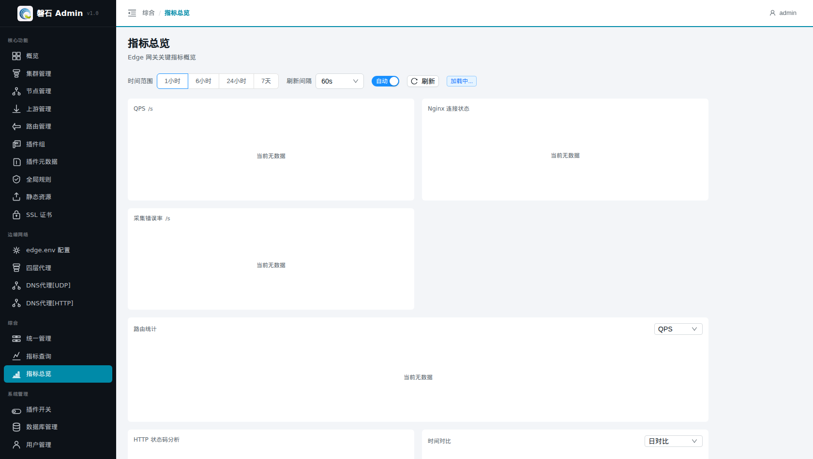
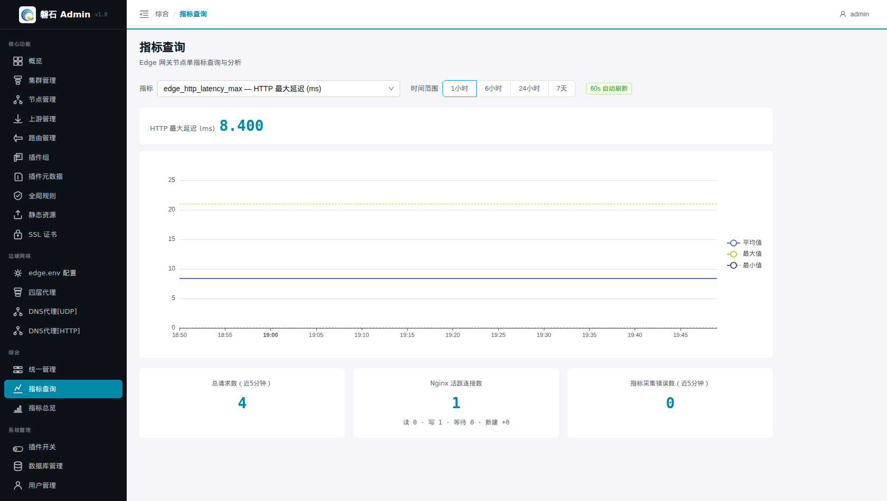

# 16. 指标总览与指标查询

> 本章场景：网关跑起来之后，回答"**流量怎么样**"的问题——QPS 多少、连接数多少、有没有错误。本章覆盖两个页面：【指标总览】看全局趋势，【指标查询】做单指标深入分析。它们与第 13 章「概览」分工不同：概览看资源与健康（运维视角），本页看流量与性能（性能视角）。

# 数据前提

> ⚠️ 指标数据来自 **Edge 节点上的采集器持续上报到 ClickHouse**，不是平台自己产生的。看到数据需要同时满足：
> 1. 节点在线且已启用（第 2 章）；
> 2. 节点上的采集器正常运行；
> 3. 平台能访问 ClickHouse（esapm 链路）。

任一条件不满足时，页面显示「当前无数据」或空图表。排查顺序：

| 步骤 | 检查 | 方法 |
|---|---|---|
| ① 节点状态 | 三台节点是否在线 | 【节点管理】列表状态列；掉线先解决连通性（[第 3 章 3.4](03-edge-env.md)） |
| ② 采集器 | 节点上采集进程是否存活 | 登录节点查看采集器进程/日志；确认其配置指向本平台 |
| ③ ClickHouse | 平台侧存储是否可达 | 联系管理员核对 esapm 链路配置 |

# 页面入口

- 【综合】→【指标总览】：全局仪表盘
- 【综合】→【指标查询】：单指标分析

> 若菜单不可见：回[第 0 章 功能开关前置检查](00-login.md)核对 `metrics` 开关。

# 指标总览

## 全局控制

| 控件 | 说明 |
|---|---|
| 时间范围 | 1 小时 / 6 小时 / 24 小时 / 7 天，切换后所有业务图重新加载 |
| 刷新间隔 | 60s / 120s / 300s，自动刷新周期 |
| 自动/手动开关 | 关闭后仅手动点【刷新】时拉取 |

## 业务图表（三张）

| 图表 | 含义 | 关注点 |
|---|---|---|
| QPS | 每秒请求数（窗口内增量统计） | 流量突增/跌零 |
| **Nginx 连接状态** | 四条序列：活跃（蓝）/ 读取中（紫）/ 写入中（青）/ 等待中（灰），带图例 | 写入中飙升常见于慢客户端；活跃数长期高位需扩容 |
| 采集错误率 | 指标采集错误数增量 | 持续非零说明采集链路异常 |

## 扩展分析

- **路由统计**：按路由维度聚合的 QPS / 带宽 / 错误率 / 延迟排行；
- **HTTP 状态码分析**：2xx/4xx/5xx 占比，5xx 升高优先排查上游；
- **时间对比**：今日 vs 昨日请求量对比与变化率；
- **节点健康**：各节点最近上报状态。

## 更多指标（折叠区）

点击底部「更多指标」展开基础设施类指标：共享字典容量/剩余、采集耗时、采集样本数、新增序列数、采集目标状态（up）。日常巡检不必常开。

# 指标查询

页面自上而下三部分：

## 汇总卡片（近 5 分钟）

| 卡片 | 口径 |
|---|---|
| 总请求数 | 计数器**窗口内增量**（不是累计总量） |
| Nginx 活跃连接数 | 各节点 `state=active` 序列最新值求和；下方细分行显示 **读 X · 写 X · 等待 X · 新建 +N**（reading/writing/waiting 瞬时值 + accepted 窗口增量） |
| 指标采集错误数 | 同样为窗口内增量 |

## 单指标图表

顶部下拉选择任意指标（含中文说明，如 `edge_http_latency_avg — HTTP 平均延迟`），配合时间范围查看趋势图。计数器类指标自动按速率展示，gauge 类展示原始值。

# 验证

1. 主线搭建完成且有真实流量后，QPS 图应出现波动而非直线为零；
2. 在浏览器打开几次 `https://test.com:5000/api/ping`（第 12 章），回到指标查询页选 `edge_http_requests_total`，约 1 分钟内可见增量；
3. Nginx 连接状态图的「等待中」通常为常态基线，「活跃」随请求出现尖峰。

# 本章小结

- 数据前提：节点在线 + 采集器运行 + ClickHouse 可达，缺一则「当前无数据」
- 总览看趋势（QPS/连接状态/错误率 + 扩展分析），查询页做单指标下钻
- 所有计数器卡片均为**窗口内增量**口径，读数时勿与累计总量混淆

下一步：[第 17 章 统一管理](17-central-management.md)
