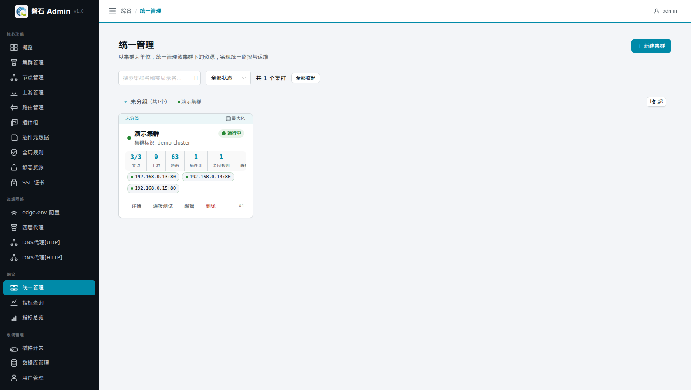

# 17. 统一管理

> 本章场景：集群多了以后，在【集群管理】列表页逐个点进查看效率很低。「统一管理」以**集群为单位**把资源统计、监控与运维入口聚合到一个页面——每行是一个集群的"驾驶舱"，适合多集群环境的日常巡检与快速跳转。

# 页面入口

点击左侧侧边栏：【综合】→【统一管理】。

> 若菜单不可见：回[第 0 章 功能开关前置检查](00-login.md)核对权限配置。

# 界面结构

## 集群分组

集群按「分组」字段归类显示（第 1 章创建集群时的分组），支持：

- **全部展开 / 全部收起**：一键控制所有分组的折叠状态；
- 单个分组标题可点击折叠/展开。

## 集群卡片与资源统计

每个集群一行，核心是**资源统计格**：

| 统计项 | 含义 | 点击行为 |
|---|---|---|
| 节点 | `健康数 / 总数`（如 `3/3`） | 最大化并切到节点标签 |
| 上游 | 该集群上游数量 | 最大化并切到上游标签 |
| 路由 | 该集群路由数量 | 最大化并切到路由标签 |
| 插件组 | 插件组数量 | 最大化并切到插件组标签 |
| 全局规则 | 全局规则数量 | 最大化并切到全局规则标签 |

> 💡 节点格显示 `2/3` 说明有一台不健康——优先处理（排查见[第 3 章 3.4](03-edge-env.md)）。

## 最大化模式

点击卡片右上角的【最大化】图标，该集群进入全屏工作台：左侧切换节点/上游/路由等标签页，右侧为对应管理界面，免去页面间来回跳转。完成后点击【退出最大化】返回列表。

📷 截图待补充：（最大化模式下切换到节点标签）

# 与其他页面的关系

| 需求 | 推荐入口 |
|---|---|
| 看**流量指标**趋势 | 【指标总览】（第 16 章） |
| 管**单个集群**的全部资源 | 本页最大化模式，或【集群管理】 |
| 建/删集群、改分组 | 本页【+ 新建集群】，或【集群管理】 |

# 本章小结

- 统一管理 = 多集群驾驶舱：分组浏览 + 资源统计 + 一键跳转
- 节点健康比 `x/y` 是巡检第一信号
- 最大化模式 = 单集群全屏工作台，多标签免跳转

下一步：[第 18 章 插件开关](18-plugin-switches.md)
