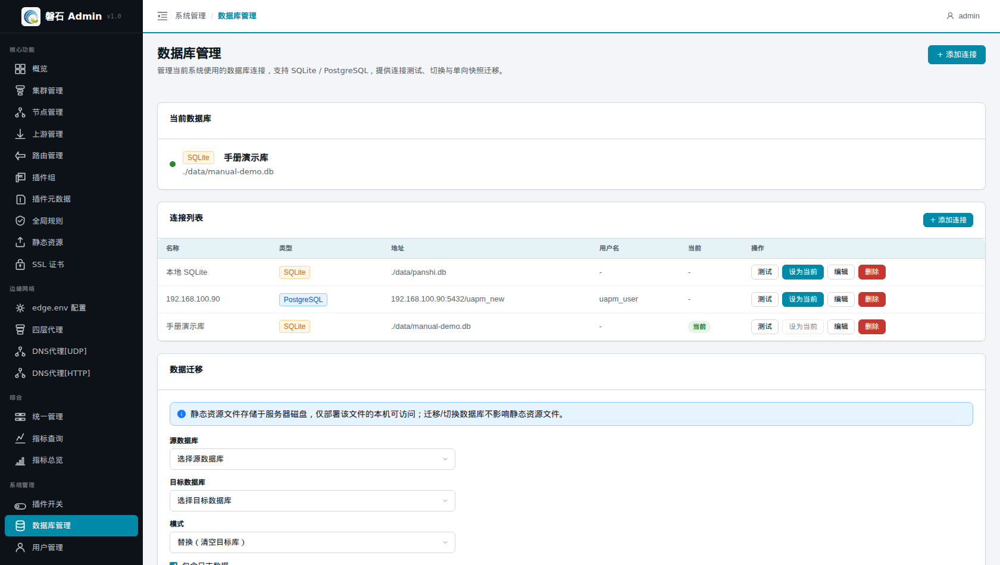
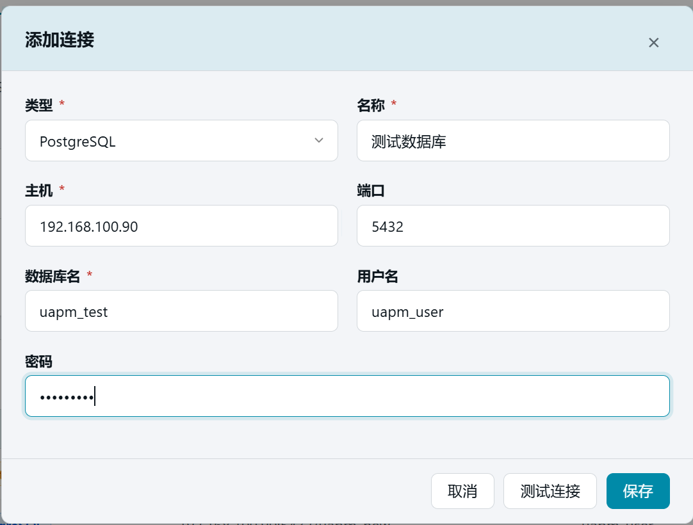
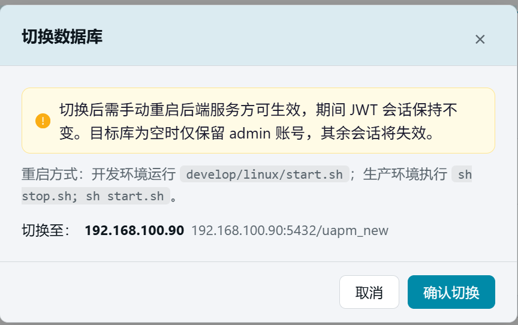
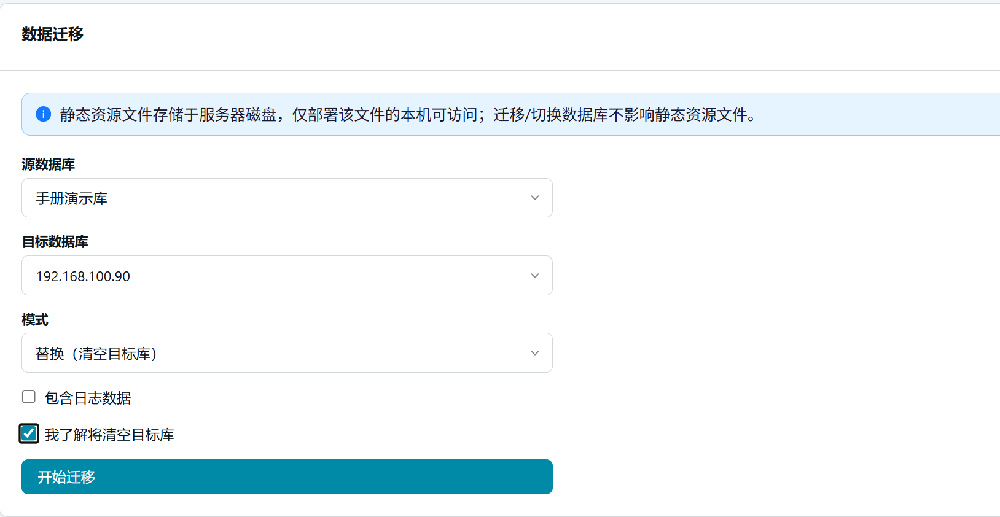
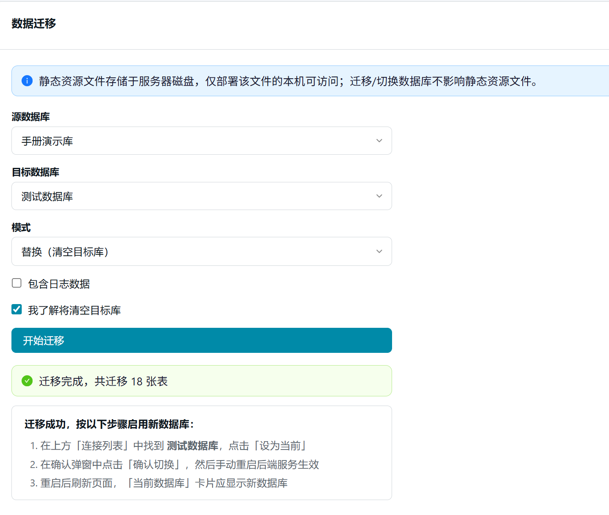

# 18. 数据库管理

> 本章场景：平台自身的配置数据存在哪里、想换一个数据库怎么办？【数据库管理】统一管理平台的**后端存储连接**（SQLite / PostgreSQL），支持连接测试、一键切换与单向快照迁移。第 1 章切空库用的就是本页，本章讲完整功能。

## 18.1 页面入口

点击左侧侧边栏：【系统管理】→【数据库管理】。

> 若菜单不可见：回[第 1 章 功能开关前置检查](01-login.md)核对 `database_management` 开关。

## 18.2 连接列表

页面顶部展示全部已登记的数据库连接，每行包含类型、名称、路径/地址与状态：

| 操作 | 说明 |
| --- | --- |
| 【+ 添加连接】 | 新增一条连接配置（不立即启用） |
| 【测试连接】 | 弹窗内验证参数是否可连通 |
| 【设为当前】 | 把该连接设为平台使用的数据库 |
| 【删除】 | 移除连接配置（不影响数据库文件本身） |

### 18.2.1 添加 / 编辑连接

| 字段 | 说明 |
| --- | --- |
| 类型 | SQLite（本地文件）或 PostgreSQL（远程库） |
| 名称 | 连接的显示名称 |
| 数据库文件路径 / 主机端口等 | 按类型填写；SQLite 路径如 `./data/manual-demo.db`，文件不存在时重启后自动创建 |

> ⚠️ 密码类字段在平台内加密保存；删除连接只删配置记录，不会删除数据库文件或库内数据。

新增 SQLite 数据库

新增 Postgres 数据库

## 18.3 设为当前与重启

「设为当前」只修改配置并标记重启标记，**必须手动重启后端服务才生效**：

切换回，需要重新启动

- 开发环境：重新执行 `develop/linux/start.sh`；
- 生产环境：`sh stop.sh; sh start.sh`。

重启完成后刷新页面，「当前数据库」卡片显示新连接即切换成功。第 1 章的切空库流程就是：添加连接 → 测试 → 设为当前 → 重启 → 验证。

## 18.4 数据迁移

把**当前激活库**的数据快照迁移到另一个已登记的连接（单向、replace 语义——目标库将被清空后写入源库数据）：

1. 在【数据迁移】卡片选择目标连接；
2. **勾选「我了解将清空目标库」**——未勾选时【开始迁移】按钮置灰不可点：

      

3. 点击【开始迁移】，进度条显示执行状态；

      

4. 迁移成功后按页面提示操作：到连接列表把目标连接【设为当前】→ 重启后端服务。

   > ⚠️ 三条硬约束：
   > - 目标库会被**完全清空**再写入，请确认目标库无需要保留的数据；
   > - 不允许向当前激活库自身发起迁移；
   > - 静态资源文件存放在服务器磁盘，迁移/切换数据库**不影响**静态资源文件。

      

## 18.5 常见问题

| 现象 | 处理 |
| --- | --- |
| 测试连接失败 | SQLite 检查路径权限；PG 检查主机/端口/账号密码与防火墙 |
| 切换后数据"消失" | 多半连到了另一个空库——核对「当前数据库」卡片显示的路径 |
| 迁移按钮点不动 | 先勾选「我了解将清空目标库」复选框 |
| 迁移报外键错误 | 确认使用的是平台内置迁移功能，不要手工对拷表数据 |

## 18.6 本章小结

- 连接列表 = 登记簿；「设为当前」+ 重启 = 真正切换
- 迁移是**单向快照 replace**：目标库清空重建，不可逆，操作前看清目标
- 静态资源在磁盘上，不受数据库切换影响

下一步：[第 23 章 Edge 直连](23-edge-client.md) / [第 24 章 数据导入](24-data-import.md)
