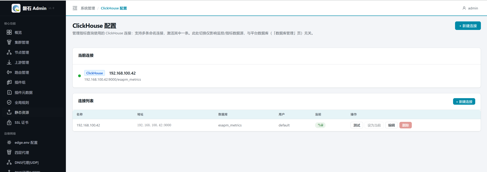
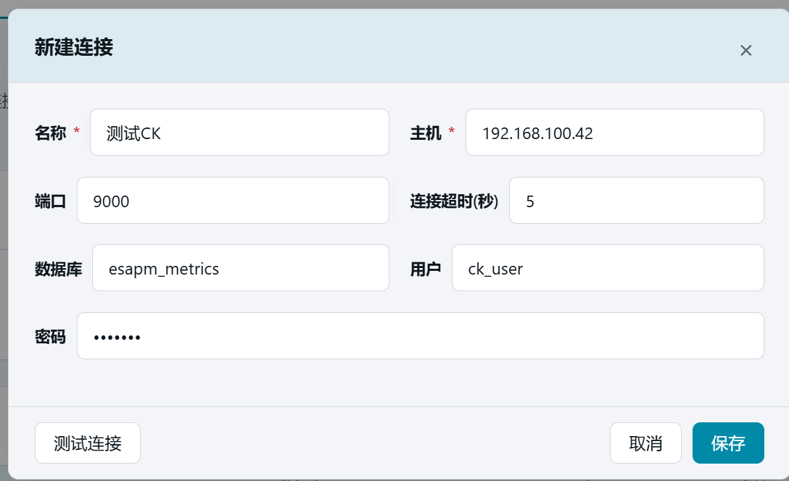

# 19. ClickHouse 配置

> 本章场景：平台的监控指标（Edge 节点采集的性能数据）存储在 ClickHouse 中。【ClickHouse 配置】管理指标查询使用的 ClickHouse 连接——支持多条命名连接，激活其中一条。此处切换仅影响监控/指标数据源，与平台数据库（第 18 章「数据库管理」）无关。

## 19.1 页面入口

点击左侧侧边栏：【系统管理】→【ClickHouse 配置】。

> 若菜单不可见：回[第 1 章 功能开关前置检查](01-login.md)核对 `clickhouse_config` 开关。

## 19.2 当前连接

页面顶部卡片显示当前激活的 ClickHouse 连接（名称、地址、数据库），供快速确认指标数据源。未配置时指标页面按默认参数尝试连接（`127.0.0.1:9000`）。

## 19.3 连接列表

| 列 | 说明 |
| --- | --- |
| 名称 | 连接的显示名称 |
| 地址 | `host:port` |
| 数据库 | ClickHouse 中存储指标数据的库名 |
| 用户 | 连接用户 |
| 当前 | 标记为「当前」的连接是指标查询的实际数据源 |

### 19.3.1 操作按钮

| 操作 | 说明 |
| --- | --- |
| 【测试】 | 对已保存的连接执行一次实际连接测试，验证参数是否可达 |
| 【设为当前】 | 将该连接切换为指标数据源（立即生效，无需重启） |
| 【编辑】 | 修改连接参数 |
| 【删除】 | 移除连接配置（当前激活的连接不可删除） |

## 19.4 新建 / 编辑连接

| 字段 | 说明 | 默认值 |
| --- | --- | --- |
| 名称 | 显示名称（必填） | — |
| 主机 | ClickHouse 服务器地址（必填） | — |
| 端口 | TCP 端口 | 9000 |
| 连接超时(秒) | 连接超时时间 | 5 |
| 数据库 | 指标数据所在的库名 | esapm_metrics |
| 用户 | 连接用户名 | default |
| 密码 | 连接密码（可选）；编辑时留空表示保留原密码 | — |

> ⚠️ 密码在平台内加密存储，API 永不回显明文。

### 19.4.1 测试连接

在弹窗内填写参数后，点击左下角【测试连接】可在保存前验证参数是否可达。测试通过后再点【保存】。

## 19.5 与指标页面的关系

- ClickHouse 配置页管理连接参数 → 决定指标查询从哪个 ClickHouse 实例读取数据
- 第 22 章「指标总览与指标查询」使用此处激活的连接执行查询
- 两者是**配置与消费**的关系：本页配连接，第 22 章用连接

## 19.6 常见问题

| 现象 | 处理 |
| --- | --- |
| 测试连接失败 | 检查主机/端口/防火墙；确认 ClickHouse 服务已启动 |
| 指标页面无数据 | 确认 ClickHouse 配置页有激活连接；检查数据库名是否正确 |
| 连接列表为空 | 点击【新建连接】添加一条；未配置时指标页按默认参数（127.0.0.1:9000）尝试 |

## 19.7 本章小结

- ClickHouse 配置 = 指标数据源的连接管理，与平台数据库完全独立
- 多连接 + 一键切换，测试连接可在保存前验证可达性
- 切换激活连接立即生效，无需重启后端

下一步：[附录A 修改 hosts 文件](附录A-修改hosts.md)
