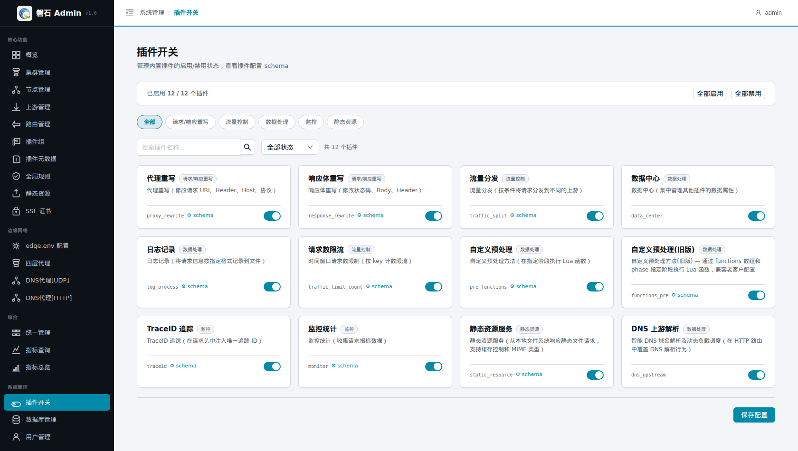
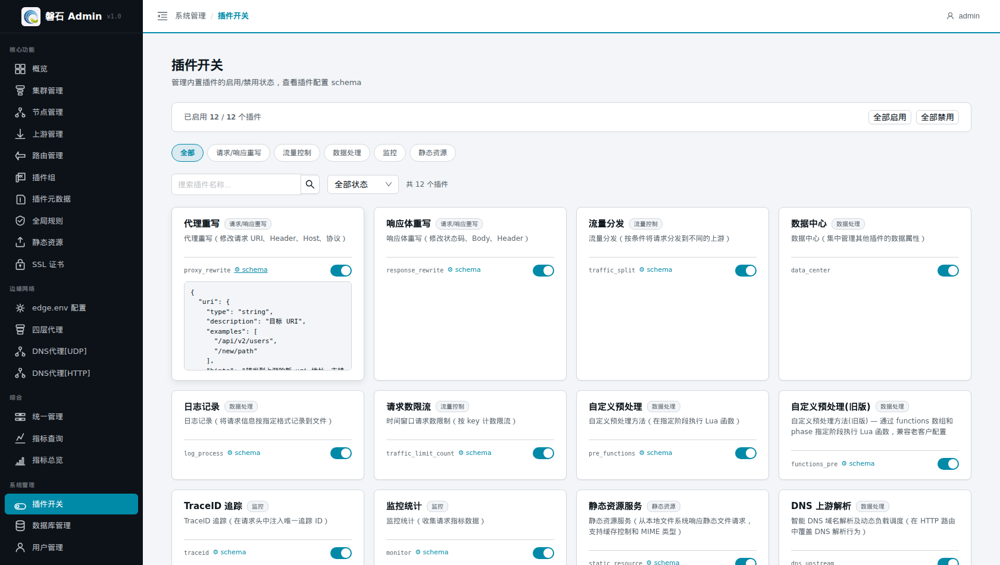
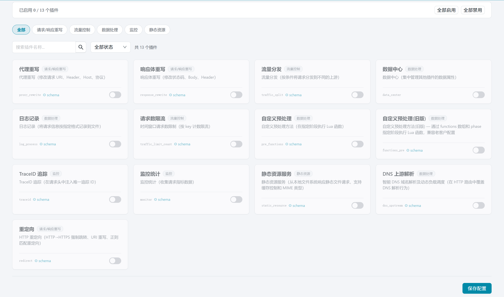
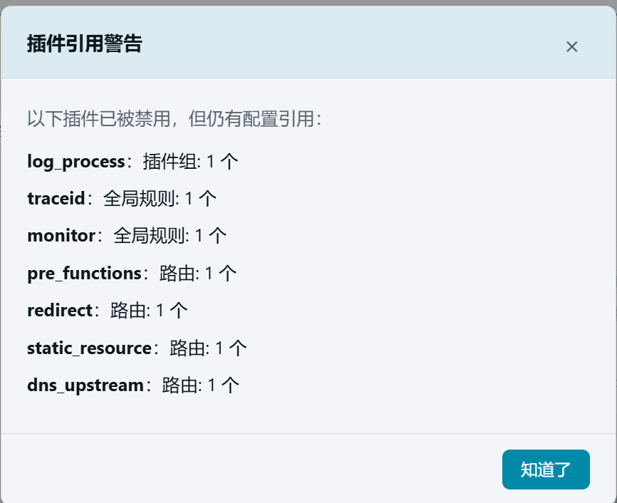
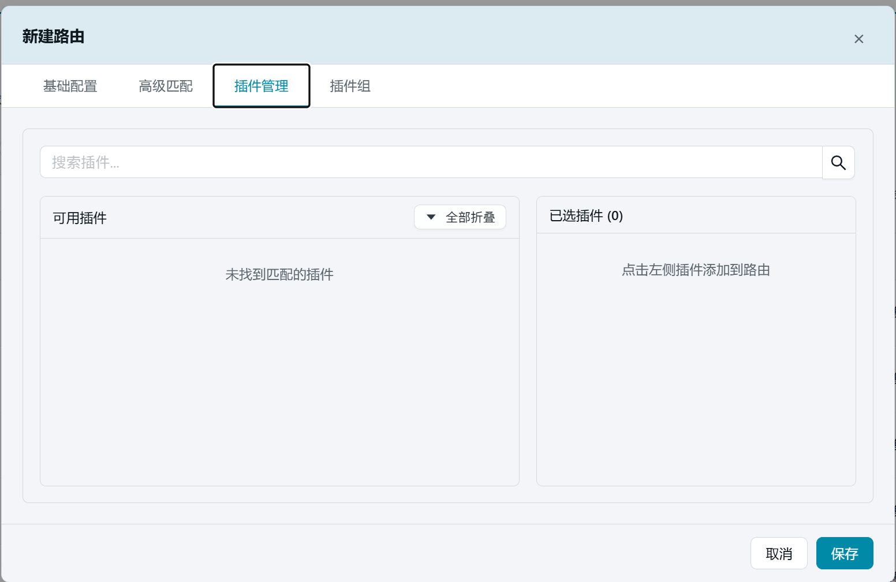

# 19. 插件开关

> 本章场景：磐石 Admin 内置了一批网关插件（日志、限流、重写等）。【插件开关】页是这些**内置插件的启用/禁用总闸**，还能查看每个插件的配置 schema——排查"某个插件为什么在路由里找不到"时，先来这里看一眼。

## 19.1 页面入口

点击左侧侧边栏：【系统管理】→【插件开关】。

> 若菜单不可见：回[第 1 章 功能开关前置检查](01-login.md)核对 `plugin_switches` 开关。

## 19.2 界面说明

| 区域 | 说明 |
| --- | --- |
| 状态条 | 显示「已启用 X / Y 个插件」，一眼看清总量 |
| 全部启用 / 全部禁用 | 批量操作按钮 |
| 状态筛选 | 只看已启用 / 已禁用 |
| 搜索框 | 按插件名称过滤 |
| 插件行 | 名称 + 启用开关（toggle）；点击 **⚙ schema** 展开该插件的配置结构定义 |

## 19.3 启用 / 禁用

1. 单个调整：拨动插件行的开关；
2. 批量调整：点【全部启用】或【全部禁用】；
3. 调整完成后，点击页面底部的【保存】提交变更。

   > ⚠️ 启用状态影响的是**平台侧可见的内置插件清单**（如新建路由/插件组时可选的插件卡片）。禁用一个插件后，相关配置界面将不再提供该插件选项；已在配置中使用的插件请先确认影响再禁用。
   >
   > 💡 该开关与 edge.env 里的 `ex_plugins` / `ex_stream_plugins`（第 4 章）不同：后者控制**节点上网关进程**的插件运行时开关，本页控制**平台侧**的插件清单。两者配合使用。

## 19.4 验证

1. 状态条数字随启停变化（如 `已启用 10 / 12 个插件`）；
2. 禁用某插件后，到【路由管理】→ 编辑 → 【插件管理】标签确认该插件不再出现在可选列表中。

可以实验全部关闭：

点击【全部禁用】, 插件卡片全部变灰

然后点击【保存配置】, 系统会警告并提示已经当前已经使用了插件的资源和数量

禁用以后，在新建路由时，在插件管理的 tab 页中就会看到，已经没有可以选择的插件了。

## 19.5 本章小结

- 本页 = 平台侧内置插件的总闸 + schema 速查
- 节点侧运行时开关在 edge.env（第 4 章），两处不要混淆
- 禁用前先确认没有存量配置依赖该插件

下一步：[第 20 章 用户管理](20-users.md)
