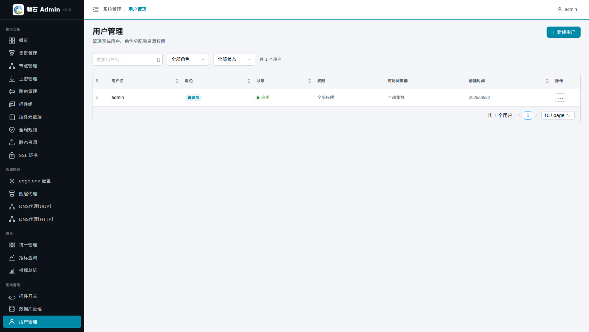

# 19. 用户管理

> 本章场景：网关平台往往不止一个人用——管理员负责全局配置，运维只管节点，审计只需要看指标。【用户管理】负责创建账号、分配角色与**资源权限**，控制每个人能看到、能操作哪些模块。

# 页面入口

点击左侧侧边栏：【系统管理】→【用户管理】。

> 只有管理员（admin）登录时才显示【+ 新建用户】按钮；普通用户进入本页只能查看。

# 角色模型

| 角色 | 权限范围 |
|---|---|
| admin | **全部权限**：所有菜单 + 用户管理 |
| 普通角色 | 按「资源权限」勾选的模块可见/可操作 |

# 新建用户

点击右上角【+ 新建用户】，填写表单：

| 字段 | 本例填写 | 说明 |
|---|---|---|
| 用户名 * | `ops01` | 登录账号，唯一 |
| 角色 | 按需选择 | admin 或自定义角色 |
| 密码 * | （6-50 位字符） | 仅新建时必填；编辑时不填表示不修改密码 |
| 启用 | ✅ 勾选 | 取消勾选 = 停用该账号（无法登录，配置保留） |

📷 截图待补充：（新建用户弹窗）

## 资源权限（非管理员）

角色不是 admin 时，表单下方出现【资源权限】区块——按模块勾选该用户可操作的入口（集群、节点、路由、指标等，与侧边栏分组对应）：

- 勾选的模块 → 该用户登录后侧边栏**显示且可操作**；
- 未勾选的模块 → 侧边栏直接隐藏。

> 💡 这就是第 0 章「功能开关前置检查」之外的第二层可见性控制：开关决定"功能存不存在"，权限决定"这个用户能不能用"。排查"某用户看不到某菜单"时，先查这里，再查 feature 开关。

# 编辑与停用

- 列表中点击用户行进入编辑：改角色、重设密码、调整资源权限；
- 取消「启用」勾选并保存即停用账号；
- admin 账号不建议停用或降权，避免失去管理入口。

# 验证

1. 新建一个仅勾选「指标查询」「指标总览」权限的账号 `viewer01`；
2. 退出登录，用 `viewer01` 登录：侧边栏只剩被授权的菜单，无【用户管理】；
3. 重新用 admin 登录确认列表中出现 `viewer01`。

📷 截图待补充：（viewer01 登录后的受限侧边栏）

# 本章小结

- admin = 全部权限；其他角色按「资源权限」逐模块授权
- 启用/停用是登录闸门，删除数据请谨慎
- "菜单不见了"两类原因：feature 开关（第 0 章）与本页资源权限

下一步：[第 20 章 数据库管理](20-database-management.md)
