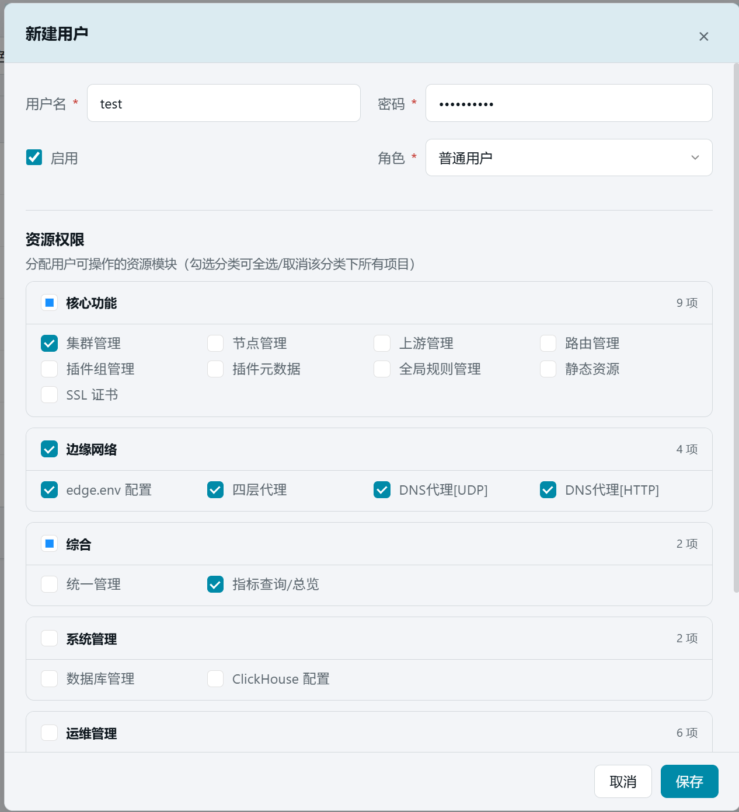

# 20. 用户管理

> 本章场景：网关平台往往不止一个人用——管理员负责全局配置，运维只管节点，审计只需要看指标。【用户管理】负责创建账号、分配角色与**资源权限**和**集群权限**，控制每个人能看到、能操作哪些模块以及哪些集群。

## 20.1 页面入口

点击左侧侧边栏：【系统管理】→【用户管理】。

> 只有管理员（admin）登录时才显示【+ 新建用户】按钮；普通用户进入本页只能查看。

## 20.2 角色模型

| 角色 | 权限范围 |
| --- | --- |
| admin | **全部权限**：所有菜单 + 用户管理 + 全部集群 |
| 普通用户 | 按「资源权限」勾选的模块可见/可操作 + 按「集群权限」限定可访问的集群 |

## 20.3 用户列表

列表展示以下列：

| 列 | 说明 |
| --- | --- |
| 用户名 | 登录账号 |
| 角色 | 管理员 / 普通用户（彩色徽章） |
| 状态 | 启用 / 禁用（带状态指示） |
| 权限 | 已授权的模块标签（最多显示 3 个，超出部分悬浮查看）；管理员显示「全部权限」 |
| 可访问集群 | 已授权的集群标签（最多显示 3 个）；管理员显示「全部集群」 |
| 创建时间 | 账号创建时间 |

列表顶部提供筛选：按用户名搜索、按角色筛选、按状态筛选。

## 20.4 新建用户

点击右上角【+ 新建用户】，在弹窗中填写：

| 字段 | 说明 |
| --- | --- |
| 用户名 \* | 登录账号，唯一 |
| 密码 \* | 6-50 位字符（仅新建时必填） |
| 启用 | 勾选 = 启用账号；取消勾选 = 停用（无法登录，配置保留） |
| 角色 | 普通用户（默认）/ 管理员 |

## 20.5 资源权限（非管理员）

角色选择「普通用户」时，表单下方出现**资源权限**区块——按左侧菜单分组展示所有可授权模块，每组支持全选/反选：

| 分组 | 包含模块 |
| --- | --- |
| 核心功能 | 集群管理、节点管理、上游管理、路由管理、插件组管理、插件元数据、全局规则管理、静态资源、SSL 证书 |
| 边缘网络 | edge.env 配置、四层代理、DNS 代理[UDP]、DNS 代理[HTTP] |
| 综合 | 统一管理、指标查询/总览 |
| 系统管理 | 数据库管理、ClickHouse 配置 |
| 运维管理 | Edge 直连、数据导入、工具箱、自启动管理、Ansible 主机清单、节点任务 |

> 💡 这就是第 1 章「功能开关前置检查」之外的第二层可见性控制：开关决定"功能存不存在"，权限决定"这个用户能不能用"。排查"某用户看不到某菜单"时，先查这里，再查 feature 开关。

## 20.6 集群权限（非管理员）

资源权限下方是**集群权限**区块——限定该用户可访问哪些集群：

- 点击【+ 选择集群】打开集群选择弹窗，按分组浏览、搜索、批量勾选
- 已选集群以标签形式展示，点 × 可移除
- 不选择任何集群 = 该用户无法访问任何集群资源

> ⚠️ 集群权限与资源权限独立控制：即使用户有「路由管理」权限，若未分配某个集群，该集群的路由对他不可见。

## 20.7 编辑用户

点击用户行操作列的【⋯】→【编辑】：

- **角色切换**：切换为管理员时，资源权限和集群权限自动清空（管理员拥有全部权限）
- **重置密码**：输入新密码后点击【重置】按钮即时生效（不修改用户信息表单）
- **调整权限**：修改资源权限和集群权限后，点击【保存】一次性提交

## 20.8 停用与删除

操作列菜单提供：

| 操作 | 说明 |
| --- | --- |
| 启用/禁用 | 切换账号状态；初始管理员（admin）不可禁用 |
| 删除 | 删除用户账号；初始管理员不可删除 |

## 20.9 验证

1. 新建一个仅勾选「指标查询/总览」权限的账号 `viewer01`，并分配部分集群；
2. 退出登录，用 `viewer01` 登录：侧边栏只剩被授权的模块，且只能看到已分配集群的数据；
3. 重新用 admin 登录确认列表中出现 `viewer01`，权限标签和集群标签正确显示。

## 20.10 本章小结

- admin = 全部权限 + 全部集群；普通用户按「资源权限」+「集群权限」双重授权
- 资源权限按菜单分组，支持全选/按组选；集群权限通过选择弹窗配置
- 启用/停用是登录闸门，删除数据请谨慎
- "菜单不见了"三类原因：feature 开关（第 1 章）、资源权限（本页）、集群权限（本页）

下一步：[第 21 章 统一管理](21-central-management.md)
