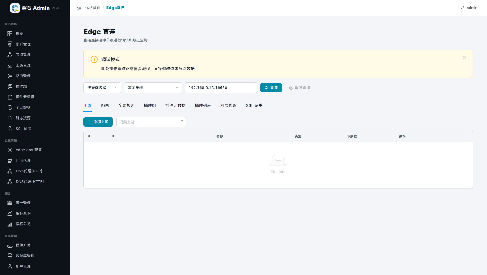
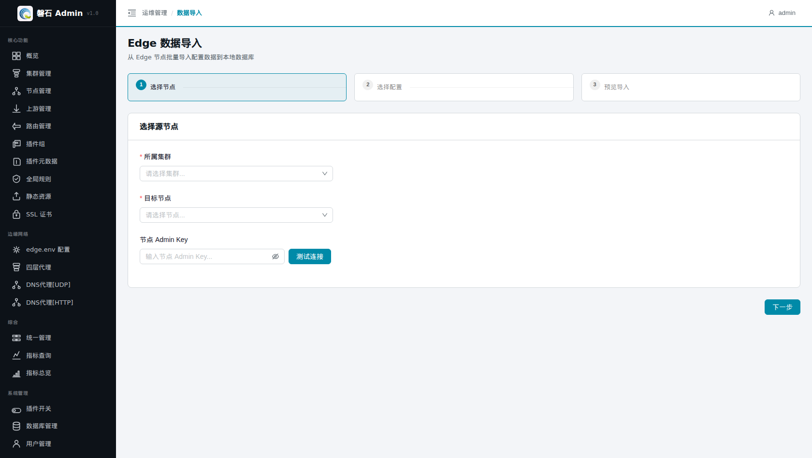

# 21. Edge 直连与数据导入

> 本章场景：手上已有一批**在用**的 Edge 节点，配置都在节点上而平台库里是空的（或想核对两边差异）。两个工具配合解决：【Edge 直连】连上节点调试查询，【数据导入】把节点上的配置批量搬进平台库。

## 21.1 Edge 直连

### 21.1.1 页面入口

点击左侧侧边栏：【运维管理】→【Edge直连】。

> 若菜单不可见：回[第 0 章 功能开关前置检查](00-login.md)核对 `edge_client` 开关。

### 21.1.2 使用方法

1. 顶部选择输入模式、集群、节点（级联下拉：先选集群才可选节点）；
2. 按输入模式填写查询内容；
3. 点击【查询】，直接向该节点的 Edge 管理 API 发起请求，结果就地展示。

   > ⚠️ 页面顶部有「调试模式」提示条——本工具直连节点实时读取，适合排障核对；对节点的任何写操作请走正规发布流程，不要在生产节点上随意试验。

📷 截图待补充：（选择集群节点后的一次查询结果）

## 21.2 数据导入

### 21.2.1 页面入口

点击左侧侧边栏：【运维管理】→【数据导入】。

> 若菜单不可见：回[第 0 章 功能开关前置检查](00-login.md)核对 `edge_import` 开关。

### 21.2.2 导入流程（分步向导）

| 步骤 | 操作 |
| --- | --- |
| ① 选择 | 勾选要导入的配置类型（上游、路由等），点击【下一步 — 预览】 |
| ② 预览 | 平台从节点拉取配置并逐项预览；解析失败的数据无法导入，其余可正常导入 |
| ③ 冲突确认 | 平台自动检测 **uuid 冲突**（同名同 ID 记录在库中已存在），显示「发现 X 项冲突」，可展开冲突详情逐项查看 |
| ④ 执行 | 确认导入项后执行写入 |

### 21.2.3 冲突处理建议

- 冲突 = 节点上已有配置的 uuid 与平台库中现有记录相同。可选择跳过冲突项只导新数据，或先删除/改名平台侧旧记录再导；
- **强烈建议在独立空库上练习导入**：到[第 20 章](20-database-management.md)添加一个空 SQLite 连接并设为当前（重启生效），练完再切回工作库——避免外部配置混入手工搭建的演示环境。

📷 截图待补充：（冲突提示卡片展开详情）

## 21.3 本章小结

- Edge 直连 = 单节点实时调试查询（读为主，谨慎写）
- 数据导入 = 分步向导：选择 → 预览 → 冲突确认 → 执行
- uuid 冲突是导入的核心风险点；练习请在独立空库上进行

下一步：[第 22 章 工具箱 / 自启动管理 / 节点任务](22-tools-autostart-tasks.md)
