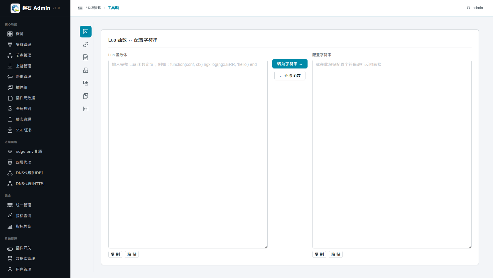
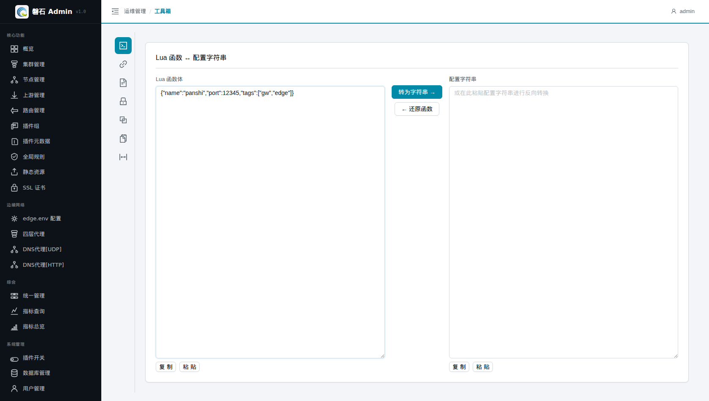
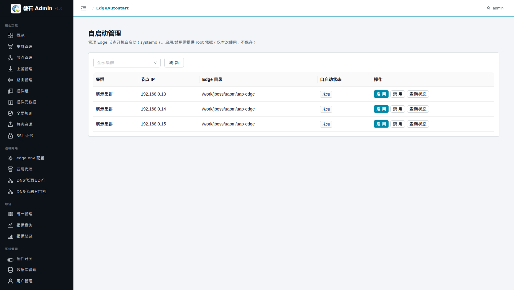
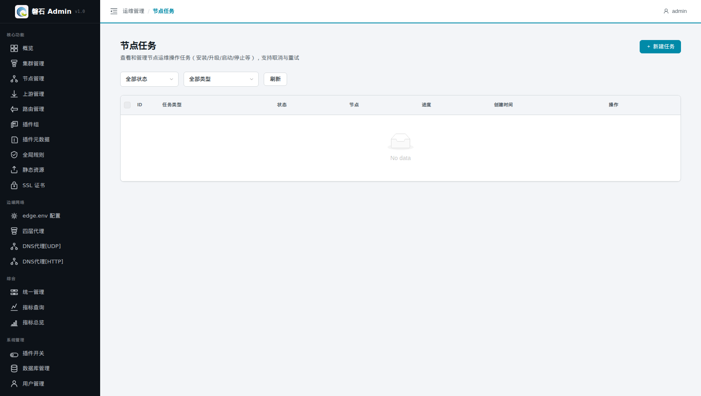

# 22. 工具箱 / 自启动管理 / 节点任务

> 本章场景：运维管理的最后三个入口——【工具箱】是日常开发调试的瑞士军刀；【自启动管理】控制节点上的 Edge 服务开机自启（systemd）；【节点任务】是所有节点级运维操作（安装/升级/启停）的任务中心。三者都不改动网关业务配置，属于"管机器、管任务"的辅助能力。

## 22.1 工具箱

### 22.1.1 页面入口

点击左侧侧边栏：【运维管理】→【工具箱】。

> 若菜单不可见：回[第 0 章 功能开关前置检查](00-login.md)核对 `tools` 开关。

### 22.1.2 内置工具

左侧图标列表切换工具，全部为**纯本地转换**（输入不出本机）：

| 工具 | 用途 |
| --- | --- |
| Lua 转换 | Lua 代码片段格式化/处理，配合路由自定义预处理插件（第 8 章）使用 |
| URL 编解码 | URL 编码与解码互转 |
| JSON 格式化 | JSON 压缩/美化，排查接口返回时常用 |
| SM4 加解密 | 国密 SM4 加解密计算，配合国密证书场景（第 9 章） |

每个输入/输出框都带【复制】/【粘贴】按钮。

## 22.2 自启动管理

### 22.2.1 页面入口

点击左侧侧边栏：【运维管理】→【自启动管理】。

### 22.2.2 功能说明

管理各节点上 **Edge 服务的 systemd 开机自启动**：

| 列/操作 | 说明 |
| --- | --- |
| 自启动状态 | 已启用（绿）/ 已禁用（橙） |
| 【启用】 | 开机自动拉起 Edge 服务 |
| 【禁用】 | 取消开机自启（服务本身不被停止） |

### 22.2.3 root 凭据

点击【启用】或【禁用】会弹出抽屉，要求填写 **root 账号与密码**——修改 systemd 自启动配置需要 root 权限：

> ⚠️ 凭据**仅本次操作使用，平台不保存**；提交后即用于 SSH 执行 systemctl 命令。手册中以 `<root-password>` 占位表示，真实密码由环境提供方线下获取，切勿写入任何文档或截图。

📷 截图待补充：（启用自启动抽屉，root 密码框打码）

## 22.3 节点任务

### 22.3.1 页面入口

点击左侧侧边栏：【运维管理】→【节点任务】。

> 若菜单不可见：回[第 0 章 功能开关前置检查](00-login.md)核对 `task_center` 开关。

### 22.3.2 任务模型

所有针对节点的运维操作（OpenResty/Edge 的**安装、升级、启动、停止**等）都会在这里留下任务记录：

| 筛选/列 | 说明 |
| --- | --- |
| 状态筛选 | 全部 / 运行中 / 已完成 / 失败 / 部分成功 / 已取消 等 |
| 类型筛选 | 安装 / 升级 / 启动 / 停止 等 |
| 详情统计 | 成功 / 失败 / 取消 各多少台节点 |

### 22.3.3 任务操作

| 按钮 | 出现条件 | 行为 |
| --- | --- | --- |
| 取消 | 运行中 / 排队中 | 中断尚未执行完的任务 |
| 重试 | 失败 / 部分成功 / 已取消 | 以原参数重新发起 |

> 💡 「部分成功」= 多节点任务中部分节点失败。点开详情看失败节点清单，修复后用【重试】只补失败部分。
>
> ⚠️ 升级类任务会影响节点上的网关进程，生产环境建议逐台执行并观察，避免全量同时升级。

## 22.4 本章小结

- 工具箱 = 本地转换四件套（Lua/URL/JSON/SM4），数据不出本机
- 自启动 = systemd 层面的开机拉起，root 凭据仅本次使用不保存
- 节点任务 = 运维操作的台账：可筛选、可取消、可重试，「部分成功」重点看失败节点明细

## 22.5 进阶与运维篇小结

至此左侧菜单全部功能均已覆盖：

| 分组 | 章节 |
| --- | --- |
| 核心功能 | 第 1~9 章（搭建篇）+ 第 13~14 章 |
| 边缘网络 | 第 3、10~11 章（搭建篇）+ 第 15 章 |
| 综合 | 第 16~17 章 |
| 系统管理 | 第 18~20 章 |
| 运维管理 | 第 21~22 章 |

回到 [README 总目录](README.md) 按需查阅。
