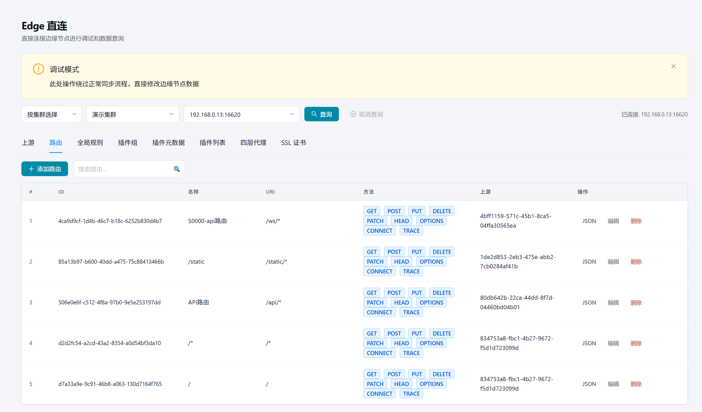
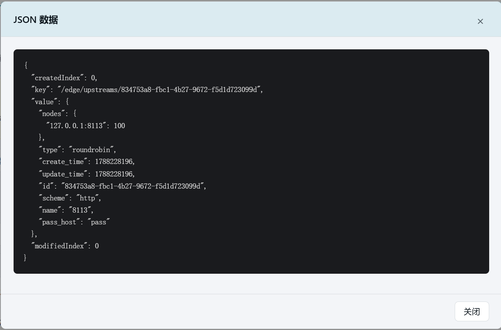

# 23. Edge 直连

> 本章场景：手上已有一批**在用**的 Edge 节点，想实时查看、编辑或清理节点上的配置。【Edge 直连】直连节点的 Edge 管理 API，支持**查询、添加、编辑、删除、JSON 查看**五种操作。

## 23.1 页面入口

点击左侧侧边栏：【运维管理】→【Edge直连】。

> 若菜单不可见：回[第 1 章 功能开关前置检查](01-login.md)核对 `edge_client` 开关。

## 23.2 选择节点

页面顶部提供两种输入模式：

| 模式 | 操作 |
| --- | --- |
| 按集群选择 | 先选集群 → 再选节点（级联下拉） |
| 手动输入 | 直接输入 `IP:管理端口`（如 `192.168.100.235:11999`） |

点击【查询】后，平台直连该节点的 Edge 管理 API，一次性加载全部配置数据（上游/路由/全局规则/插件组/插件元数据/插件列表/四层代理/SSL证书）。

> ⚠️ 页面顶部有「调试模式」提示条——**本工具绕过正常同步流程，直接修改边缘节点数据**。生产环境写操作请走正规发布流程。

## 23.3 资源 Tab 页

查询成功后，页面展示 8 个 Tab 页，每个 Tab 对应节点上的一类资源：

| Tab | 资源类型 | 支持操作 |
| --- | --- | --- |
| 上游 | Upstream（负载均衡组） | 添加 / 编辑 / JSON 查看 / 删除 |
| 路由 | Route（流量匹配规则） | 添加 / 编辑 / JSON 查看 / 删除 |
| 全局规则 | Global Rule（全节点插件规则） | 添加 / 编辑 / JSON 查看 / 删除 |
| 插件组 | Plugin Config（插件配置组） | 添加 / 编辑 / JSON 查看 / 删除 |
| 插件元数据 | Plugin Metadata（插件元数据） | 添加 / 编辑 / JSON 查看 / 删除 |
| 插件列表 | Plugin List（已加载插件清单） | 仅查看 |
| 四层代理 | Stream Route（TCP 转发规则） | JSON 查看 / 删除 |
| SSL 证书 | SSL Certificate | JSON 查看 / 删除 |

每个 Tab 页顶部都有搜索框，支持按名称/ID 快速过滤。

## 23.4 JSON 查看

点击每行操作栏的【JSON】按钮，弹出 JSON 弹窗，展示该条资源的完整原始数据。

**用途**：
- 查看节点上资源的完整字段（含平台编辑界面不展示的隐藏字段）
- 确认节点配置与平台库的差异
- 排障时核对实际生效的配置内容

**注意事项**：
- JSON 弹窗为**只读**，不支持直接编辑
- 部分字段（如 `create_time`、`update_time`）为 APISIX 自动生成，不可修改

## 23.5 添加与编辑

支持**表单模式**的资源类型：上游、路由、全局规则、插件组、插件元数据。

### 23.5.1 上游（Upstream）

点击【添加上游】或行内【编辑】打开表单弹窗：

| 字段 | 说明 |
| --- | --- |
| 名称 | 上游名称（可选） |
| 类型 | roundrobin（默认）/ chash / ewma / least_conn |
| 哈希位置 | 仅 chash 类型：HTTP 请求头 / Cookie / 内置变量 / 自定义变量 |
| Key | 仅 chash + 内置变量模式：`remote_addr` / `uri` / `host` / `arg_xxx` 等 |
| 节点 | 后端节点列表，格式 `IP:端口` + 权重 |

### 23.5.2 路由（Route）

点击【添加路由】或行内【编辑】打开表单弹窗：

| 字段 | 说明 |
| --- | --- |
| 名称 | 路由名称 |
| URI | 匹配路径，如 `/api/*` |
| 请求方法 | 复选 GET/POST/PUT/DELETE 等 |
| 域名 | 逗号分隔，如 `example.com,*.example.com` |
| 优先级 | 数值越大优先级越高 |
| 上游 | 从已加载的上游列表中选择 |
| 插件配置 | JSON 格式插件配置 |
| 高级匹配 | 开启后可配置 `vars` 匹配条件（请求头/Cookie/查询参数等） |
| 关联插件组 | 从已加载的插件组中勾选 |

### 23.5.3 全局规则 / 插件组 / 插件元数据

表单较简单，主要字段：
- **全局规则 / 插件组**：ID（创建时填写，编辑时只读）+ 描述 + 插件配置（JSON）
- **插件元数据**：插件名称（创建时填写，编辑时只读）+ 配置数据（JSON）

## 23.6 删除

点击每行操作栏的【删除】按钮，弹出确认弹窗：

> 确定删除 XXX ？此操作绕过同步流程。

确认后直接从节点删除该条资源。

**⚠️ 删除注意事项**：
- 删除操作**立即生效**，不可撤销
- 删除的资源不会从平台库中移除（仅影响节点）
- 删除路由前确认该路由未被生产流量使用
- 删除 SSL 证书前确认该证书未被路由引用
- **建议先通过 JSON 查看确认资源身份，再执行删除**

## 23.7 常见操作场景

| 场景 | 操作步骤 |
| --- | --- |
| 查看节点上所有路由 | 选节点 → 查询 → 路由 Tab |
| 核对节点与平台的配置差异 | JSON 查看 → 与平台库中的配置逐字段对比 |
| 节点上有残留的脏数据 | JSON 查看确认 → 点击删除 |
| 临时在节点上加一条测试路由 | 添加路由 → 填写表单 → 创建 |
| 修改节点上某条路由的上游 | 编辑 → 修改上游字段 → 保存 |

## 23.8 本章小结

- Edge 直连 = 单节点实时调试工具（查询 / 添加 / 编辑 / 删除 / JSON 查看）
- **写操作绕过平台同步流程**，直接修改节点数据
- JSON 查看适合排障核对，编辑适合临时调整
- 删除不可撤销，建议先 JSON 查看确认后再操作
- 生产环境的正式配置变更请走正规发布流程

下一步：[第 24 章 数据导入](24-data-import.md)
