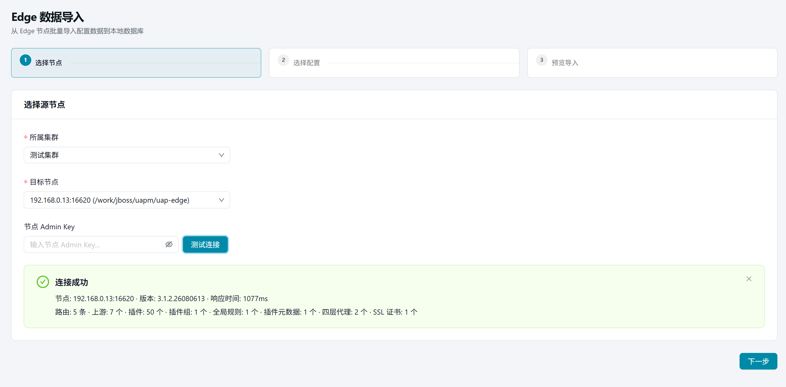
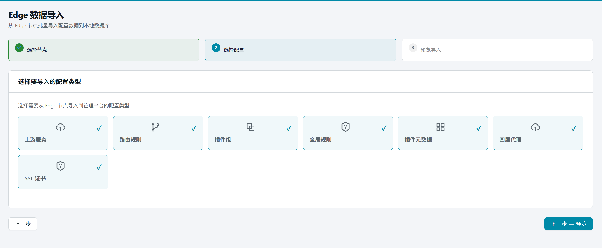
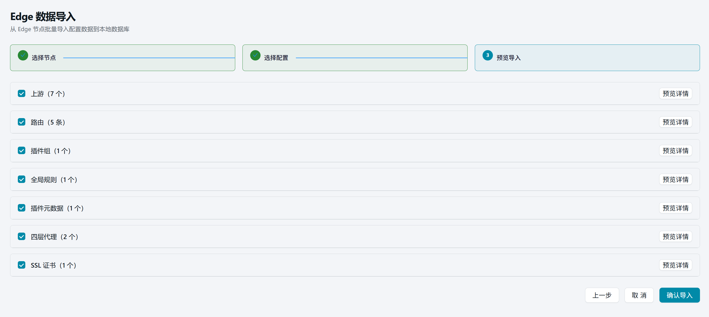
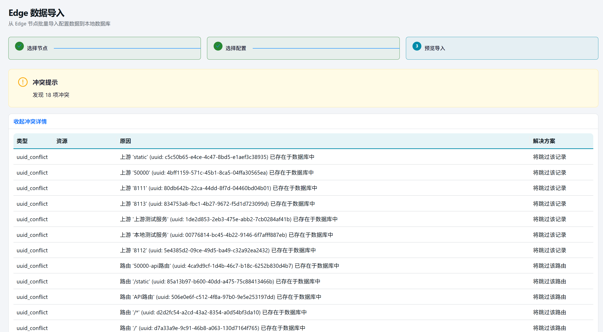
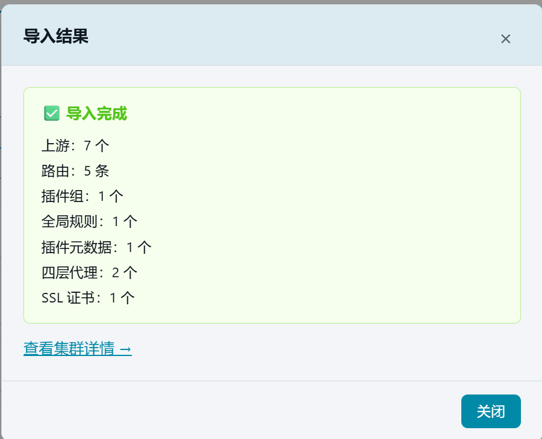

# 24. 数据导入

> 本章场景：手上有一台**已有完整配置**的 Edge 节点，想把上面的配置批量搬进平台数据库，以便集中管理。【数据导入】直连节点拉取配置，分步向导导入到数据库。

## 24.1 页面入口

点击左侧侧边栏：【运维管理】→【数据导入】。

> 若菜单不可见：回[第 1 章 功能开关前置检查](01-login.md)核对 `edge_import` 开关。

## 24.2 前置准备

数据导入的**源**是 Edge 节点上的配置数据。导入前需要在平台上做好以下准备：

1. **新建一个空集群**（参考[第 2 章](02-cluster.md)）——导入的目标容器
2. **在该集群下添加一个节点**（参考[第 3 章](03-nodes.md)）——填入源节点的 IP、管理端口等信息，指向你要导入的那台 Edge 节点

> ⚠️ 导入的数据会写入该集群对应的数据库。请确保目标集群是刚建的空集群，避免导入数据与已有手工配置产生冲突。

## 24.3 导入向导（3 步）

### 步骤 ①：选择节点

| 字段 | 说明 |
| --- | --- |
| 所属集群 | 选择刚才新建的空集群 |
| 目标节点 | 选择集群下已添加的节点 |
| 节点 Admin Key | 输入节点的 Admin Key（管理密钥），用于鉴权 |

填写后点击【测试连接】，验证平台能否连通该节点。连接成功后会显示：

- 节点地址、版本号、响应时间
- 节点上现有资源统计（路由/上游/插件/插件组/全局规则/插件元数据/四层代理/SSL证书各多少条）

> ⚠️ 连接失败请检查：节点 IP 和端口是否正确、Admin Key 是否匹配、节点管理端口是否对外可达。

连接测试通过后，点击【下一步】。

### 步骤 ②：选择配置

勾选需要导入的配置类型（全部默认勾选）：

| 配置类型 | 说明 |
| --- | --- |
| 上游服务 | Upstream 负载均衡组 |
| 路由规则 | Route 流量匹配规则 |
| 插件组 | Plugin Config（插件配置组） |
| 全局规则 | Global Rule（全节点插件规则） |
| 插件元数据 | Plugin Metadata（插件级配置） |
| 四层代理 | Stream Proxy（TCP 转发规则） |
| SSL 证书 | SSL Certificate |

取消不需要的类型，只导入需要的配置。选择完成后点击【下一步 — 预览】。

### 步骤 ③：预览导入

平台从节点拉取所有选中类型的配置数据，逐项展示预览。此步需要关注：

#### a. 获取警告

如果部分数据获取失败（如节点上某类资源不存在），会显示黄色警告条。**失败的数据无法导入，其余数据可正常导入。**

#### b. 插件识别

平台会自动识别节点上的插件是否为已知内置插件。发现新插件时显示提示：

> 已识别 X 个已知插件，发现 Y 个新插件（xxx），新插件将存入数据库。

新插件会随配置一起导入，导入后可在[第 17 章 插件开关](17-plugin-switches.md)中查看。

#### c. 冲突检测

平台自动检测**冲突**——节点上某条资源的 ID 在目标数据库中已存在。冲突项会以黄色警告提示「发现 X 项冲突」，可展开冲突详情查看：

| 字段 | 说明 |
| --- | --- |
| 类型 | 冲突资源的类型（上游/路由等） |
| 资源 | 资源 ID 或名称 |
| 原因 | 为什么产生冲突（ID 重复等） |
| 解决方案 | 建议的处理方式 |

#### d. 逐项预览

每类资源可展开详情表格，预览即将导入的具体数据（名称/类型/URI/方法等）。确认无误后点击【确认导入】。

## 24.4 导入结果

导入完成后弹出结果弹窗：

- **成功**：显示各类资源导入数量，以及跳过项数（冲突项被跳过）
- **失败**：显示错误信息，需排查后重试

可点击链接跳转到[第 2 章 集群管理](02-cluster.md)查看导入后的集群详情。

## 24.5 注意事项

1. **目标集群必须是空的**——导入前确保该集群下没有任何路由/上游等配置，否则会产生冲突
2. **Admin Key 必须正确**——用于节点管理 API 鉴权，错误会导致连接失败
3. **冲突项会被跳过**——不会覆盖已有数据，跳过的数量在结果中显示
4. **导入后需要发布**——导入的配置只写入平台数据库，需要通过发布流程同步到节点（参考[第 14 章 概览](14-overview.md)）

## 24.6 常见问题

| 问题 | 排查方向 |
| --- | --- |
| 测试连接失败 | 检查节点 IP/端口/Admin Key；确认节点管理端口对外可达 |
| 部分数据获取失败 | 节点上对应资源可能不存在或格式异常，其余数据可正常导入 |
| 导入后数据不完整 | 检查冲突跳过项；确认勾选了需要的配置类型 |
| 导入成功但界面无变化 | 导入仅写入数据库，需发布后同步到节点 |

## 24.7 本章小结

- 数据导入 = 从 Edge 节点批量搬配置到平台库
- 前置条件：新建空集群 → 添加节点 → 测试连接
- 3 步向导：选择节点 → 选择配置类型 → 预览确认
- 冲突项自动跳过，不覆盖已有数据
- 导入后需发布才能生效

下一步：[第 25 章 工具箱](25-tools.md)
