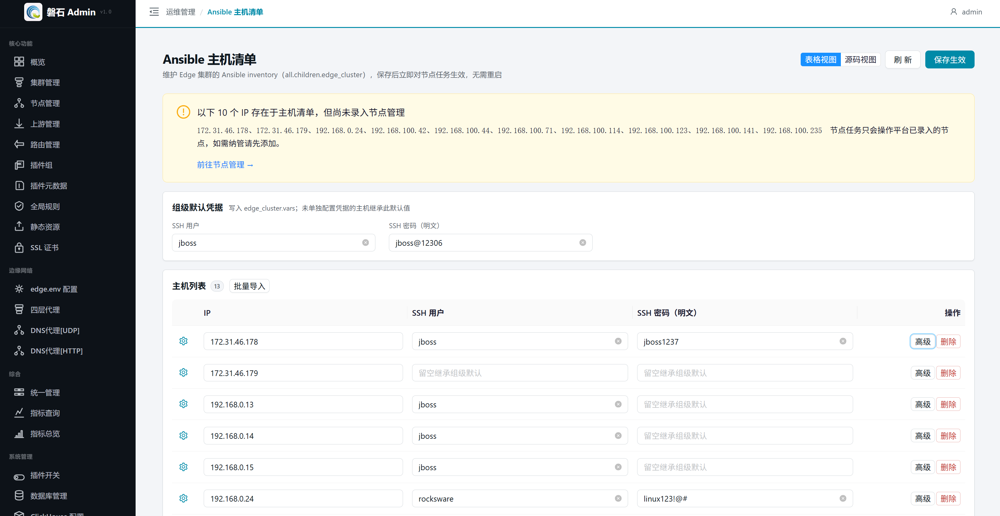
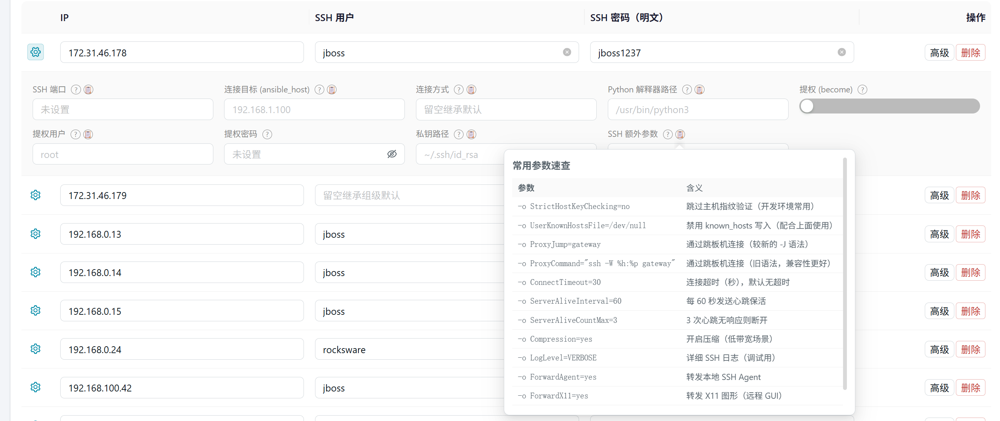
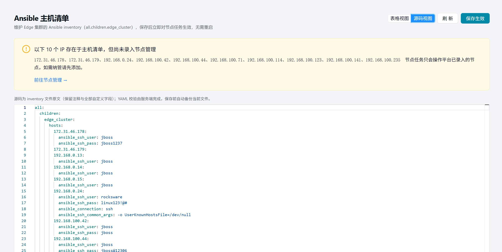
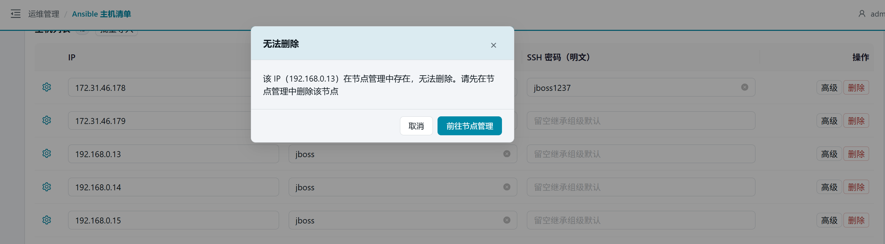
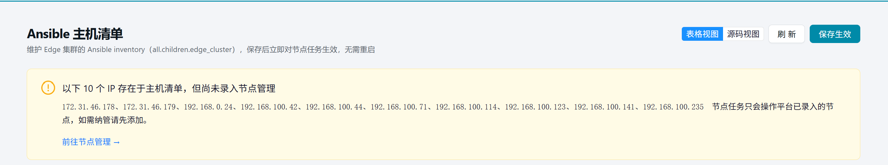

# 26. Ansible 主机清单

> 本章场景：平台通过 Ansible 对 Edge 节点执行任务（安装、配置、状态采集等）。主机清单（inventory）定义了 Ansible 连接哪些主机、使用什么凭据。本章介绍如何通过界面管理这份清单。

## 26.1 页面入口

点击左侧侧边栏：【运维管理】→【Ansible 主机清单】。

> 若菜单不可见：回[第 1 章 功能开关前置检查](01-login.md)确认 `ansible_inventory` 开关已启用。

## 26.2 界面结构

页面分为三个区域：

1. **组级默认凭据**（顶部）：设置整个 `edge_cluster` 组的默认 SSH 用户名和密码，新主机未填写凭据时自动继承
2. **主机列表**（中部表格）：每行一台主机，支持表格视图和源码视图切换
3. **操作栏**（顶部右侧）：新增主机、保存、切换视图

## 26.3 表格视图

### 26.3.1 基本字段

每行显示三列可编辑字段：

| 字段 | 说明 | 示例 |
| --- | --- | --- |
| IP | 主机 IP 地址（唯一标识，不可重复） | `192.168.0.13` |
| SSH 用户名 | 连接用户名，留空继承组级默认 | `root` |
| SSH 密码 | 连接密码，留空继承组级默认 | `••••••` |

### 26.3.2 高级设置

点击行右侧的【高级】按钮展开高级设置面板，可配置常用连接变量：

| 字段 | 说明 | 默认值 |
| --- | --- | --- |
| SSH 端口 | 远程 SSH 端口，留空使用默认 22 | `22` |
| 连接目标 | 覆盖实际连接地址（用于 NAT/端口转发场景） | — |
| 连接方式 | SSH 连接类型：smart/ssh/paramiko_ssh/local/docker/podman | `smart` |
| Python 解释器 | 远程主机 Python 路径，留空自动检测 | — |
| 提权 (become) | 是否使用 sudo 提权 | 关闭 |
| 提权用户 | sudo 目标用户，留空默认 root | `root` |
| 提权密码 | sudo 密码，留空使用 NOPASSWD 配置 | — |
| 私钥路径 | SSH 私钥文件路径，支持 `~` 表示主目录 | `~/.ssh/id_rsa` |
| SSH 额外参数 | 空格分隔的 SSH 选项，如 `-o StrictHostKeyChecking=no` | — |

> 💡 每个字段旁有 📋 图标，点击可查看常用参数速查表并一键复制。

### 26.3.3 高级字段联动

- **提权 (become) 关闭时**：提权用户和提权密码输入框自动灰掉（不清空已有值）
- **提权 (become) 开启时**：提权用户和提权密码恢复可编辑

## 26.4 源码视图

点击【源码视图】切换为 YAML 编辑器，直接编辑 inventory 文件原文。适合高级用户或需要批量修改的场景。

源码视图保留文件中的所有注释和格式；表格视图切换时注释会丢失（YAML 序列化不保留注释）。

## 26.5 新增与删除主机

### 26.5.1 新增主机

点击【+ 新增主机】，表格末尾追加空白行，填写 IP 和凭据后保存。

### 26.5.2 删除主机

- **未录入节点管理的主机**：直接删除，保存后生效
- **已录入节点管理的主机**：删除被阻止，提示「该 IP 在节点管理中存在，无法删除。请先在节点管理中删除该节点」

### 26.5.3 平台已录入提示

若清单中存在尚未录入节点管理的 IP，页面顶部显示提示条：「以下 N 个 IP 存在于主机清单，但尚未录入节点管理」，附【前往节点管理 →】按钮跳转到节点管理页面去添加节点信息。

## 26.6 保存机制

1. 点击【保存】→ 后端校验 YAML 格式 + 字段合法性（端口范围、连接方式等）
2. 校验通过后写入文件，**立即生效**（下次节点任务执行时使用新配置）
3. 校验失败返回具体错误信息，不修改文件

**保存前自动备份**：每次保存前，系统自动备份当前文件（备份路径：`ansible/inventory/backups/host.bak[时间戳]`）。

## 26.7 与其他页面的关系

| 需求 | 推荐入口 |
| --- | --- |
| 管理单个集群的节点 | 【节点管理】（第 3 章） |
| 管理 Edge 节点的 SSH 连接配置 | 本页 |
| 查看节点执行任务的日志 | 【节点任务】→ 【操作】→ 【详情】→ 【完整日志】 |
| 管理平台级 SSH 配置 | 【Edge 环境配置】（第 4 章） |

## 26.8 本章小结

- 主机清单 = Ansible 连接配置，保存后立即对节点任务生效
- 表格视图适合日常编辑，源码视图适合批量修改
- 高级字段覆盖 90% 常用连接变量，罕见字段走源码模式全保真保留
- 已录入节点管理的主机不可从清单删除（需先删节点）

下一步：[第 27 章 ClickHouse 配置](27-clickhouse-config.md)
