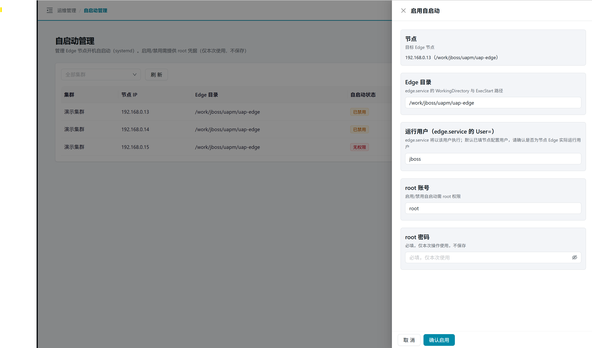
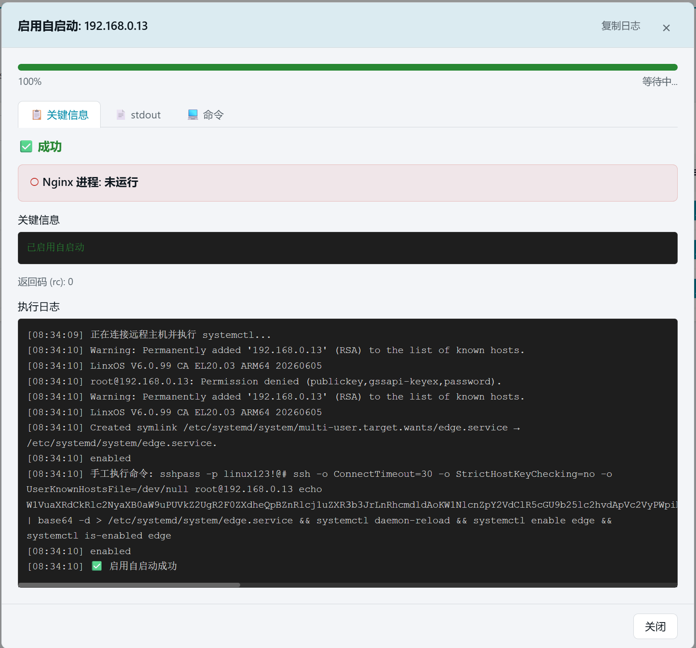
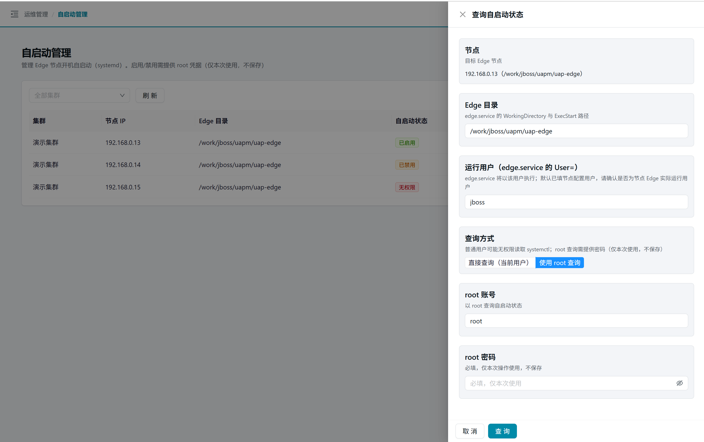
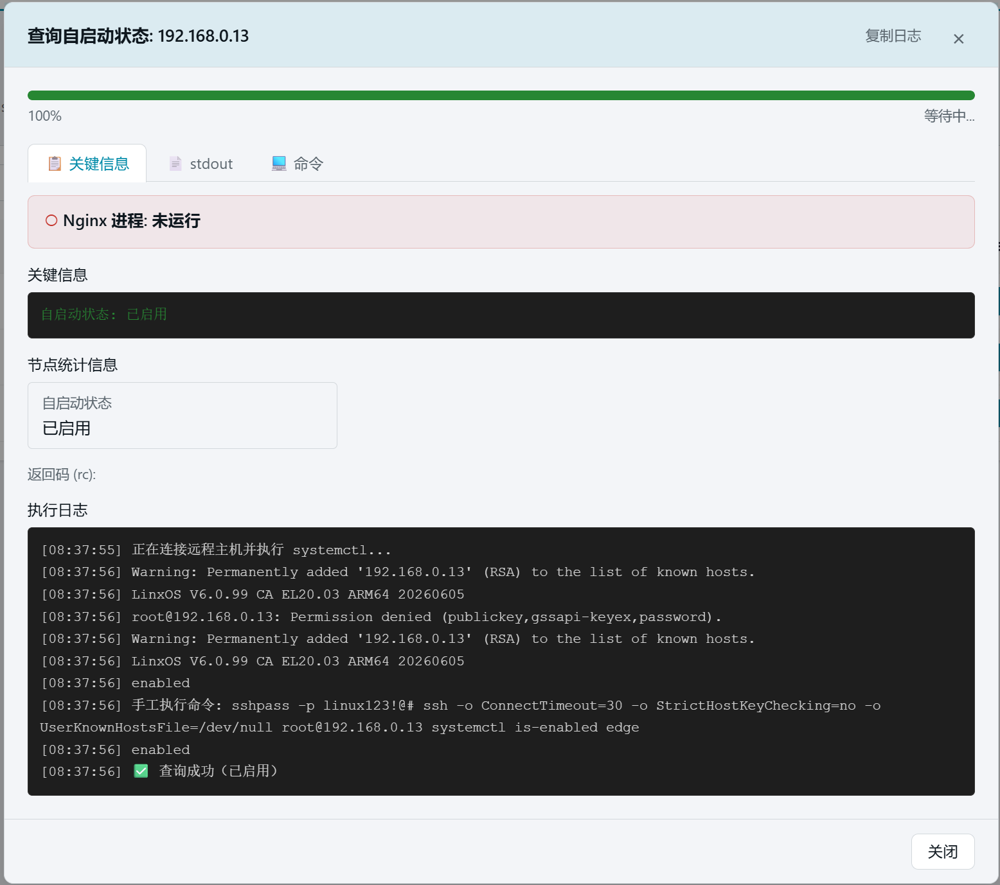

# 26. 自启动管理

> 管理各节点上 Edge 服务的 systemd 开机自启动。启用/禁用需提供 root 凭据（仅本次使用，不保存）；查询状态支持当前用户直查或 root 查询两种模式。

## 25.1 页面入口

点击左侧侧边栏：【运维管理】→【自启动管理】。

> 若菜单不可见：回[第 1 章 功能开关前置检查](01-login.md)核对 `edge_autostart` 开关。

## 25.2 节点列表

页面顶部提供**集群筛选**下拉框，可按集群过滤节点。列表展示各节点的自启动配置情况：

| 列 | 说明 |
| --- | --- |
| 集群 | 节点所属集群名称 |
| 节点 IP | Edge 节点 IP 地址 |
| Edge 目录 | edge.service 的工作目录 |
| 自启动状态 | 已启用（绿）/ 已禁用（橙）/ 未配置（红）/ 无权限（红）/ 未知 |

## 25.3 操作抽屉

点击任一操作按钮（【启用】/【禁用】/【查询状态】）打开抽屉，包含以下通用字段：

| 字段 | 说明 |
| --- | --- |
| 节点 | 目标 Edge 节点（只读展示） |
| Edge 目录 | edge.service 的 WorkingDirectory 与 ExecStart 路径，默认取节点配置值 |
| 运行用户 | edge.service 的 User= 字段，默认取节点 inventory 用户，可修改 |

### 25.3.1 启用 / 禁用

启用或禁用需提供 root 凭据：

| 字段 | 说明 |
| --- | --- |
| root 账号 | 默认 `root` |
| root 密码 | 必填，**仅本次操作使用，平台不保存** |

点击【确认启用】或【确认禁用】后，进入执行结果抽屉，实时展示 SSH 执行日志与进度。成功后表格中的自启动状态标签自动更新。

### 25.3.2 查询状态

查询状态支持两种凭据模式：

| 模式 | 说明 |
| --- | --- |
| 直接查询（当前用户） | 无需密码，以节点 inventory 用户 SSH 执行 `systemctl is-enabled`；普通用户可能无权限 |
| 使用 root 查询 | 需提供 root 密码，以 root 身份执行查询 |

> 💡 普通用户无权限时，切换为 root 模式重试即可。

查询结果同样在执行结果抽屉中展示，成功后自动更新表格中的状态标签。

### 25.3.3 执行结果抽屉

启用、禁用、查询状态操作完成后，弹出结果抽屉展示：

| 区域 | 说明 |
| --- | --- |
| 进度条 | 操作执行进度（成功/失败） |
| 日志 | 实时 SSH 执行日志 |
| 统计 | 操作结果摘要（如：自启动状态 = 已启用） |
| 高亮 | 关键信息提示 |
| 命令 | 实际执行的 SSH 命令 |

## 25.4 状态说明

| 状态标签 | 含义 |
| --- | --- |
| 已启用 | Edge 服务已配置开机自启动 |
| 已禁用 | Edge 服务已取消开机自启动 |
| 未配置 | 节点上不存在 edge.service |
| 无权限 | 普通用户无法执行 systemctl 查询 |
| 未知 | 状态无法识别 |

## 25.5 常见问题

| 现象 | 处理 |
| --- | --- |
| 启用/禁用失败 | 检查 root 密码是否正确；确认节点 SSH 可达 |
| 查询状态显示「无权限」 | 切换为 root 模式查询 |
| 状态显示「未配置」 | 需先通过节点任务安装 Edge 服务 |

## 25.6 本章小结

- 自启动管理 = systemd 层面的开机拉起控制
- 三种操作共用抽屉风格，root 凭据仅本次使用不保存
- 查询状态支持当前用户直查和 root 查询两种模式
- 操作结果通过执行结果抽屉实时反馈，状态标签自动同步

下一步：[第 28 章 节点任务](28-node-tasks.md)
