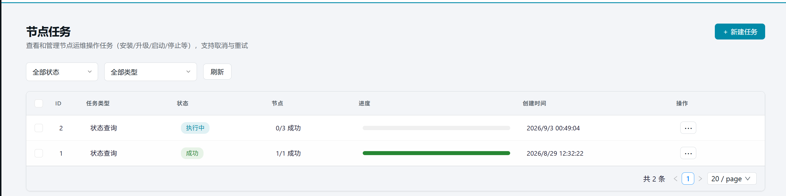
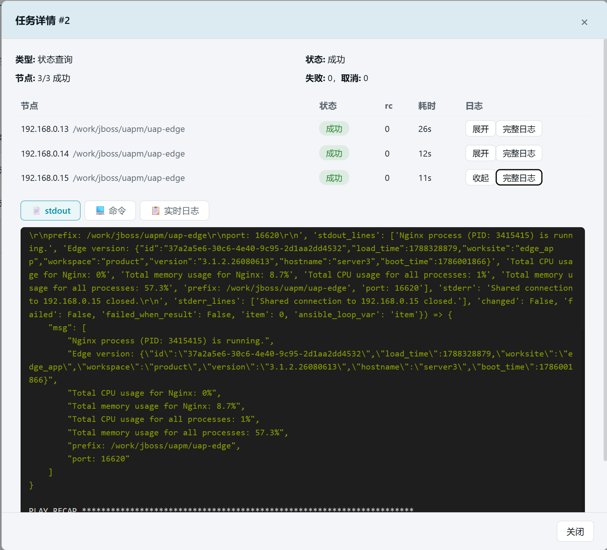

# 28. 节点任务

> 所有节点级运维操作（安装/升级/启停/状态查询等）的任务中心。本章以「状态查询」为例介绍完整操作流程。

## 26.1 页面入口

点击左侧侧边栏：【运维管理】→【节点任务】。

> 若菜单不可见：回[第 1 章 功能开关前置检查](01-login.md)核对 `task_center` 开关。

## 26.2 筛选与任务列表

页面顶部提供状态筛选（全部/待执行/执行中/成功/部分成功/失败/已取消）和类型筛选下拉框，支持按条件过滤任务。

任务列表各列含义：

| 列 | 说明 |
| --- | --- |
| ID | 任务编号 |
| 任务类型 | 安装/升级/启动/停止/状态查询/软件查询/命令执行等 |
| 状态 | 待执行/执行中/成功/部分成功/失败/已取消 |
| 节点 | 成功/总节点数（如 3/5 成功） |
| 进度 | 可视化进度条（蓝=执行中，绿=成功，红=失败） |
| 创建时间 | 任务创建时间 |
| 操作 | ⋯ 菜单，含详情/取消/重试/删除 |

> 💡 列表会自动轮询刷新：当有执行中或待执行的任务时，每 3 秒自动更新一次。

## 26.3 新建任务：以「状态查询」为例

### 26.3.1 打开创建弹窗

点击页面右上角【＋ 新建任务】按钮，弹出创建任务弹窗。

### 26.3.2 选择集群与节点

1. **选择集群**：从下拉框中选择目标集群（如「演示集群」）
2. **选择节点**：下方自动列出该集群的全部节点，勾选需要查询的节点（支持全选/取消全选）

### 26.3.3 选择任务类型

从任务类型下拉框中选择「状态查询」（`statistic`）。

> 📋 全部任务类型一览：
>
> | 类型 | 说明 |
> | --- | --- |
> | 安装 OpenResty | 需额外选择安装包文件 |
> | 安装 Edge | 安装 Edge 服务 |
> | 关联新 OpenResty | 重新关联 OpenResty |
> | 升级 Edge(传包) | 需额外选择 Edge 版本包 |
> | 升级 Edge(切版本) | 需额外选择目标版本 |
> | 启动 / 停止 / Reload | 启停 Edge 服务 |
> | 状态查询 | 查询 Edge 服务运行状态 |
> | 软件查询 | 查询节点上指定软件安装情况 |
> | 命令执行 | 在节点上执行自定义命令（支持安全策略配置） |

### 26.3.4 创建

确认选择后点击【创建】，任务进入待执行队列。页面自动刷新，可在列表中看到新任务。

## 26.4 任务详情

点击任务行的操作列的 【⋯】 →【详情】打开详情弹窗，展示：

### 26.4.1 概览信息

| 字段 | 说明 |
| --- | --- |
| 类型 | 任务类型 |
| 状态 | 当前状态 |
| 节点 | 成功/总节点数 |
| 失败 / 取消 | 失败和取消的节点数 |
| 参数 | 任务创建时的参数（JSON 格式） |

### 26.4.2 节点执行明细

每个节点一行，展示：

| 列 | 说明 |
| --- | --- |
| 节点 | IP 地址与节点名称 |
| 状态 | 该节点的执行状态 |
| rc | 命令退出码（0=成功） |
| 耗时 | 执行耗时（秒） |
| 日志 | 【展开】查看实时日志；【完整日志】加载全部日志 |

> 💡 执行中的任务支持 **SSE 实时流**，日志和状态会自动更新，无需手动刷新。

### 26.4.3 底部操作

| 按钮 | 出现条件 | 行为 |
| --- | --- | --- |
| 取消任务 | 待执行/执行中 | 中断尚未完成的节点 |
| 重试失败节点 | 失败/部分成功/已取消 | 仅重新执行失败/取消的节点，已成功的不重复执行 |
| 关闭 | 始终 | 关闭详情弹窗 |

## 26.5 任务操作

### 26.5.1 取消

在列表或详情中对运行中/待执行的任务点击【取消】，中断尚未执行完的节点。

### 26.5.2 重试

对失败/部分成功/已取消的任务，点击【重试】会弹出确认弹窗，说明：

- 仅重新执行失败/取消的节点
- 已成功的节点不会被重复执行
- 确认后发起重试

> 💡 「部分成功」= 多节点任务中部分节点失败。点开详情看失败节点清单，修复后用【重试】只补失败部分。

### 26.5.3 删除

对已完成的任务（成功/失败/部分成功/已取消），点击【删除】确认后移除任务记录及日志文件（不可恢复）。

支持**批量删除**：勾选多行后点击工具栏的【批量删除】按钮，执行中/待执行的任务会被跳过。

## 26.6 特殊任务类型补充

### 26.6.1 软件查询

选择「软件查询」类型后，可勾选预置软件列表（nc/vim/bc/make 等），也可手动输入自定义软件名。任务完成后，详情弹窗展示**软件矩阵**——每行一个软件，每列一个节点，✓ 表示已安装，✗ 表示未安装。

### 26.6.2 命令执行

选择「命令执行」类型后，需填写：

| 字段 | 说明 |
| --- | --- |
| 命令 | 要执行的 shell 命令 |
| 安全策略 | 黑名单（默认禁止危险命令）/ 白名单（仅允许指定命令）/ 不限制 |
| 超时 | 命令超时时间（秒），默认 30 |

## 26.7 常见问题

| 现象 | 处理 |
| --- | --- |
| 任务一直「待执行」 | 确认后端服务正常运行；检查是否有正在执行的任务（队列串行） |
| 状态查询返回「无权限」 | 检查节点 inventory 中的 SSH 用户权限 |
| 重试按钮不可点 | 只有失败/部分成功/已取消的任务才能重试 |
| 批量删除无响应 | 执行中/待执行的任务会被跳过，只删除已完成的任务 |

## 26.8 本章小结

- 节点任务 = 运维操作的台账：可筛选、可取消、可重试、可删除
- 新建任务流程：选集群 → 选节点 → 选类型 → 创建
- 详情弹窗支持实时日志流（SSE），执行中无需刷新
- 「部分成功」重点看失败节点明细，修复后用重试只补失败部分
- 升级类任务建议逐台执行并观察，避免全量同时升级

---

## 进阶与运维篇小结

至此左侧菜单全部功能均已覆盖：

| 分组 | 章节 |
| --- | --- |
| 核心功能 | 第 2~10 章（搭建篇）+ 第 14~15、17~20 章 |
| 边缘网络 | 第 4、11~12 章（搭建篇）+ 第 16 章 |
| 综合 | 第 21~22 章 |
| 运维管理 | 第 23~28 章 |

回到 [README 总目录](README.md) 按需查阅。
