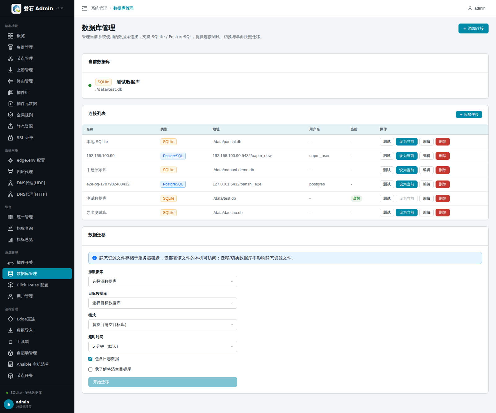
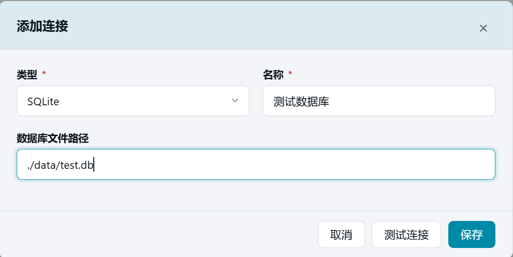
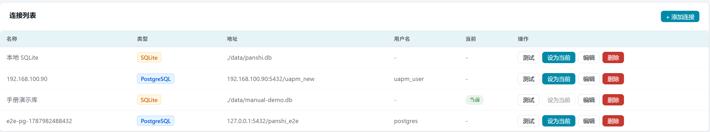
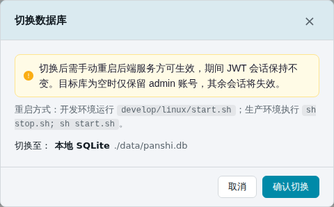

# 18. 数据库管理

> 本章场景：平台自身的配置数据存在哪里、想换一个数据库怎么办？【数据库管理】统一管理平台的**后端存储连接**（SQLite / PostgreSQL），支持连接测试、一键切换与单向快照迁移——迁移全程 SSE 实时进度、可设超时、随时终止，清空前自动备份源库。第 1 章切空库用的就是本页，本章讲完整功能。

## 18.1 页面入口

点击左侧侧边栏：【系统管理】→【数据库管理】。

> 若菜单不可见：回[第 1 章 功能开关前置检查](01-login.md)核对 `database_management` 开关。

## 18.2 连接列表

页面顶部展示全部已登记的数据库连接，每行包含类型、名称、路径/地址与状态：

| 操作 | 说明 |
| --- | --- |
| 【+ 添加连接】 | 新增一条连接配置（不立即启用） |
| 【测试连接】 | 弹窗内验证参数是否可连通 |
| 【设为当前】 | 把该连接设为平台使用的数据库 |
| 【删除】 | 移除连接配置（不影响数据库文件本身） |

### 18.2.1 添加 / 编辑连接

| 字段 | 说明 |
| --- | --- |
| 类型 | SQLite（本地文件）或 PostgreSQL（远程库） |
| 名称 | 连接的显示名称 |
| 数据库文件路径 / 主机端口等 | 按类型填写；SQLite 路径如 `./data/manual-demo.db`，文件不存在时重启后自动创建 |

> ⚠️ 密码类字段在平台内加密保存；删除连接只删配置记录，不会删除数据库文件或库内数据。

新增 SQLite 数据库

新增 Postgres 数据库

## 18.3 设为当前与重启

「设为当前」只修改配置并标记重启标记，**必须手动重启后端服务才生效**：

切换回，需要重新启动

- 开发环境：重新执行 `develop/linux/start.sh`；
- 生产环境：`sh stop.sh; sh start.sh`。

重启完成后刷新页面，「当前数据库」卡片显示新连接即切换成功。第 1 章的切空库流程就是：添加连接 → 测试 → 设为当前 → 重启 → 验证。

## 18.4 数据迁移

把任一已登记连接（**源**）的数据快照单向迁移到另一连接（**目标**）：目标库将被**清空重建**后写入源库数据（replace 语义）。迁移通过 SSE 实时回报进度，可随时终止。

### 18.4.1 迁移表单字段

| 字段 | 说明 |
| --- | --- |
| 源数据库 | 数据从哪来；可选任意已登记连接（含非当前库） |
| 目标数据库 | 数据写到哪；不能与源相同，也不允许选当前激活库 |
| 模式 | 固定为「替换（清空目标库）」——平台仅提供此一种迁移模式 |
| 超时时间 | 1 / 3 / 5（默认）/ 10 / 30 分钟；超过时限系统自动中止迁移；**迁移进行中该下拉框禁用** |
| 包含日志数据 | 勾选后日志类表随业务数据一起迁移；取消勾选只迁业务数据 |
| 我了解将清空目标库 | 高风险确认项；未勾选时【开始迁移】按钮置灰不可点 |

### 18.4.2 迁移步骤与实时进度

1. 选择源数据库与目标数据库；
2. 按数据量设置**超时时间**（库较大时选 10/30 分钟，避免迁移中途超时）；
3. **勾选「我了解将清空目标库」**——未勾选时【开始迁移】按钮置灰不可点：

      

4. 点击【开始迁移】，进度区分两个阶段实时刷新：
   - **备份阶段**：显示「正在备份源库…」与备份进度条（表 N / M）——清空目标库前，系统会先把**源库**自动备份为归档文件；
   - **迁移阶段**：显示「正在迁移数据… 表 N / M」、表级进度条、当前表名、「已迁移 X / Y 行」；源库不存在的表会标注「跳过：表不存在」。

      

      

5. 进度区右侧有【终止迁移】按钮：点击即中止本次迁移（前端断开后，后端会在下一个检查点安全退出，已写入目标库的数据不完整，重新迁移即可覆盖）；
6. 迁移成功后按页面提示操作：到连接列表把目标连接【设为当前】→ 重启后端服务。

   > ⚠️ 四条硬约束：
   > - 目标库会被**完全清空**再写入，请确认目标库无需要保留的数据；
   > - 不允许向当前激活库自身发起迁移，源与目标不能相同；
   > - **源库全程只读**，迁移失败/超时/终止都不影响源库数据；
   > - 静态资源文件存放在服务器磁盘，迁移/切换数据库**不影响**静态资源文件。

### 18.4.3 迁移结果与自动备份

迁移完成后页面展示：

- 成功提示与**迁移详情表格**：每张表的名称、列数、迁移行数，便于核对迁移覆盖范围；
- **备份已保存**标记与备份文件路径——只要执行了清空替换迁移，系统都会在迁移前把源库完整备份到 `backend/data/backups`，自动保留**最近 10 份**，更早的自动清理。

迁移成功只是数据就位，还差两步启用：把目标连接【设为当前】→ 按提示重启后端服务。

### 18.4.4 失败、超时与恢复

- 迁移失败、超时或被终止时，页面给出错误原因（含「超时」字样的即为超时中止）；
- 无论成败，每次迁移都会写入迁移记录与操作审计，供管理员追溯（见【系统管理】→ 操作历史）；
- 恢复路径：源库本身未受影响，可直接**重新发起迁移**覆盖目标库；若目标库已切换启用才发现问题，可用 `backend/data/backups/` 里的源库备份归档恢复。

## 18.5 常见问题

| 现象 | 处理 |
| --- | --- |
| 测试连接失败 | SQLite 检查路径权限；PG 检查主机/端口/账号密码与防火墙 |
| 切换后数据"消失" | 多半连到了另一个空库——核对「当前数据库」卡片显示的路径 |
| 迁移按钮点不动 | 先勾选「我了解将清空目标库」复选框 |
| 迁移报外键错误 | 确认使用的是平台内置迁移功能，不要手工对拷表数据 |
| 迁移中途提示超时 | 大库调大超时时间（10/30 分钟）后重新发起；超时自动解锁写操作，源库不受影响 |
| 误点了终止迁移 | 已写入部分直接重新迁移覆盖即可；源库数据完好 |
| 想找回迁移前的数据 | 查看 `backend/data/backups/` 下迁移前自动备份（保留最近 10 份） |

## 18.6 本章小结

- 连接列表 = 登记簿；「设为当前」+ 重启 = 真正切换
- 迁移是**单向快照 replace**：目标库清空重建，不可逆，操作前看清目标
- 迁移前自动备份**源库**（保留最近 10 份）；SSE 实时进度随时可看，【终止迁移】随时可停
- 超时时间按数据量设置，默认 5 分钟，迁移中不可修改
- 静态资源在磁盘上，不受数据库切换影响

下一步：[第 23 章 Edge 直连](23-edge-client.md) / [第 24 章 数据导入](24-data-import.md)
