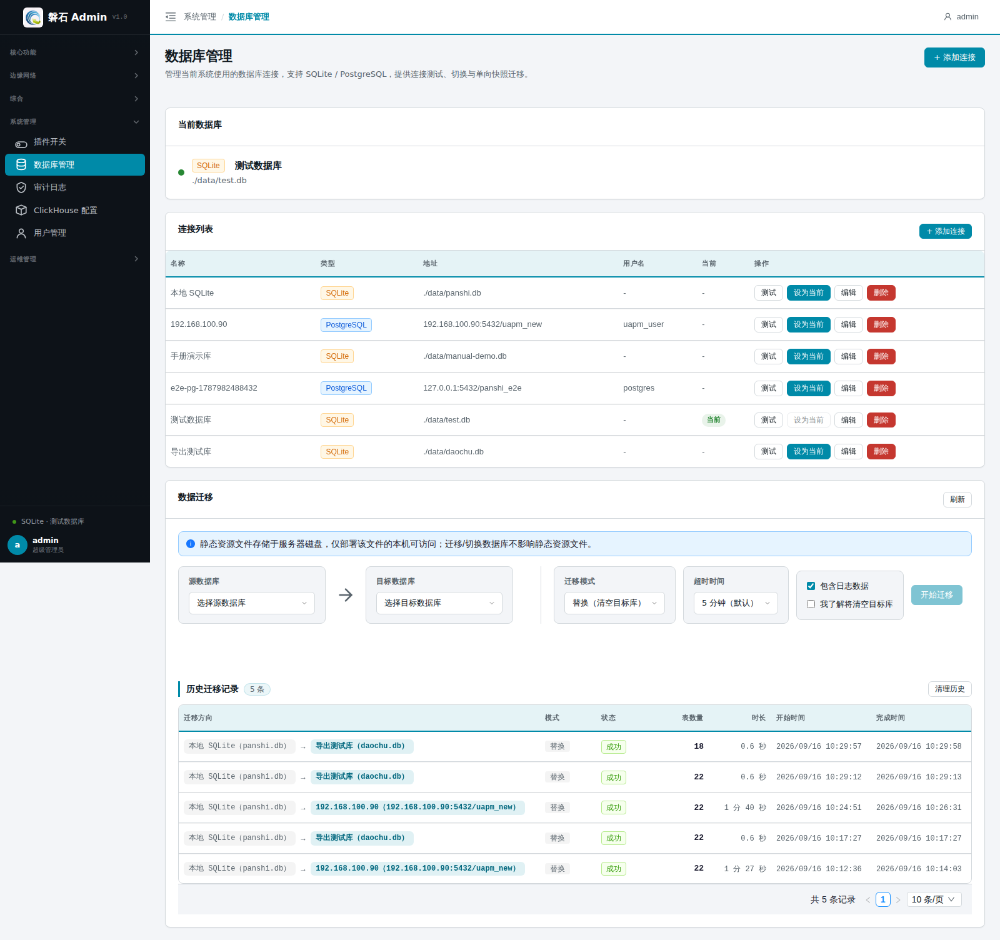
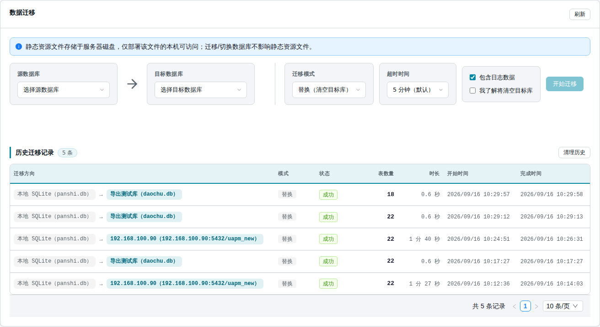
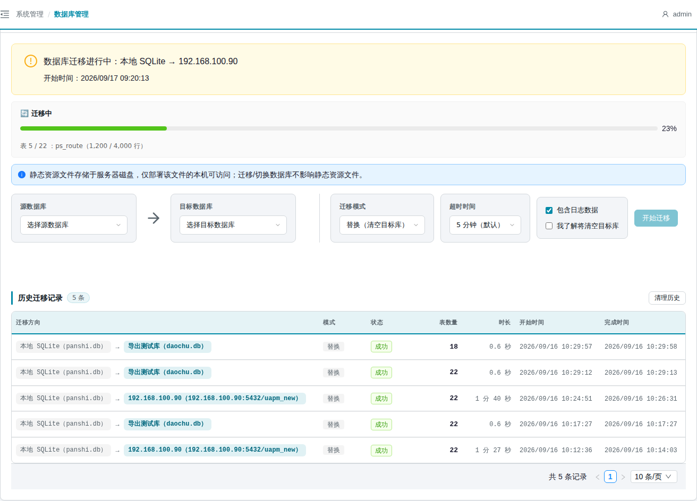
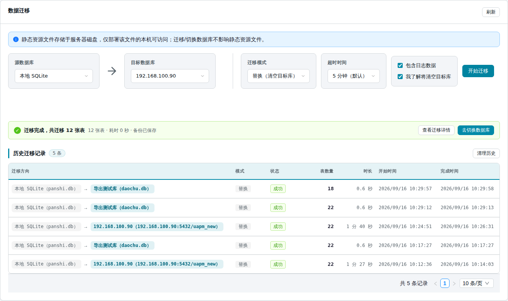
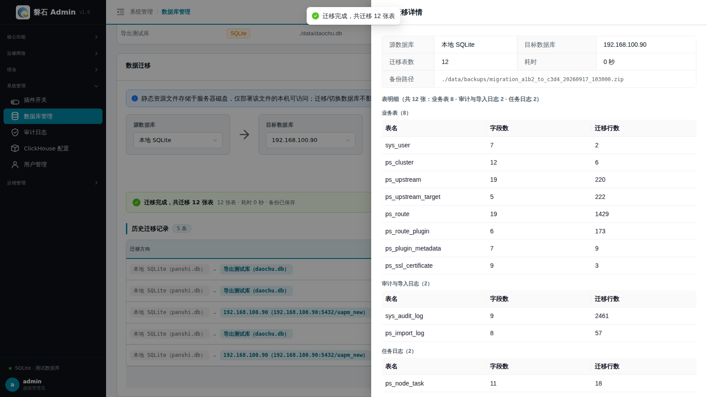
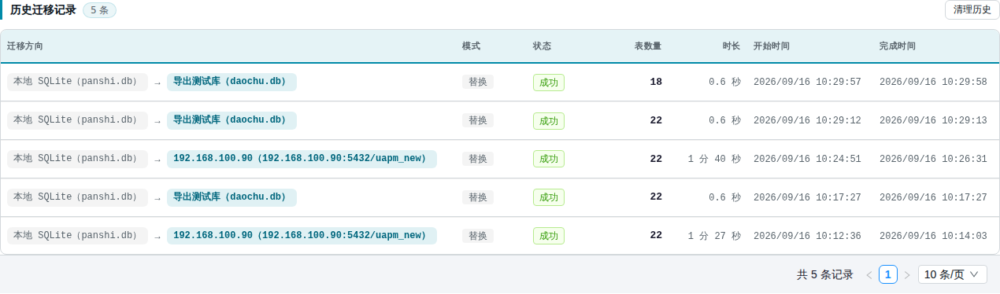
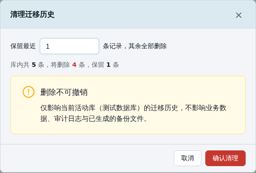

# 18. 数据库管理

> 本章场景：平台自身的配置数据存在哪里、想换一个数据库怎么办？【数据库管理】统一管理平台的**后端存储连接**（SQLite / PostgreSQL），支持连接测试、一键切换与单向快照迁移——迁移全程 SSE 实时进度、可设超时；迁移期间平台写操作进入保护锁，刷新或关闭页面都不会中断迁移，清空前自动备份源库。第 1 章切空库用的就是本页，本章讲完整功能。

## 18.1 页面入口

点击左侧侧边栏：【系统管理】→【数据库管理】。

> 若菜单不可见：回[第 1 章 功能开关前置检查](01-login.md)核对 `database_management` 开关。

## 18.2 连接列表

页面中部分三张卡片：【当前数据库】状态卡、【连接列表】、【数据迁移】。连接列表展示全部已登记的数据库连接，每行包含名称、类型、地址、用户名与是否「当前」：

| 操作 | 说明 |
| --- | --- |
| 【+ 添加连接】 | 新增一条连接配置（不立即启用）；页面标题右侧与连接列表卡片右上均有入口 |
| 【测试】 | 验证该连接是否可连通（需先保存） |
| 【设为当前】 | 把该连接设为平台使用的数据库；当前连接该按钮置灰 |
| 【编辑】 | 修改连接参数 |
| 【删除】 | 移除连接配置（不影响数据库文件本身）；当前激活连接不可删除，需先切换到其他连接 |

### 18.2.1 添加 / 编辑连接

| 字段 | 说明 |
| --- | --- |
| 类型 | SQLite（本地文件）或 PostgreSQL（远程库） |
| 名称 | 连接的显示名称 |
| 数据库文件路径 | SQLite 类型填写，如 `./data/manual-demo.db`，文件不存在时重启后自动创建 |
| 主机 / 端口 / 数据库名 / 用户名 / 密码 | PostgreSQL 类型填写；端口默认 5432；**编辑时密码留空表示不修改** |

新增 SQLite 数据库

新增 Postgres 数据库

> 💡 弹窗内不做参数级连通测试——点【测试连接】会提示先保存；保存后在连接列表点行内【测试】即可验证。
>
> ⚠️ 密码类字段在平台内加密保存；删除连接只删配置记录，不会删除数据库文件或库内数据。

## 18.3 设为当前与重启

「设为当前」只修改配置并标记重启标记，**必须手动重启后端服务才生效**。确认弹窗会提示：

- 切换后需手动重启后端服务方可生效，期间 JWT 会话保持不变；
- 目标库为空时仅保留 admin 账号，其余会话将失效；
- 重启方式：开发环境运行 `develop/linux/start.sh`；生产环境执行 `sh stop.sh; sh start.sh`。

点击【确认切换】后，重新启动后端服务：

- 开发环境：重新执行 `develop/linux/start.sh`；
- 生产环境：`sh stop.sh; sh start.sh`。

重启完成后刷新页面，「当前数据库」卡片显示新连接即切换成功。第 1 章的切空库流程就是：添加连接 → 测试 → 设为当前 → 重启 → 验证。

## 18.4 数据迁移

把任一已登记连接（**源**）的数据快照单向迁移到另一连接（**目标**）：目标库将被**清空重建**后写入源库数据（replace 语义）。迁移通过 SSE 实时回报进度，可设超时时间。

迁移期间平台有两层保护，务必知晓：

- **全局写锁**：迁移进行中，平台**所有写操作**（新增 / 保存 / 删除 / 切换等，登录也是写操作）统一返回 503「正在迁移数据库，暂时禁止写操作」；只读浏览不受影响，迁移结束后自动恢复；
- **迁移不因断开而中断**：刷新页面、关闭浏览器甚至点击【终止迁移】都只是断开前端进度显示，迁移会在后端**继续执行至结束**，结果照常写入历史记录。

### 18.4.1 迁移进行中状态

当有迁移正在执行时，数据迁移卡片顶部会显示**黄色警告横幅**，包含迁移方向（源 → 目标）和开始时间。此时：

- 横幅下方自动恢复显示迁移进度（阶段、进度条、当前表、已迁移行数）；
- 「开始迁移」按钮不可用，防止重复发起迁移；
- 超时时间下拉框禁用；
- 卡片右上角【刷新】按钮可手动刷新迁移状态。

> 💡 迁移进度在页面刷新后不会丢失——重新进入页面时自动恢复显示，5 秒自动轮询确保进度实时更新。横幅会一直显示到迁移**真正结束**（含后台继续执行的场景），横幅消失即写锁解除。

### 18.4.2 迁移表单字段

| 字段 | 说明 |
| --- | --- |
| 源数据库 | 数据从哪来；可选任意已登记连接（含非当前库） |
| 目标数据库 | 数据写到哪；不能与源相同，也不允许选当前激活库 |
| 模式 | 固定为「替换（清空目标库）」——平台仅提供此一种迁移模式 |
| 超时时间 | 1 / 3 / 5（默认）/ 10 / 30 分钟；超过时限系统自动中止迁移；**迁移进行中该下拉框禁用** |
| 包含日志数据 | 勾选后日志类表随业务数据一起迁移；取消勾选只迁业务数据 |
| 我了解将清空目标库 | 高风险确认项；未勾选时【开始迁移】按钮置灰不可点 |

### 18.4.3 迁移步骤与实时进度

1. 选择源数据库与目标数据库；
2. 按数据量设置**超时时间**（库较大时选 10/30 分钟，避免迁移中途超时）；
3. **勾选「我了解将清空目标库」**——未勾选时【开始迁移】按钮置灰不可点：
4. 点击【开始迁移】，进度区分两个阶段实时刷新：
   - **备份阶段**：显示「📦 备份中」与备份进度条（表 N / M）——清空目标库前，系统会先把**源库**自动备份为归档文件；
   - **迁移阶段**：显示「🔄 迁移中」、表级进度条、当前表名、「已迁移 X / Y 行」；源库不存在的表会标注「已跳过」。
5. 进度区右侧有【终止迁移】按钮：点击后页面立即收起进度区并提示「迁移已终止」，但**迁移本身不会停止**——它会在后端继续执行至结束，结果照常写入历史记录（可能显示「成功」），写锁也到那时才解除。若确需中断，只能等待其完成或重启后端服务（重启会导致迁移中断、目标库数据不完整，重新迁移即可覆盖）；
6. 迁移成功后按页面提示操作：点结果条上的【去切换数据库】（见 18.4.4），或到连接列表把目标连接【设为当前】→ 重启后端服务。

   > ⚠️ 四条硬约束：
   > - 目标库会被**完全清空**再写入，请确认目标库无需要保留的数据；
   > - 不允许向当前激活库自身发起迁移，源与目标不能相同；
   > - **源库全程只读**，迁移失败/超时/终止都不影响源库数据；
   > - 静态资源文件存放在服务器磁盘，迁移/切换数据库**不影响**静态资源文件。

### 18.4.4 迁移结果与自动备份

迁移完成后，页面只显示**一行绿色摘要条**（避免大表格把页面撑长）：

- 摘要内容：✓「迁移完成，共迁移 N 张表」· 耗时 X 秒（前端计时）· 备份已保存；
- 【查看迁移详情】：打开右侧抽屉，包含源/目标数据库、迁移表数、耗时、备份路径，以及**表明细分组明细**——按「业务表」「审计与导入日志」「任务日志」三组展示每张表的表名、字段数、迁移行数；本次未迁日志表时会提示勾选「包含日志数据」后重新执行；
- 【去切换数据库】：直接打开目标连接的切换确认弹窗（见 18.3），省去回连接列表逐个查找；

**自动备份**：只要执行了清空替换迁移，系统都会在迁移前把**源库**完整备份到 `backend/data/backups/migration_<源连接ID>_to_<目标连接ID>_<时间戳>.zip`，自动保留**最近 10 份**，更早的自动清理。

迁移成功只是数据就位，还差两步启用：把目标连接【设为当前】→ 按提示重启后端服务。

### 18.4.5 历史迁移记录

数据迁移卡片底部展示**历史迁移记录**表格，最多显示**最近 100 条**（达到上限时标题旁提示「仅显示最近 100 条」），支持分页（每页 10/20/50 条）与快速跳页：

| 列 | 说明 |
| --- | --- |
| 迁移方向 | 源数据库名 → 目标数据库名（含文件名/地址） |
| 模式 | 替换（清空目标库） |
| 状态 | 成功 / 失败 / 已取消 |
| 表数量 | 迁移涉及的表数 |
| 时长 | 迁移总耗时 |
| 开始时间 | 迁移发起时间（早期记录无此值时按「完成时间 − 时长」倒推显示） |
| 完成时间 | 迁移结束时间 |

标题栏的【清理历史】按钮可批量精简记录：弹窗内设置「保留最近 N 条」（默认 10），系统实时预览「库内共 X 条，将删除 Y 条，保留 Z 条」；清理**仅影响当前活动库的迁移历史**，不影响业务数据、审计日志与已生成的备份文件；删除不可撤销，正在执行中的迁移记录不会删除。

> 💡 迁移完成后，历史记录会自动刷新，无需手动点击【刷新】。

### 18.4.6 失败、超时与恢复

- 迁移失败、超时或被终止时，页面给出错误原因（含「超时」字样的即为超时中止）；
- 无论成败，每次迁移都会写入迁移记录与操作审计，供管理员追溯（见【系统管理】→ 操作历史）；
- 恢复路径：源库本身未受影响，可直接**重新发起迁移**覆盖目标库；若目标库已切换启用才发现问题，可用 `backend/data/backups/` 里的源库备份归档恢复。

## 18.5 常见问题

| 现象 | 处理 |
| --- | --- |
| 测试连接失败 | SQLite 检查路径权限；PG 检查主机/端口/账号密码与防火墙 |
| 切换后数据"消失" | 多半连到了另一个空库——核对「当前数据库」卡片显示的路径 |
| 迁移按钮点不动 | 先勾选「我了解将清空目标库」复选框 |
| 迁移报外键错误 | 确认使用的是平台内置迁移功能，不要手工对拷表数据 |
| 迁移中途提示超时 | 大库调大超时时间（10/30 分钟）后重新发起；超时自动解锁写操作，源库不受影响 |
| 迁移期间其他页面保存/登录报「正在迁移数据库，暂时禁止写操作」 | 迁移写锁（503）生效中——等迁移结束自动恢复，期间只读浏览不受影响；排查用只读操作或预先取得的会话 |
| 点了「终止迁移」但横幅还在 | 正常——终止只断开前端进度显示，迁移在后端继续执行至结束；横幅消失即真正完成，结果见历史记录 |
| 误点了终止迁移 | 迁移仍在后台继续，无需处理；若确要重来，等本次结束后重新发起迁移覆盖即可，源库数据完好 |
| 想找回迁移前的数据 | 查看 `backend/data/backups/` 下迁移前自动备份（保留最近 10 份） |
| 刷新页面后迁移进度消失 | 现已修复——后端持久化迁移进度，刷新页面后自动恢复显示；且刷新不会中断迁移 |
| 迁移完成后历史记录为空 | 迁移完成后会自动刷新历史记录；若仍未显示，点击【刷新】按钮 |
| 迁移历史太多想清理 | 点历史记录标题旁【清理历史】，按「保留最近 N 条」批量删除（不影响业务数据与备份文件） |
| 想同时发起多个迁移 | 不支持——有迁移进行中时，「开始迁移」按钮不可用，后端写锁也会拒绝重复发起 |

## 18.6 本章小结

- 连接列表 = 登记簿；「设为当前」+ 重启 = 真正切换
- 迁移是**单向快照 replace**：目标库清空重建，不可逆，操作前看清目标
- 迁移前自动备份**源库**（保留最近 10 份）；SSE 实时进度随时可看
- 迁移期间平台写操作进入**全局写锁**（503），刷新/关闭页面/终止都**不会中断迁移**——它在后台执行至结束，横幅消失才是真正结束
- 迁移完成后结果收进一行摘要条，明细在抽屉里按「业务表 / 审计与导入日志 / 任务日志」分组
- 历史记录最多显示最近 100 条，可用【清理历史】按「保留最近 N 条」精简
- 超时时间按数据量设置，默认 5 分钟，迁移中不可修改
- 静态资源在磁盘上，不受数据库切换影响

下一步：[第 23 章 Edge 直连](23-edge-client.md) / [第 24 章 数据导入](24-data-import.md)
