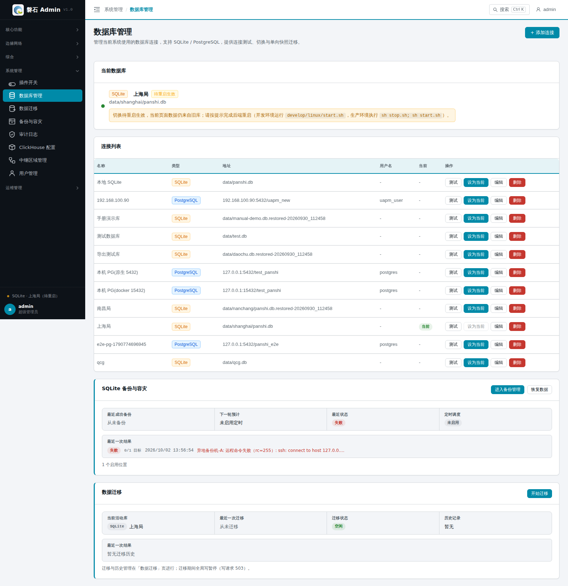
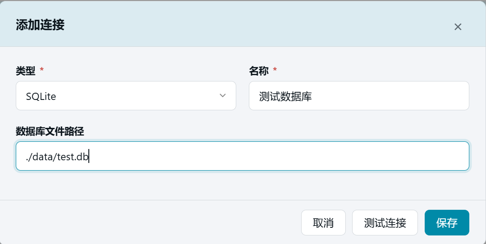
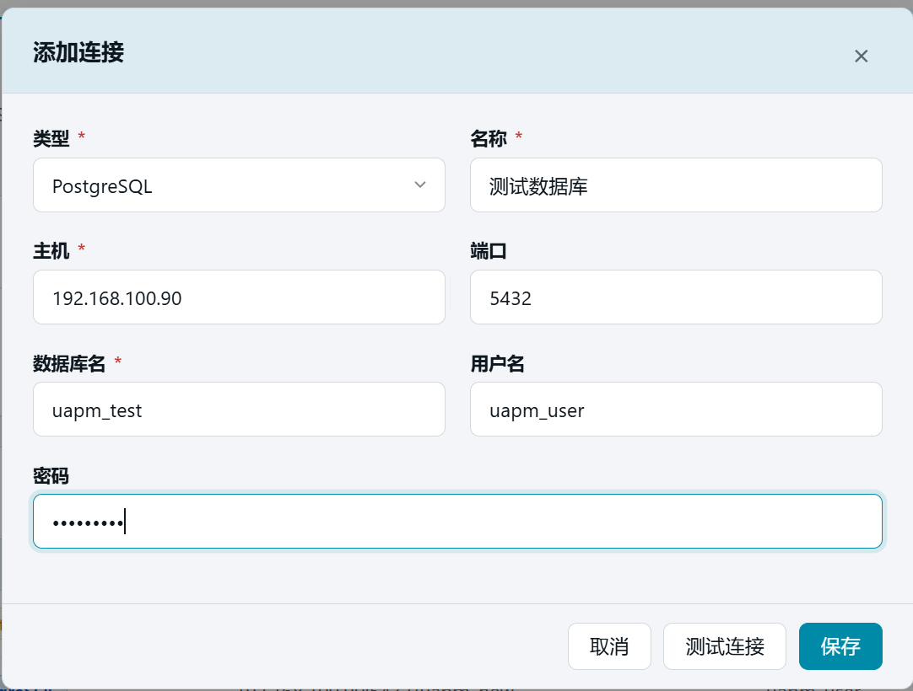
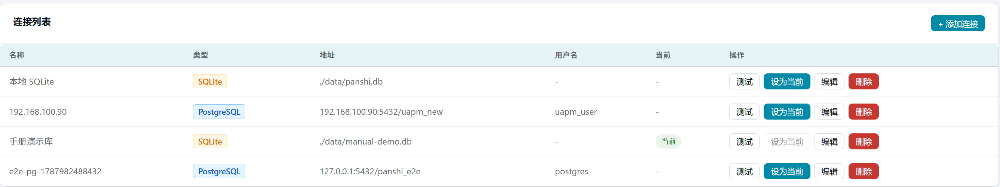
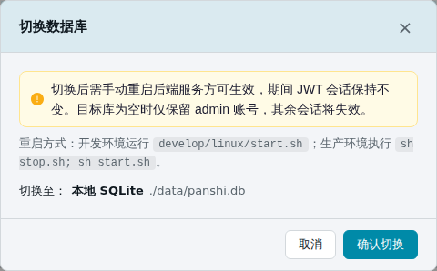

# 18. 数据库管理

> 本章场景：平台自身的配置数据存在哪里、想换一个数据库怎么办？【数据库管理】统一管理平台的**后端存储连接**（SQLite / PostgreSQL）：登记连接、测试连通性、把某个连接「设为当前」并重启生效。**数据迁移**与**备份与容灾**已拆分为独立页面，本章末尾的摘要入口卡可一键跳转（详见[第 19 章](19-db-migration.md)与[第 20 章](20-backup-management.md)）。第 1 章切空库用的就是本页，本章讲完整功能。

## 18.1 页面入口

点击左侧侧边栏：【系统管理】→【数据库管理】。

> 若菜单不可见：回[第 1 章 功能开关前置检查](01-login.md)核对 `database_management` 开关。

页面自上而下分为三个区域：

1. **【当前数据库】状态卡**——平台此刻真正在用的连接；若已「设为当前」但尚未重启，卡片会显示「待重启生效」标签与重启提示；
2. **【连接列表】**——全部已登记的数据库连接；
3. **页面底部两张摘要入口卡**（见 18.4）——**数据迁移**与 **SQLite 备份与容灾**两个独立功能页的快捷入口。

## 18.2 连接列表

连接列表展示全部已登记的数据库连接，每行包含名称、类型、地址、用户名与是否「当前」：

| 操作 | 说明 |
| --- | --- |
| 【+ 添加连接】 | 新增一条连接配置（不立即启用）；按钮在页面标题右侧 |
| 【测试】 | 验证该连接是否可连通（需先保存） |
| 【设为当前】 | 把该连接设为平台使用的数据库；当前连接该按钮置灰 |
| 【编辑】 | 修改连接参数 |
| 【删除】 | 移除连接配置（不影响数据库文件本身）；当前激活连接不可删除，需先切换到其他连接 |

### 18.2.1 添加 / 编辑连接

| 字段 | 说明 |
| --- | --- |
| 类型 | SQLite（本地文件）或 PostgreSQL（远程库） |
| 名称 | 连接的显示名称 |
| 数据库文件路径 | SQLite 类型填写，如 `./data/manual-demo.db`，文件不存在时重启后自动创建 |
| 主机 / 端口 / 数据库名 / 用户名 / 密码 | PostgreSQL 类型填写；端口默认 5432；**编辑时密码留空表示不修改** |

新增 SQLite 数据库

新增 Postgres 数据库

> 💡 弹窗内不做参数级连通测试——点【测试连接】会提示先保存；保存后在连接列表点行内【测试】即可验证。
>
> ⚠️ 密码类字段在平台内加密保存；删除连接只删配置记录，不会删除数据库文件或库内数据。

## 18.3 设为当前与重启

「设为当前」只修改配置并标记重启标记，**必须手动重启后端服务才生效**。确认弹窗会提示：

- 切换后需手动重启后端服务方可生效，期间 JWT 会话保持不变；
- 目标库为空时仅保留 admin 账号，其余会话将失效；
- 重启方式：开发环境运行 `develop/linux/start.sh`；生产环境执行 `sh stop.sh; sh start.sh`。

点击【确认切换】后，重新启动后端服务：

- 开发环境：重新执行 `develop/linux/start.sh`；
- 生产环境：`sh stop.sh; sh start.sh`。

重启完成后刷新页面，「当前数据库」卡片显示新连接即切换成功（「待重启生效」标签消失）；切换确认后、重启前，该卡片会持续显示「待重启生效」标签，此时页面数据仍来自旧库。第 1 章的切空库流程就是：添加连接 → 测试 → 设为当前 → 重启 → 验证。

## 18.4 数据迁移与备份入口（摘要卡）

页面底部纵向排列两张摘要卡，是两个独立功能页的快捷入口：

| 入口卡 | 跳转 | 卡面信息 | 按钮 |
| --- | --- | --- | --- |
| **数据迁移** | [第 19 章 数据迁移](19-db-migration.md)（`/db-migration`） | 当前活动库、最近一次迁移结果、迁移状态、历史记录条数 | 【开始迁移】 |
| **SQLite 备份与容灾** | [第 20 章 备份与容灾](20-backup-management.md)（`/backup-management`） | 最近成功备份时间、下一轮预计执行、最近一次状态、定时调度 | 【进入备份管理】、【恢复数据】（直开恢复向导） |

- 数据迁移摘要卡需 `database_management` 权限且 `db_migration` 功能开启（注意：摘要卡随数据库管理页权限显示，但**数据迁移页本身**需独立的 `db_migration` 权限）；备份摘要卡需 `db_backup` 权限；
- 数据迁移摘要卡同时说明：迁移由「数据迁移」页管理，迁移期间全局写暂停、写请求返回 503；
- 备份功能**仅 SQLite 源库适用**：注册表中没有 SQLite 连接时，卡面直接显示「不适用」；
- 尚未配置备份位置时，卡面显示「尚未配置备份位置」引导文案，点【进入备份管理】直达配置页。

## 18.5 常见问题

| 现象 | 处理 |
| --- | --- |
| 测试连接失败 | SQLite 检查路径权限；PG 检查主机/端口/账号密码与防火墙 |
| 切换后数据"消失" | 多半连到了另一个空库——核对「当前数据库」卡片显示的路径 |
| 页面底部没有迁移/备份入口卡 | 核对功能开关（`db_migration` / `db_backup`，见第 1 章）与账号权限（`database_management` / `db_backup`） |
| 备份摘要卡显示「不适用」 | 备份功能仅 SQLite 源库适用——连接注册表中没有 SQLite 连接时的正常提示 |

## 18.6 本章小结

- 连接列表 = 登记簿；「设为当前」+ 重启 = 真正切换
- 切换是**改配置 + 重启生效**，不做数据搬移——搬数据用[第 19 章 数据迁移](19-db-migration.md)
- 平台自备份与换机容灾在[第 20 章 备份与容灾](20-backup-management.md)
- 静态资源在磁盘上，不受数据库切换影响

下一步：[第 19 章 数据迁移](19-db-migration.md)
