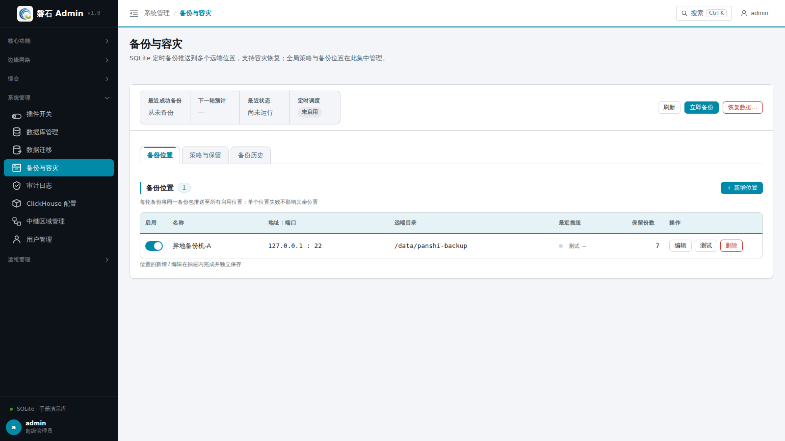
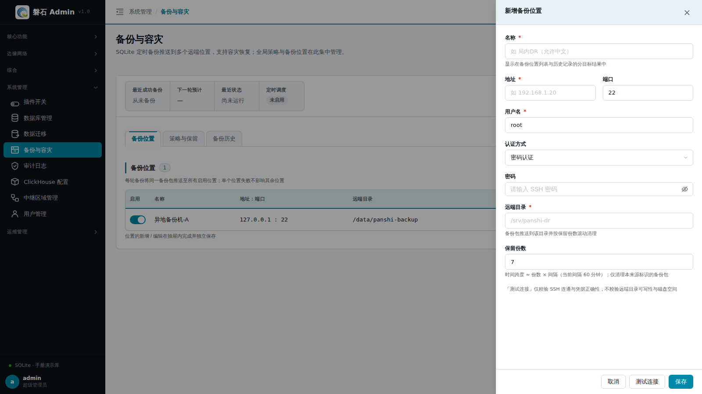
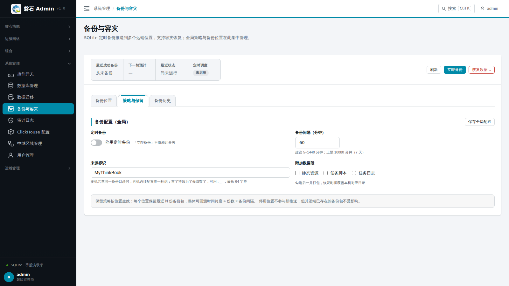
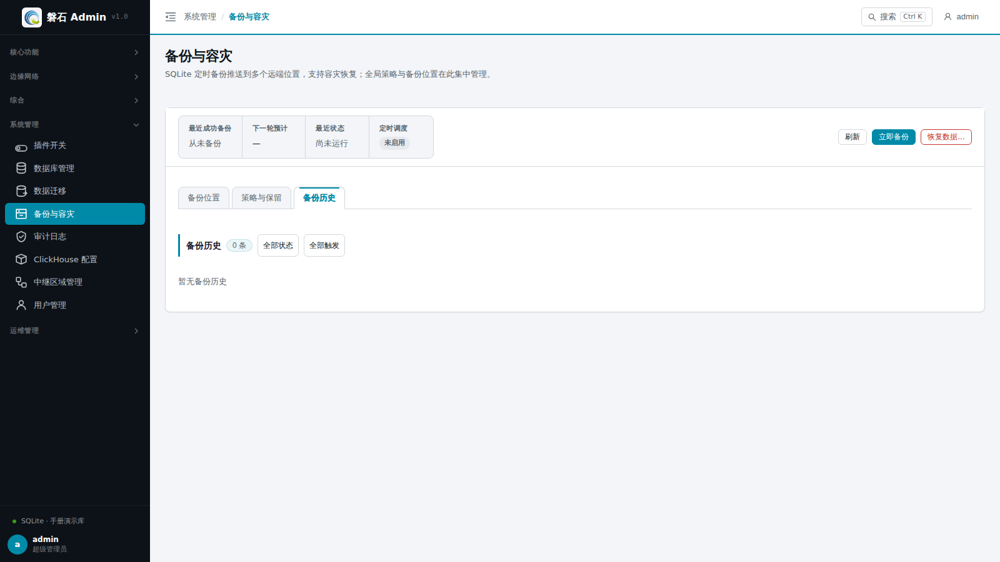

# 20. 备份与容灾

> 本章场景：平台数据要定期备份到异机、服务器要搬迁或灾难后要在新机上快速拉起。【备份与容灾】为**SQLite 源库**提供「定时打包 + 推送多个远端位置」的备份流水线，以及一套三步「容灾恢复向导」：选来源 → 选包校验 → 确认执行，恢复后只需重启后端。备份包自带 JWT 密钥、连接注册表与关键配置，换机恢复后登录即用。

## 20.1 页面入口

三种方式进入：

1. 左侧侧边栏：【系统管理】→【备份与容灾】；
2. 从[第 18 章 数据库管理](18-database-management.md)页面底部摘要卡点【进入备份管理】；
3. 摘要卡点【恢复数据】——直达本页并自动弹出**容灾恢复向导**。

> 若菜单不可见：回[第 1 章 功能开关前置检查](01-login.md)核对 `db_backup` 开关，并确认账号具有 `db_backup` 权限。
>
> ⚠️ 备份功能**仅 SQLite 源库适用**：连接注册表中没有 SQLite 连接时，页面统计条直接显示「不适用」（PostgreSQL 源请用数据库自带的备份机制）。

## 20.2 状态总览条

页面顶部是常驻统计条，四格信息：

| 格 | 内容 |
| --- | --- |
| 最近成功备份 | 上次成功完成的时间；从未成功过显示「—」 |
| 下一轮预计执行 | 定时备份启用时显示下次调度时间；未启用显示「未启用」 |
| 最近一次状态 | 上次执行结果（成功 / 失败，失败原因悬停可见）；未执行过显示「—」 |
| 定时调度 | 未启用 / 每 X 分钟 |

统计条右侧操作区：

| 按钮 | 说明 |
| --- | --- |
| 【保存策略】 | 保存「策略与保留」页签的未保存修改；有修改时统计条出现**「有未保存修改」**徽标 |
| 【刷新】 | 重新拉取配置、状态与历史 |
| 【立即备份】 | 手动触发一次完整备份，**不依赖定时开关**；备份执行中按钮显示「备份中…」 |
| 【恢复数据…】 | 打开容灾恢复向导（见 20.6） |

> 💡 「立即备份」时若有未保存的策略修改，会先弹出三选确认：**备份并保存修改** / **仅备份（不保存修改，按服务端已保存配置执行）** / 取消。备份结束后弹出结果窗口，逐个备份位置显示推送结果。

## 20.3 备份位置

「备份位置」页签管理备份包要推送到的**远端 SSH 目录**，支持多个位置同时推送：

| 列 | 说明 |
| --- | --- |
| 名称 | 位置显示名 |
| 主机 / 端口 | SSH 地址，端口默认 22 |
| 用户名 | 登录账号（建议使用专用备份账号，仅授予目标目录写权限） |
| 认证方式 | 密码 或 SSH 私钥 |
| 远端目录 | 备份包存放的绝对路径（需预先创建并授权） |
| 保留份数 | 该位置保留最近 N 份备份包（默认 7），超出自动清理 |
| 状态 | 启用（参与推送）/ 已停用（保留配置不推送） |
| 操作 | 【测试】验证连通与目录可写；【编辑】；【删除】（有确认弹窗） |

点【＋ 新增位置】打开右侧抽屉：

| 字段 | 说明 |
| --- | --- |
| 名称 | 必填，显示名（如 `局内DR`，允许中文） |
| 地址 / 端口 / 用户名 | SSH 连接参数；端口默认 22，用户名默认 `root`（建议改用专用备份账号，仅授予目标目录写权限） |
| 认证方式 | 密码：填写密码；私钥：填写私钥文件路径（如 `~/.ssh/id_ed25519`） |
| 远端目录 | 绝对路径，不存在时测试会报错 |
| 备份保留份数 | 该位置的保留策略，默认 7；仅清理本来源标识的备份包 |
| 启用 | 默认开启；关闭后保留配置、不参与推送 |

> 💡 抽屉底部【测试连接】按**当前表单参数**即时验证（无需先保存），验证通过再【保存位置】。尚无任何位置时，列表显示空态引导，与顶部「尚未配置备份位置」提示一致。

## 20.4 策略与保留

「策略与保留」页签配置全局备份策略：

| 字段 | 说明 |
| --- | --- |
| 启用定时备份 | 总开关；「立即备份」不依赖此开关 |
| 备份间隔（分钟） | 建议 5–1440，上限 10080（7 天）；启用后约 30 秒内执行首次备份 |
| 来源标识 | 写入备份包名与远端子目录，用于多机互备时区分来源（如 `panshi-a`、`panshi-b`） |
| 包含静态资源 | 默认不勾选；勾选后把平台静态资源目录一并打包 |
| 包含任务脚本 | 默认不勾选；勾选后包含节点任务上传的脚本存档 |
| 包含任务日志 | 默认不勾选；勾选后包含节点任务执行日志 |

修改后点统计条上的【保存策略】生效；不保存而直接「立即备份」时，按服务端**已保存**配置执行。

> ⚠️ 附加数据段（静态资源 / 任务脚本 / 任务日志）默认不勾选：它们体积大、且属于「数据库行引用的运行时数据」。勾选越多包越大、推送越慢，按容灾要求取舍。核心数据（SQLite 库文件、JWT 密钥、连接注册表、功能开关、ClickHouse 配置、SSH 主机清单）**始终打包**，无需勾选。

## 20.5 备份历史

「备份历史」页签展示每次备份的执行记录，支持按**状态**（成功 / 部分成功 / 失败）与**触发方式**（定时 / 手动）筛选，分页浏览（单页上限 100 条）：

| 列 | 说明 |
| --- | --- |
| 备份包名 | `panshi_backup_<来源标识>_<时间戳>.tar.gz`；无来源标识的旧格式为 `panshi_backup_<时间戳>.tar.gz` |
| 触发 | 定时 / 手动 |
| 状态 | ✓ 成功（所有启用位置推送成功）/ ⚠ 部分成功（本地已打包、部分位置推送失败）/ ✗ 失败 |
| 耗时 / 开始时间 | 执行时长与触发时刻 |
| 操作 | 【恢复此包】——直达恢复向导：自动定位该包所在位置、列包并**预选该包**，直接从第 2 步校验继续（安全闸保留，仍需手动校验与确认） |

展开任意一行可看**分位置结果**：每个启用位置的推送结果（✓ 推送成功 / ✗ 推送失败及原因）与本地缓存状态（✓ 已缓存 `backend/data/archives/`）。推送失败但本地缓存成功的包，仍可通过本地缓存恢复。

> 💡 历史记录上限分页 100 条；筛选时前端自动取满 100 条后在结果内翻页补齐。

## 20.6 容灾恢复向导

【恢复数据…】（或备份历史【恢复此包】、摘要卡【恢复数据】）打开三步向导：

### 20.6.1 第一步：选择备份来源

- **已配置备份位置**：从备份位置下拉选择（或「全部位置」并列扫描）——常规场景用这档；
- **手工录入**：直接填主机 / 端口 / 用户名 / 认证方式 / 密码或私钥路径 / 远端目录——**平台宕机后在新环境拉起时用这档**，手工信息仅本次使用，不会保存。

### 20.6.2 第二步：选择并校验备份包

列出远端目录中所有 `panshi_backup_*.tar.gz`，每张包卡片显示：文件名、大小、来源标识、**存在位置**（多个位置含同一包时可择一复制）、备份时间、平台版本与提交号，以及标签（如「元数据不可读」「未含静态资源」「跳过库」「包含库」）。支持「仅看每个来源的最新包」过滤。

> ⚠️ **必须先校验再恢复**：选中包后点【校验此包】，系统核对 SHA256、tar 完整性、关键表与逐库完整性；未校验的包不能进入下一步。多位置同包时，校验与恢复将使用你选定的那个位置。

### 20.6.3 第三步：确认并执行恢复

- 红色危险提示：恢复将**覆盖本机数据库文件与关键配置**；原活动库自动改名为 `*.pre-restore-<时间戳>` 保留（回退用）；
- 摘要确认：备份包、来源位置、包大小、包含数据段、将写入的目标连接等；
- 勾选「我已知晓风险并确认执行恢复」后点【执行恢复】；
- 成功后显示：恢复后的活动连接 ID、**重启命令**（开发 `develop/linux/start.sh`；生产 `sh stop.sh && sh start.sh`，带一键复制）、暂存有效期 10 分钟内完成落位等提示，点「已完成，刷新页面」收尾。

> ⚠️ 三点务必知晓：
> - **必须重启后端**恢复才生效（JWT 密钥链切换到恢复包内的密钥，旧会话全部失效，需用**备份时点**的账号密码重新登录）；
> - 恢复会继承包内的**来源标识**：多台机器先后用同一个包恢复会互相覆盖远端备份，恢复完成后建议在本机改一个新的来源标识；
> - 暂存区有效期 10 分钟（600 秒），超时未执行需重新校验。

## 20.7 备份包命名与保留策略

- **命名双格式**：新格式 `panshi_backup_{来源标识}_{YYYYMMDD_HHMMSS}.tar.gz`（主格式，时间戳为 Asia/Shanghai）；无来源标识的旧格式 `panshi_backup_{YYYYMMDD_HHMMSS}.tar.gz` 仍可识别与恢复；
- **按位置独立保留**：每个备份位置按包时间戳倒序保留各自「保留份数」；清理只针对**本机来源标识**的新格式包与旧格式包，**绝不删除其他来源标识的包**（多机互备安全）；
- 备份包目录结构：核心数据（`databases/`、密钥、`db_config.json`、`features.yaml`、`clickhouse.yaml`、SSH 主机清单）+ 按开关附加的运行时数据段 + `meta.json`（连接映射、活动连接 ID、版本信息）。

## 20.8 常见问题

| 现象 | 处理 |
| --- | --- |
| 统计条显示「不适用」 | 连接注册表中没有 SQLite 连接——备份仅 SQLite 源适用（原因会原文显示，如「注册表中没有 SQLite 连接，不适用」） |
| 推送失败但想恢复该包 | 展开历史行确认「本地缓存 ✓ 已缓存」，用【恢复此包】走本地缓存恢复 |
| 定时没到点就备份了 | 正常——启用定时后约 30 秒内会执行首次备份 |
| 校验报「元数据不可读」 | 包内 `meta.json` 缺失或损坏（如手工改名/截断）；关键表校验通过仍可恢复，但连接映射等需人工核对 |
| 恢复后登录不上 | 用**备份时点**的账号密码登录（恢复包内含当时的用户表与 JWT 密钥）；仍不行检查是否已重启后端 |
| 想回退恢复 | 停平台 → 把 `db_config.json` 中 SQLite 连接 path 改回旧库（`*.pre-restore-*` 前改名保留）→ 重启 |
| 只想把库迁去 PostgreSQL | 备份恢复不是干这个的——用[第 19 章 数据迁移](19-db-migration.md) |
| 立即备份按的哪份配置 | 有未保存修改时会弹三选确认；「仅备份」按服务端已保存配置执行，屏幕上的未保存修改不生效 |

## 20.9 本章小结

- 备份 = 核心数据必打包 + 三个附加段按需勾选，推送到多个远端 SSH 位置，按位置独立保留 N 份
- 定时与手动独立：不开定时也能【立即备份】；有未保存修改时三选确认
- 恢复 = 三步向导（来源 → 选包**强制校验** → 确认执行），完成后**必须重启后端**
- 原活动库自动改名保留，可回退；恢复继承来源标识，多机同包恢复后记得改标识
- 仅 SQLite 源适用；PostgreSQL 迁移/同步走[第 19 章](19-db-migration.md)
- 包名 `panshi_backup_{来源}_{时间戳}.tar.gz`，旧格式兜底识别；清理只清本源包

下一步：[第 21 章 ClickHouse 配置](21-clickhouse-config.md)
