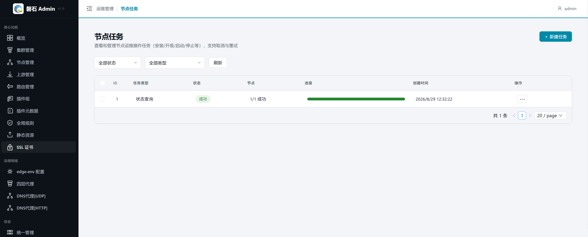
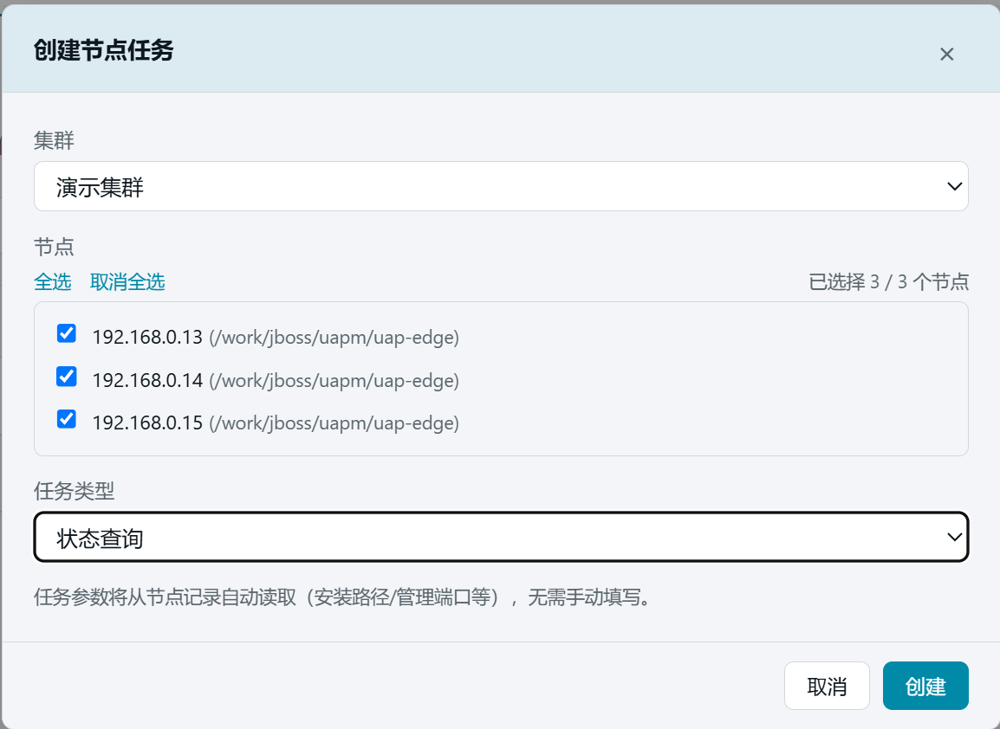
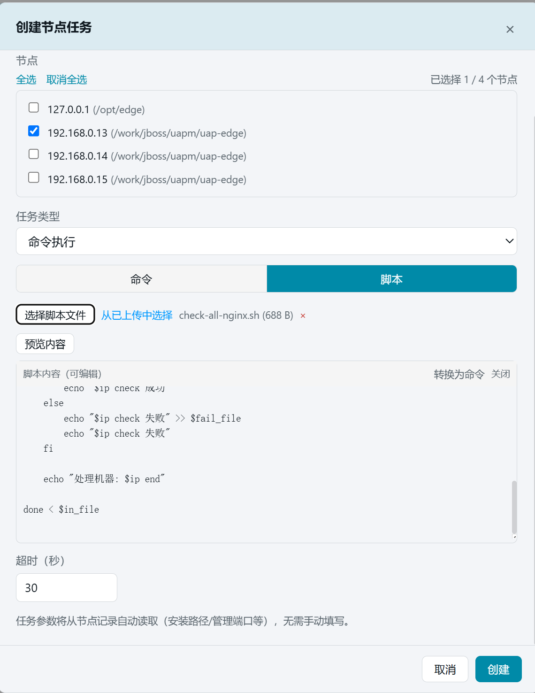
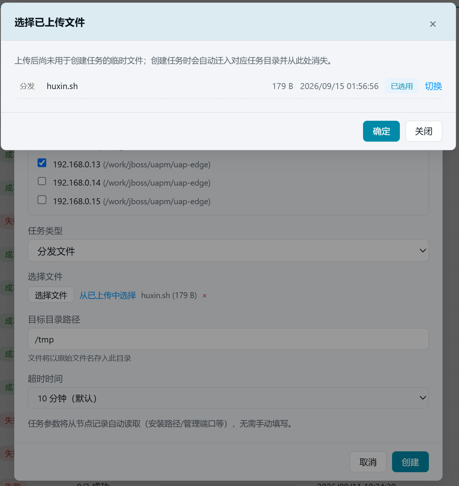

# 28. 节点任务

> 所有节点级运维操作（安装/升级/启停/状态查询/命令执行/脚本上传/文件分发等）的任务中心。

## 28.1 页面入口

点击左侧侧边栏：【运维管理】→【节点任务】。

> 若菜单不可见：回[第 1 章 功能开关前置检查](01-login.md)核对 `task_center` 开关。

## 28.2 筛选与任务列表

页面顶部提供状态筛选（全部/待执行/执行中/成功/部分成功/失败/已取消）和类型筛选下拉框，支持按条件过滤任务。

任务列表各列含义：

| 列 | 说明 |
| --- | --- |
| ID | 任务编号 |
| 任务类型 | 安装/升级/启动/停止/状态查询/软件查询/命令执行/分发文件等 |
| 状态 | 待执行/执行中/成功/部分成功/失败/已取消 |
| 节点 | 成功/总节点数（如 3/5 成功） |
| 进度 | 可视化进度条（蓝=执行中，绿=成功，红=失败） |
| 创建时间 | 任务创建时间 |
| 结束时间 | 任务完成时间 |
| 耗时 | 执行总耗时 |
| 操作 | ⋯ 菜单，含详情/取消/重试/删除 |

> 💡 列表会自动轮询刷新：当有执行中或待执行的任务时，每 3 秒自动更新一次。

### 工具栏

列表上方工具栏提供：

| 按钮 | 说明 |
| --- | --- |
| ＋ 新建任务 | 打开创建任务弹窗 |
| 待用上传（N） | 管理已上传但尚未用于创建任务的临时脚本/文件（独立弹窗） |
| 任务留档（N） | 查看各任务迁入任务目录的控制端源文件副本（独立弹窗） |
| 批量删除 | 勾选多行后批量删除已完成的任务（执行中/待执行会被跳过） |

## 28.3 新建任务

### 28.3.1 打开创建弹窗

点击页面右上角【＋ 新建任务】按钮，弹出创建任务弹窗。

### 28.3.2 选择集群与节点

1. **选择集群**：从下拉框中选择目标集群（如「演示集群」）
2. **选择节点**：下方自动列出该集群的全部节点，勾选需要的节点（支持全选/取消全选）

### 28.3.3 选择任务类型

从任务类型下拉框中选择所需类型。

> 📋 全部任务类型一览：
>
> | 类型 | 说明 | 额外参数 |
> | --- | --- | --- |
> | 安装 OpenResty | 需额外选择安装包文件 | 安装包文件名 |
> | 安装 Edge | 安装 Edge 服务 | — |
> | 关联新 OpenResty | 重新关联 OpenResty | — |
> | 升级 Edge(传包) | 需额外选择 Edge 版本包 | 版本包文件名 |
> | 升级 Edge(切版本) | 需额外选择目标版本 | 目标版本号 |
> | 启动 / 停止 / Reload | 启停 Edge 服务 | — |
> | 状态查询 | 查询 Edge 服务运行状态 | — |
> | 软件查询 | 查询节点上指定软件安装情况 | 软件列表 |
> | 命令执行 | 在节点上执行自定义命令（支持脚本模式） | 命令/脚本 + 安全策略 + 超时 |
> | 分发文件 | 将文件分发到指定节点的目标目录 | 目标目录 + 超时 |

### 28.3.4 命令执行详情

选择「命令执行」类型后，支持两种模式：

**命令模式**：直接输入 shell 命令。

| 字段 | 说明 |
| --- | --- |
| 命令 | 要执行的 shell 命令 |
| 安全策略 | 黑名单（默认禁止危险命令）/ 白名单（仅允许指定命令）/ 不限制 |
| 超时 | 命令超时时间（秒），默认 30 |

**脚本模式**：上传 `.sh` 脚本文件并编辑后执行。

| 字段 | 说明 |
| --- | --- |
| 脚本文件 | 支持 `.sh` / `.bash` 文件，最大 512KB；可直接上传或从「待用上传」中选择 |
| 脚本内容 | 上传后自动加载并展示在编辑区，可在线修改 |
| 超时 | 命令超时时间（秒），默认 30 |

> 💡 脚本执行走 SSH + base64 管道传输：编辑区内容即为实际执行内容。

### 28.3.5 分发文件详情

选择「分发文件」类型后，需上传要分发的文件并指定目标目录：

| 字段 | 说明 |
| --- | --- |
| 选择文件 | 支持任意类型文件，可直接上传或从「待用上传」中选择 |
| 目标目录 | 节点上的目标目录路径（如 `/opt/data/`），必须以 `/` 结尾（未加自动追加） |
| 超时 | 分发超时时间（秒），默认 600 |

> 💡 文件在节点上的落地名 = 目标目录 + 原始文件名。分发过程中支持取消。

### 28.3.6 创建

确认选择后点击【创建】，任务进入待执行队列。页面自动刷新，可在列表中看到新任务。

## 28.4 任务详情

点击任务行的操作列的 【⋯】 →【详情】打开详情弹窗，展示：

### 28.4.1 概览信息

| 字段 | 说明 |
| --- | --- |
| 类型 | 任务类型 |
| 状态 | 当前状态 |
| 节点 | 成功/总节点数 |
| 失败 / 取消 | 失败和取消的节点数 |
| 参数 | 任务创建时的参数（JSON 格式） |

### 28.4.2 节点执行明细

每个节点一行，展示：

| 列 | 说明 |
| --- | --- |
| 节点 | IP 地址与节点名称 |
| 状态 | 该节点的执行状态 |
| rc | 命令退出码（0=成功） |
| 耗时 | 执行耗时（秒） |
| 日志 | 【展开】查看实时日志；【完整日志】加载全部日志 |

> 💡 执行中的任务支持 **SSE 实时流**，日志和状态会自动更新，无需手动刷新。

### 28.4.3 命令执行/分发文件特殊展示

- **命令执行**：详情中展示执行命令内容；若为脚本模式，展示脚本文件名
- **分发文件**：详情中展示目标目录路径和分发文件名

### 28.4.4 底部操作

| 按钮 | 出现条件 | 行为 |
| --- | --- | --- |
| 取消任务 | 待执行/执行中 | 中断尚未完成的节点 |
| 重试失败节点 | 失败/部分成功/已取消 | 仅重新执行失败/取消的节点，已成功的不重复执行 |
| 关闭 | 始终 | 关闭详情弹窗 |

## 28.5 任务操作

### 28.5.1 取消

在列表或详情中对运行中/待执行的任务点击【取消】，中断尚未执行完的节点。

### 28.5.2 重试

对失败/部分成功/已取消的任务，点击【重试】会弹出确认弹窗，说明：

- 仅重新执行失败/取消的节点
- 已成功的节点不会被重复执行
- 确认后发起重试

> 💡 「部分成功」= 多节点任务中部分节点失败。点开详情看失败节点清单，修复后用【重试】只补失败部分。

### 28.5.3 删除

对已完成的任务（成功/失败/部分成功/已取消），点击【删除】确认后移除任务记录及日志文件（不可恢复）。

支持**批量删除**：勾选多行后点击工具栏的【批量删除】按钮，执行中/待执行的任务会被跳过。

## 28.6 文件管理

### 28.6.1 待用上传

工具栏的【待用上传】按钮打开独立弹窗，管理已上传但尚未用于创建任务的临时文件。

- **脚本文件**（`.sh` / `.bash`）：用于命令执行的脚本模式
- **分发文件**（任意类型）：用于分发文件任务

上传后文件暂存于服务端临时目录，创建任务时自动迁入对应任务目录并从此处消失。可手动删除不需要的文件。

> 💡 创建任务时，也可在命令执行/分发文件表单中直接上传，无需预先到「待用上传」。

### 28.6.2 任务留档

工具栏的【任务留档】按钮打开独立弹窗，展示各任务迁入任务目录的控制端源文件副本。

- 仅展示控制端备份，**不包括**节点上已分发的文件
- 可按任务 ID 和文件名查看、删除留档文件
- 删除留档仅清除控制端副本，不影响任务记录和节点上的文件

## 28.7 特殊任务类型补充

### 28.7.1 软件查询

选择「软件查询」类型后，可勾选预置软件列表（nc/vim/bc/make 等），也可手动输入自定义软件名。任务完成后，详情弹窗展示**软件矩阵**——每行一个软件，每列一个节点，✓ 表示已安装，✗ 表示未安装。

## 28.8 常见问题

| 现象 | 处理 |
| --- | --- |
| 任务一直「待执行」 | 确认后端服务正常运行；检查是否有正在执行的任务（队列串行） |
| 状态查询返回「无权限」 | 检查节点 inventory 中的 SSH 用户权限 |
| 重试按钮不可点 | 只有失败/部分成功/已取消的任务才能重试 |
| 批量删除无响应 | 执行中/待执行的任务会被跳过，只删除已完成的任务 |
| 脚本上传失败 | 检查文件格式（仅 .sh/.bash）和大小（≤512KB） |
| 分发文件落地名不对 | 节点上文件名 = 目标目录 + 原始文件名，确保目标目录路径正确 |

## 28.9 本章小结

- 节点任务 = 运维操作的台账：可筛选、可取消、可重试、可删除
- 新建任务流程：选集群 → 选节点 → 选类型 → 创建
- 命令执行支持命令模式和脚本模式（上传 .sh 脚本 + 在线编辑）
- 分发文件支持将任意文件传送到节点指定目录
- 文件管理：待用上传（临时文件）+ 任务留档（控制端副本），独立弹窗管理
- 详情弹窗支持实时日志流（SSE），执行中无需刷新
- 「部分成功」重点看失败节点明细，修复后用重试只补失败部分
- 升级类任务建议逐台执行并观察，避免全量同时升级
